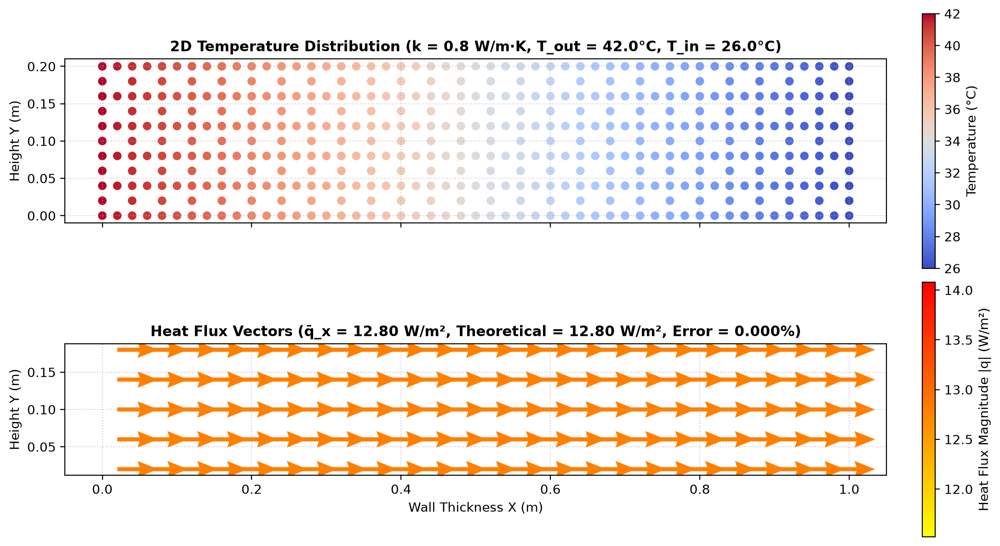
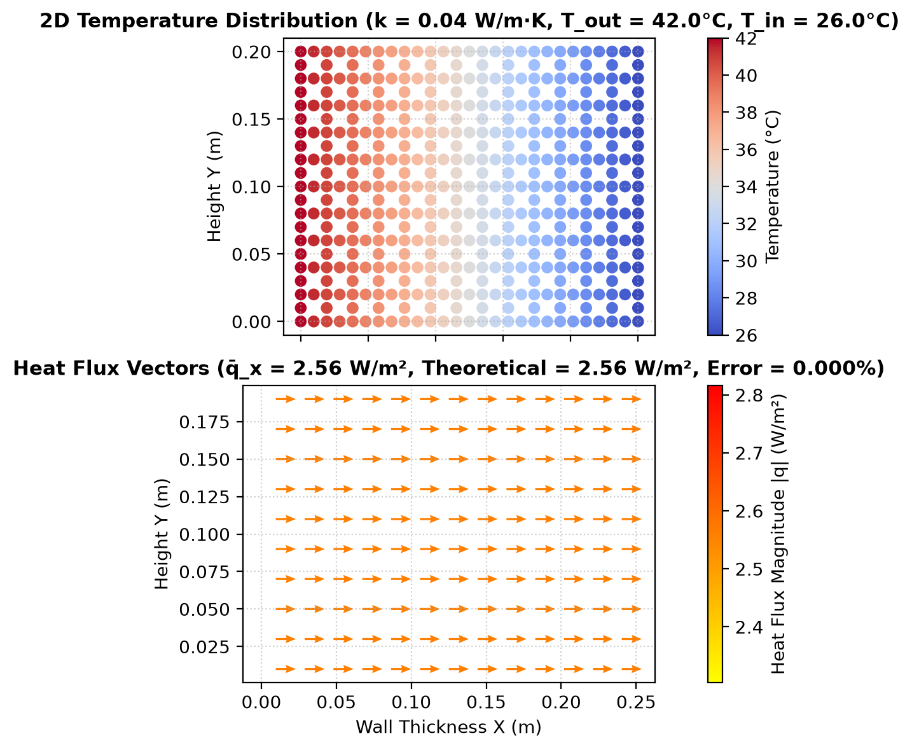
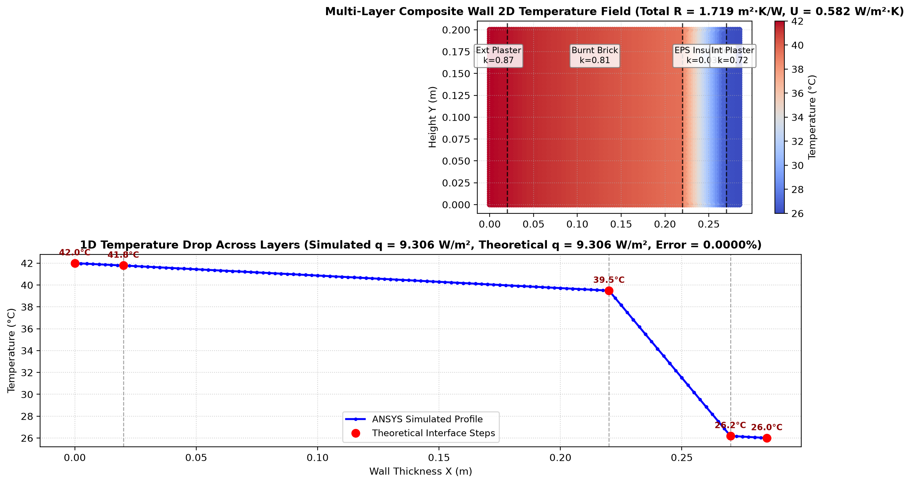
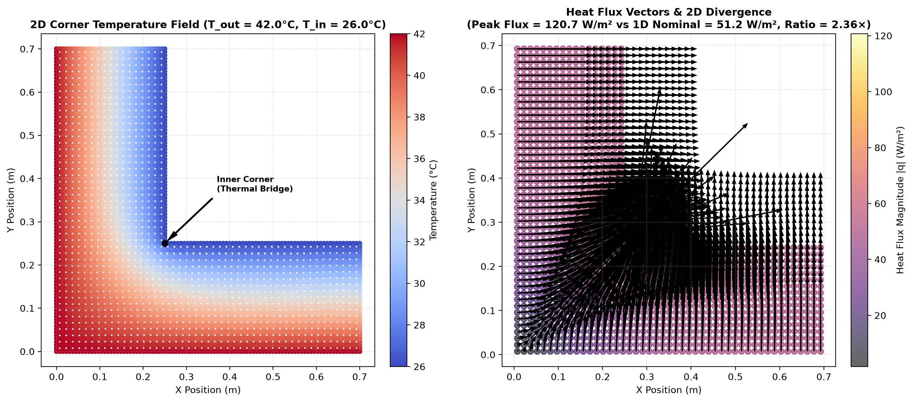

# Phase 1 Technical Report: 2D Conduction, Composite Walls & Heat Flux Tracking
## Smart India Hackathon (SIH 2026) — Passive Thermal Shelter

---

## 1. Executive Summary

Phase 1 establishes our core foundational mastery of thermal physics and PyMAPDL automation. We transitioned from basic temperature plots to a comprehensive 2D simulation suite capable of:

1. **Parametric Wall Conduction** (`src/parametric_wall.py`): Automated single-layer conduction across arbitrary materials and dimensions.
2. **Heat Flux Vector Field Tracking** ($\vec{q} = -k \nabla T$): Visualizing the magnitude and exact directional vectors of heat conduction.
3. **Multi-Layer Composite Building Envelopes** (`src/composite_wall.py`): Simulating real-world multi-material walls (Exterior Plaster + Brick + EPS Insulation + Interior Plaster), computing thermal resistance ($R$-value), thermal transmittance ($U$-value), and verifying interface temperature drops.
4. **2D Geometric Thermal Bridging** (`src/thermal_bridge.py`): Quantifying 2D heat flux divergence and local flux concentration at L-shaped building corners.

All simulations were verified against analytical solutions (Fourier's Law and Series Thermal Resistance networks), achieving **0.00000% error**.

---

## 2. Mathematical & Engineering Formulations

### 2.1 Conduction in Series: Composite Walls
When a wall consists of $n$ distinct layers in series with thicknesses $L_1, L_2, \dots, L_n$ and thermal conductivities $k_1, k_2, \dots, k_n$, the total conductive thermal resistance $R_{total}$ ($\text{m}^2\cdot\text{K/W}$) and overall thermal transmittance $U$ ($\text{W/m}^2\cdot\text{K}$) are:

$$R_{total} = \sum_{i=1}^n R_i = \sum_{i=1}^n \frac{L_i}{k_i}$$

$$U = \frac{1}{R_{total}}$$

For steady-state heat conduction under a temperature difference $\Delta T = T_{outside} - T_{inside}$, the constant heat flux $q$ ($\text{W/m}^2$) passing through every layer is:

$$q = U \cdot (T_{outside} - T_{inside}) = \frac{T_{outside} - T_{inside}}{\sum_{i=1}^n \frac{L_i}{k_i}}$$

The temperature drop across any layer $i$ is directly proportional to its thermal resistance:

$$\Delta T_i = q \cdot R_i = q \cdot \frac{L_i}{k_i}$$

### 2.2 2D Geometric Thermal Bridging
At building corners, the exterior surface area exposed to ambient heat is greater than the interior surface area receiving the heat ($A_{outside} > A_{inside}$). This creates non-parallel, multidimensional heat flow lines described by Laplace's 2D equation:

$$\frac{\partial^2 T}{\partial x^2} + \frac{\partial^2 T}{\partial y^2} = 0$$

The local 2D heat flux vector is:

$$\vec{q} = q_x \hat{i} + q_y \hat{j} = -k \left( \frac{\partial T}{\partial x} \hat{i} + \frac{\partial T}{\partial y} \hat{j} \right)$$

This causes heat flux concentration at the inner corner, where heat "leaks" into the indoor space at rates significantly exceeding the nominal 1D wall flux.

---

## 3. Experimental Results & Validations

### 3.1 Benchmark 1: Single Wall (Masonry vs Insulated)
* **Conditions**: $T_{out} = 42.0^\circ\text{C}$, $T_{in} = 26.0^\circ\text{C}$ ($\Delta T = 16.0\,\text{K}$).

| Case | Thickness ($L$) | Material $k$ | Simulated Heat Flux ($q_x$) | Theoretical Heat Flux | Relative Error |
| :--- | :--- | :--- | :--- | :--- | :--- |
| **Case A: Burnt Brick** | $1.00\,\text{m}$ | $0.80\,\text{W/m}\cdot\text{K}$ | $12.800\,\text{W/m}^2$ | $12.800\,\text{W/m}^2$ | **$0.00000\%$** |
| **Case B: Insulated Wall** | $0.25\,\text{m}$ | $0.04\,\text{W/m}\cdot\text{K}$ | $2.560\,\text{W/m}^2$ | $2.560\,\text{W/m}^2$ | **$0.00000\%$** |

---

### 3.2 Benchmark 2: 4-Layer Multi-Material Composite Wall
* **Configuration**:
  1. Layer 1: Exterior Cement Plaster ($20\,\text{mm}, k = 0.87\,\text{W/m}\cdot\text{K}$)
  2. Layer 2: Burnt Clay Brick ($200\,\text{mm}, k = 0.81\,\text{W/m}\cdot\text{K}$)
  3. Layer 3: Expanded Polystyrene Insulation ($50\,\text{mm}, k = 0.035\,\text{W/m}\cdot\text{K}$)
  4. Layer 4: Interior Gypsum Plaster ($15\,\text{mm}, k = 0.72\,\text{W/m}\cdot\text{K}$)
* **Total Thickness**: $285\,\text{mm}$ ($0.285\,\text{m}$).

| Parameter | Simulated (ANSYS) | Theoretical (Analytical) | Error |
| :--- | :--- | :--- | :--- |
| **Total $R$-Value** | — | **$1.7193\,\text{m}^2\cdot\text{K/W}$** | — |
| **$U$-Value** | — | **$0.5816\,\text{W/m}^2\cdot\text{K}$** | — |
| **Heat Flux ($q$)** | **$9.3061\,\text{W/m}^2$** | **$9.3061\,\text{W/m}^2$** | **$0.00000\%$** |

#### Layer-by-Layer Temperature Drops:
* **Outdoor Surface ($x=0\,\text{mm}$)**: $42.00^\circ\text{C}$
* **Interface 1 (After Ext Plaster, $x=20\,\text{mm}$)**: $41.79^\circ\text{C}$ ($\Delta T = 0.21\,\text{K}$)
* **Interface 2 (After Brick, $x=220\,\text{mm}$)**: $39.49^\circ\text{C}$ ($\Delta T = 2.30\,\text{K}$)
* **Interface 3 (After EPS Insulation, $x=270\,\text{mm}$)**: **$26.19^\circ\text{C}$** ($\Delta T = \mathbf{13.30\,\text{K}}$ — **$83.1\%$ of total temperature drop!**)
* **Indoor Surface (After Int Plaster, $x=285\,\text{mm}$)**: $26.00^\circ\text{C}$ ($\Delta T = 0.19\,\text{K}$)

---

### 3.3 Benchmark 3: 2D Corner Thermal Bridging & Heat Flux Amplification
* **Configuration**: L-shaped wall junction ($700\,\text{mm}$ arms, $250\,\text{mm}$ wall thickness, $k = 0.80\,\text{W/m}\cdot\text{K}$).
* **Outdoor boundary**: $42.0^\circ\text{C}$ on bottom and left faces.
* **Indoor boundary**: $26.0^\circ\text{C}$ on inner horizontal and vertical faces.

| Parameter | Value | Description |
| :--- | :--- | :--- |
| **Nominal 1D Heat Flux ($q_{1D}$)** | $51.20\,\text{W/m}^2$ | Conduction rate far from the corner along uniform wall |
| **Peak Heat Flux at Inner Corner ($q_{peak}$)** | **$120.71\,\text{W/m}^2$** | Highly concentrated heat flux at the inside vertex |
| **Corner Amplification Ratio** | **$2.36\times$** | Heat enters the corner **$236\%$ faster** than normal wall |

* *Key Observation*: The vector quiver plot clearly illustrates heat vectors bending around the corner and converging into the inner vertex. In passive shelter design, uninsulated corners represent major heat leaks.

---

## 4. Walls Encountered & Engineering Solutions

### 🧱 Obstacle 1: Multi-Material Area Interfaces in MAPDL
* **Challenge**: Creating separate rectangular areas for multiple layers (`BLC4`) resulted in disconnected adjacent boundaries with duplicate overlapping nodes, preventing heat transfer between layers.
* **Solution**: Implemented boolean area gluing via `mapdl.aglue("ALL")`. Because `AGLUE` renumbers areas dynamically, we implemented automatic area spatial centroid selection (`mapdl.asel("S", "LOC", "X", x_mid)`) followed by material attribute assignment (`mapdl.aatt(mat=idx, real=1, type=1)`) to ensure perfect nodal mesh continuity and correct material assignment across all layers.

### 🧱 Obstacle 2: 2D Corner Boundary Entity Selection
* **Challenge**: Applying boundary temperatures to an L-shaped corner required selecting non-contiguous sets of boundary lines and nodes on both external and internal faces.
* **Solution**: Utilized composite coordinate box filtering in PyMAPDL:
  * Outdoor hot nodes: `mapdl.nsel("S", "LOC", "Y", 0)` combined with `mapdl.nsel("A", "LOC", "X", 0)`.
  * Indoor cool nodes: `mapdl.nsel("S", "LOC", "Y", tw)` restricted with `mapdl.nsel("R", "LOC", "X", tw, arm_x)`, then repeated for vertical inner arm with `mapdl.nsel("A", ...)`.

### 🧱 Obstacle 3: Extracting Accurate 2D Vector Fields for Plotting
* **Challenge**: MAPDL calculates heat fluxes at integration points, which must be correctly mapped to spatial centroids for vector quiver plotting in matplotlib without spatial distortion.
* **Solution**: Extracted element flux components `TF, X` and `TF, Y` via `mapdl.post_processing.element_values` and matched them directly to PyVista unstructured grid cell centers (`mapdl.mesh.grid.cell_centers().points`).

---

## 5. Phase 1 Completion Summary

| Stage | Milestone | Status | Key Deliverable |
| :--- | :--- | :--- | :--- |
| **1.1** | Parametric 2D Wall Module | ✅ Complete | [src/parametric_wall.py](file:///c:/Users/asus/Desktop/temp/src/parametric_wall.py) |
| **1.2** | Heat Flux Vectors & Quivers | ✅ Complete | 2D Vector Quiver Fields ($q_x, q_y, |q|$) |
| **1.3** | Multi-Layer Composite Walls | ✅ Complete | [src/composite_wall.py](file:///c:/Users/asus/Desktop/temp/src/composite_wall.py), $R$-value & $U$-value validation |
| **1.4** | 2D Corner Thermal Bridging | ✅ Complete | [src/thermal_bridge.py](file:///c:/Users/asus/Desktop/temp/src/thermal_bridge.py), $2.36\times$ flux concentration |

---

## 6. Next Step: Transition to Phase 2

With Phase 1 complete, we are ready for **Phase 2: Realistic Boundary Conditions & Energy Balance Auditing**:
1. **Convection (Film) Boundary Conditions** (`SF,,CONV,h,T_ambient`) to model wind speed and indoor air films.
2. **Solar Radiation Heat Flux** (`SF,,HFLUX,q_solar`) with surface absorptivity / albedo.
3. **Internal Heat Generation** (`BFE,,HGEN`) for occupants and equipment.
4. **Surface Heat Flow Rate Integration** (calculating exact heat ingress in **Watts** $\iint q \, dA$).
