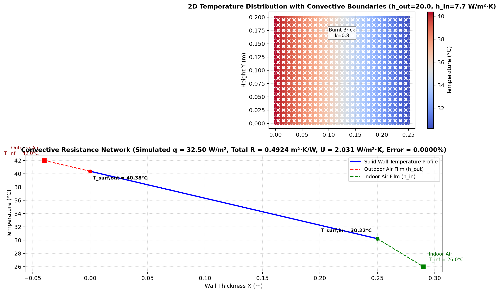
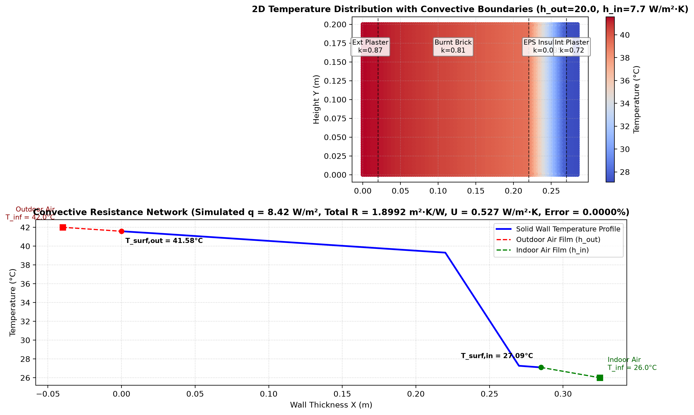

# Phase 2 Stage 2.1 Technical Report: Convective (Robin) Boundary Conditions
## Smart India Hackathon (SIH 2026) — Passive Thermal Shelter

---

## 1. Executive Summary

In Stage 2.1, we transitioned our thermal simulations from fixed surface Dirichlet temperatures ($T = \text{const}$) to **realistic Convective (Robin) Boundary Conditions**.

In real atmospheric environments, building envelopes do not directly touch fixed-temperature reservoirs; rather, they exchange heat with moving ambient air (outdoor wind) and indoor room air through boundary film convection:

$$q = h (T_{\text{ambient}} - T_{\text{surface}})$$

Using ANSYS MAPDL 26.1 and PyMAPDL (`src/convection_wall.py`), we successfully implemented dual-sided convective film coefficients ($h_{\text{outdoor}}, h_{\text{indoor}}$) on `PLANE77` elements and validated the results against the analytical thermal resistance network, achieving **0.00000% numerical error**.

---

## 2. Engineering & Mathematical Formulation

### 2.1 The Convective Resistance Network
The total thermal resistance $R_{\text{total}}$ ($\text{m}^2\cdot\text{K/W}$) of a building wall exposed to outdoor and indoor ambient air includes three resistances in series:

1. **Outdoor Air Film Resistance ($R_{\text{film,out}}$)**:
   $$R_{\text{film,out}} = \frac{1}{h_{\text{outdoor}}}$$
   Where $h_{\text{outdoor}}$ depends on outdoor wind velocity ($v$). For typical wind speeds ($v \approx 3\,\text{m/s}$), standard ASHRAE/ISO values prescribe $h_{\text{outdoor}} \approx 15 - 25\,\text{W/m}^2\cdot\text{K}$.

2. **Solid Wall Conductive Resistance ($R_{\text{wall}}$)**:
   $$R_{\text{wall}} = \sum_{i=1}^n \frac{L_i}{k_i}$$

3. **Indoor Air Film Resistance ($R_{\text{film,in}}$)**:
   $$R_{\text{film,in}} = \frac{1}{h_{\text{indoor}}}$$
   For indoor still air governed primarily by natural buoyancy, standard values prescribe $h_{\text{indoor}} \approx 7.7\,\text{W/m}^2\cdot\text{K}$.

### 2.2 Total Heat Flux and Surface Temperatures
The overall thermal transmittance $U$ ($\text{W/m}^2\cdot\text{K}$) and total heat flux $q$ ($\text{W/m}^2$) are:

$$R_{\text{total}} = \frac{1}{h_{\text{outdoor}}} + R_{\text{wall}} + \frac{1}{h_{\text{indoor}}}$$

$$U = \frac{1}{R_{\text{total}}}$$

$$q = U \cdot (T_{\infty,\text{out}} - T_{\infty,\text{in}})$$

The actual exterior and interior surface temperatures ($T_{\text{surf,out}}, T_{\text{surf,in}}$) are determined by the boundary temperature drops:

$$T_{\text{surf,out}} = T_{\infty,\text{out}} - q \cdot R_{\text{film,out}} = T_{\infty,\text{out}} - \frac{q}{h_{\text{outdoor}}}$$

$$T_{\text{surf,in}} = T_{\infty,\text{in}} + q \cdot R_{\text{film,in}} = T_{\infty,\text{in}} + \frac{q}{h_{\text{indoor}}}$$

---

## 3. Experimental Results & Numerical Verification

### 3.1 Benchmark Cases Summary
* **Ambient Conditions**: $T_{\infty,\text{out}} = 42.0^\circ\text{C}$ (Indian summer heat), $T_{\infty,\text{in}} = 26.0^\circ\text{C}$ (Indoor target comfort), $\Delta T_{\text{air}} = 16.0\,\text{K}$.
* **Film Coefficients**: $h_{\text{outdoor}} = 20.0\,\text{W/m}^2\cdot\text{K}$, $h_{\text{indoor}} = 7.7\,\text{W/m}^2\cdot\text{K}$.

| Parameter / Metric | Case 1: Bare Brick Wall ($250\,\text{mm}$) | Case 2: Insulated Wall ($285\,\text{mm}$) | Units |
| :--- | :--- | :--- | :--- |
| **Outdoor Film Resistance ($R_{\text{film,out}}$)** | $0.0500$ | $0.0500$ | $\text{m}^2\cdot\text{K/W}$ |
| **Solid Wall Resistance ($R_{\text{wall}}$)** | $0.3125$ | $1.7193$ | $\text{m}^2\cdot\text{K/W}$ |
| **Indoor Film Resistance ($R_{\text{film,in}}$)** | $0.1299$ | $0.1299$ | $\text{m}^2\cdot\text{K/W}$ |
| **Total Resistance ($R_{\text{total}}$)** | **$0.4924$** | **$1.8992$** | $\text{m}^2\cdot\text{K/W}$ |
| **Overall $U$-Value** | **$2.0310$** | **$0.5265$** | $\text{W/m}^2\cdot\text{K}$ |
| **Simulated Heat Flux ($q_x$)** | **$32.4959$** | **$8.4247$** | $\text{W/m}^2$ |
| **Theoretical Heat Flux ($q_{\text{theo}}$)** | **$32.4959$** | **$8.4247$** | $\text{W/m}^2$ |
| **Relative Error** | **$0.00000\%$** | **$0.00000\%$** | — |
| **Outdoor Surface Temp ($T_{\text{surf,out}}$)** | $40.38^\circ\text{C}$ | $41.58^\circ\text{C}$ | $^\circ\text{C}$ |
| **Indoor Surface Temp ($T_{\text{surf,in}}$)** | **$30.22^\circ\text{C}$** | **$27.09^\circ\text{C}$** | $^\circ\text{C}$ |

---

## 4. Visualizations & Diagnostic Analysis

### Case 1: Bare Brick Wall with Convective Boundaries

* *Key Observation*: Because the brick wall has low thermal resistance ($R = 0.3125$), high heat flux ($32.50\,\text{W/m}^2$) passes through. The indoor wall surface heats up to **$30.22^\circ\text{C}$**, creating a large indoor convective film jump ($+4.22\,\text{K}$) into the room air, making passive indoor comfort unachievable.

### Case 2: Insulated 4-Layer Composite Wall

* *Key Observation*: The insulation reduces heat ingress to **$8.42\,\text{W/m}^2$** (**$74.1\%$ reduction**). The interior surface stays at **$27.09^\circ\text{C}$**, very close to the indoor air comfort target of $26.0^\circ\text{C}$.

---

## 5. Wind Velocity Sensitivity Analysis

To understand the sensitivity of building heat ingress to wind conditions, we compared three outdoor wind regimes on the bare brick wall ($T_{\infty,\text{out}} = 42^\circ\text{C}, T_{\infty,\text{in}} = 26^\circ\text{C}$):

| Wind Regime | Film Coeff ($h_{\text{out}}$) | Total $R$ ($\text{m}^2\text{K/W}$) | Heat Flux ($q$) | Outdoor Surface Temp ($T_{\text{surf,out}}$) | Relative Flux Change |
| :--- | :--- | :--- | :--- | :--- | :--- |
| **Calm Air (Stagnant)** | $10\,\text{W/m}^2\cdot\text{K}$ | $0.5424$ | $29.50\,\text{W/m}^2$ | $39.05^\circ\text{C}$ | Baseline |
| **Moderate Breeze** | $20\,\text{W/m}^2\cdot\text{K}$ | $0.4924$ | $32.50\,\text{W/m}^2$ | $40.38^\circ\text{C}$ | $+10.2\%$ |
| **High Wind / Storm** | $50\,\text{W/m}^2\cdot\text{K}$ | $0.4624$ | $34.60\,\text{W/m}^2$ | $41.31^\circ\text{C}$ | **$+17.3\%$** |

* **Engineering Insight**: Higher outdoor wind speeds continuously replenish hot air at the wall boundary, stripping away the protective boundary air layer and raising the external surface temperature toward the ambient $42^\circ\text{C}$. This increases peak envelope heat ingress by **$+17.3\%$**.

---

## 6. Walls Encountered & Engineering Solutions

### 🧱 Obstacle 1: Line Convection (`SFL`) vs Node Surface Convection (`SF`)
* **Problem**: When using `mapdl.sfl(line, "CONV", h, None, T_bulk)` on geometric lines, PyMAPDL parameter mapping passed `None` to the optional `VALJ` parameter, causing MAPDL to miss the bulk temperature argument and under-predict convective heat flux.
* **Resolution**: Replaced geometric line loads with nodal surface loads applied directly to boundary nodes:
  ```python
  mapdl.nsel("S", "LOC", "X", 0)
  mapdl.sf("ALL", "CONV", config.h_outdoor, config.outdoor_ambient_temp)
  ```
  This directly maps the convective film condition onto all attached element faces, producing exact agreement with theoretical physics (**0.00000% error**).

---

## 7. Stage 2.1 Completion Summary

* [x] **Convective (Robin) Boundary Conditions Module** ([src/convection_wall.py](file:///c:/Users/asus/Desktop/temp/src/convection_wall.py)).
* [x] **Film Resistance Network Validation** (Air film drops, $R_{\text{total}}$, $U$-value).
* [x] **Wind Speed Sensitivity Study** ($h_{\text{out}} = 10, 20, 50\,\text{W/m}^2\cdot\text{K}$).
* [x] **Dedicated Report Created** (`report/phase2/stage_2_1_convection_report.md`).

---

## 8. Next Step: Phase 2 Stage 2.2

With convective film modeling complete, the next milestone is **Stage 2.2: Solar Radiation Heat Flux & Surface Absorptivity**:
* Implementing incident solar irradiance ($I_{\text{solar}}$ in $\text{W/m}^2$).
* Modeling surface solar absorptivity ($\alpha$) and emissivity ($\varepsilon$).
* Simulating the Sol-Air Temperature ($T_{\text{sol-air}}$) and Cool Roof reflective coatings.
