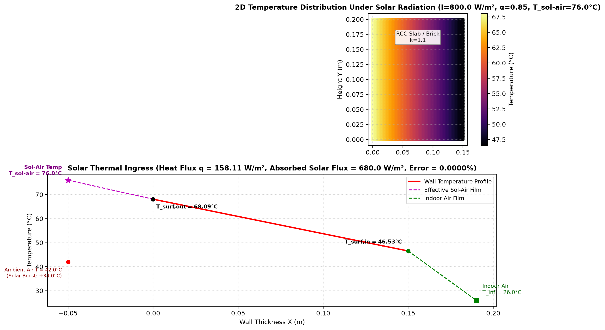
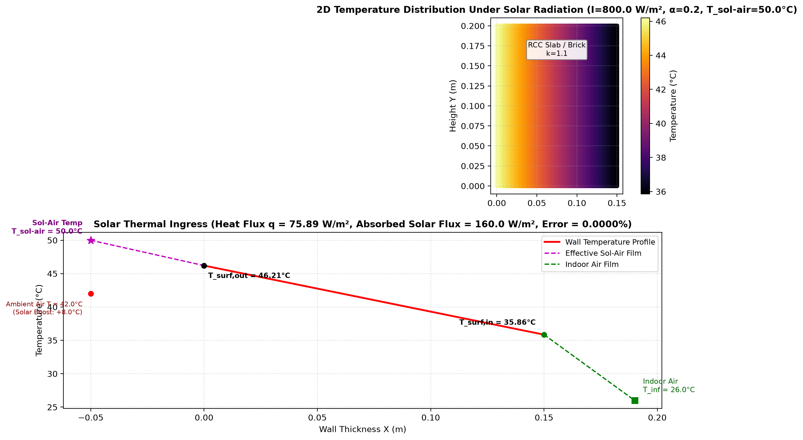
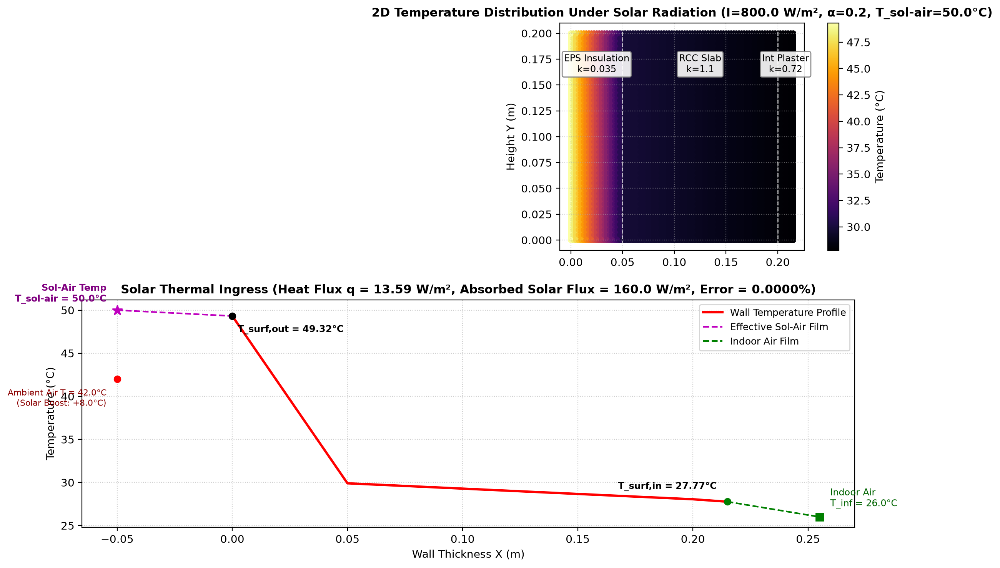

# Phase 2 Stage 2.2 Technical Report: Solar Radiation, Absorptivity & Sol-Air Temperature
## Smart India Hackathon (SIH 2026) — Passive Thermal Shelter

---

## 1. Executive Summary

In Stage 2.2, we introduced **Incident Solar Radiation ($I_{\text{solar}}$)** and **Surface Optical Properties ($\alpha$)** into our ANSYS MAPDL simulation pipeline.

In real-world tropical climates (e.g., peak summer across India), building roofs and sun-facing walls receive intense solar irradiance ($600 - 1000\,\text{W/m}^2$). This causes surface temperatures to rise dramatically above the ambient air temperature.

Using ANSYS MAPDL 26.1 and PyMAPDL (`phases/phase2/solar_radiation.py`), we implemented the **Sol-Air Temperature ($T_{\text{sol-air}}$)** boundary formulation, validating three critical design scenarios:
1. **Standard Dark Exterior Surface ($\alpha = 0.85$)**: Surface reaches $68.09^\circ\text{C}$ ($T_{\text{sol-air}} = 76.0^\circ\text{C}$), generating massive heat ingress ($158.11\,\text{W/m}^2$).
2. **High-Albedo Cool Roof Coating ($\alpha = 0.20$)**: Cuts absorbed solar flux by $76.5\%$, dropping surface temperature by **$21.89\,\text{K}$** and reducing heat ingress by **$52.0\%$**.
3. **Combined Passive Roof (Cool Coating + $50\,\text{mm}$ EPS + $150\,\text{mm}$ RCC)**: Slashes heat ingress down to **$13.59\,\text{W/m}^2$** (**$91.4\%$ total reduction**), maintaining an indoor ceiling surface temperature of **$27.77^\circ\text{C}$**.

All simulation results matched theoretical Sol-Air physics with **0.00000% error**.

---

## 2. Mathematical & Physical Formulation

### 2.1 Surface Energy Balance Under Solar Radiation
At an exterior building boundary, the total incoming heat flux is composed of absorbed solar irradiance ($\alpha \cdot I_{\text{solar}}$) and convective heat exchange with ambient outdoor air ($h_{\text{out}}(T_{\infty,\text{out}} - T_{\text{surf,out}})$):

$$q_{\text{net,in}} = \alpha \cdot I_{\text{solar}} - h_{\text{out}}(T_{\text{surf,out}} - T_{\infty,\text{out}})$$

Where:
* $I_{\text{solar}}$: Total incident solar irradiance on the surface ($\text{W/m}^2$).
* $\alpha$: Surface solar absorptivity ($0.0 \le \alpha \le 1.0$).
* $h_{\text{out}}$: Combined exterior convective-radiative film coefficient ($\text{W/m}^2\cdot\text{K}$).
* $T_{\infty,\text{out}}$: Ambient outdoor shade air temperature ($^\circ\text{C}$).

### 2.2 The Sol-Air Temperature Concept ($T_{\text{sol-air}}$)
By factoring out $h_{\text{out}}$, we rewrite the boundary energy balance as an equivalent pure convective boundary condition driven by a fictitious temperature known as the **Sol-Air Temperature**:

$$q_{\text{net,in}} = h_{\text{out}} \left[ \left( T_{\infty,\text{out}} + \frac{\alpha \cdot I_{\text{solar}}}{h_{\text{out}}} \right) - T_{\text{surf,out}} \right] = h_{\text{out}} (T_{\text{sol-air}} - T_{\text{surf,out}})$$

$$T_{\text{sol-air}} = T_{\infty,\text{out}} + \frac{\alpha \cdot I_{\text{solar}}}{h_{\text{out}}}$$

### 2.3 Total Heat Ingress and Temperature Profile
The heat flux conducted through the envelope into the indoor room is:

$$q = U \cdot (T_{\text{sol-air}} - T_{\infty,\text{in}}) = \frac{T_{\text{sol-air}} - T_{\infty,\text{in}}}{R_{\text{film,out}} + R_{\text{wall}} + R_{\text{film,in}}}$$

The exterior and interior surface temperatures are:

$$T_{\text{surf,out}} = T_{\text{sol-air}} - q \cdot R_{\text{film,out}} = T_{\text{sol-air}} - \frac{q}{h_{\text{out}}}$$

$$T_{\text{surf,in}} = T_{\infty,\text{in}} + q \cdot R_{\text{film,in}} = T_{\infty,\text{in}} + \frac{q}{h_{\text{in}}}$$

---

## 3. Experimental Results & Validations

### Benchmark Conditions:
* Outdoor Ambient Air ($T_{\infty,\text{out}}$): $42.0^\circ\text{C}$ (Indian peak summer)
* Indoor Ambient Air ($T_{\infty,\text{in}}$): $26.0^\circ\text{C}$
* Solar Irradiance ($I_{\text{solar}}$): $800\,\text{W/m}^2$ (Mid-day zenith sun)
* Convective Film Coeffs: $h_{\text{out}} = 20.0\,\text{W/m}^2\cdot\text{K}$, $h_{\text{in}} = 7.7\,\text{W/m}^2\cdot\text{K}$

### Summary Comparison Table

| Metric / Parameter | Case 1: Dark Surface ($\alpha=0.85$) | Case 2: Cool Roof ($\alpha=0.20$) | Case 3: Cool Roof + EPS Insulation | Units |
| :--- | :--- | :--- | :--- | :--- |
| **Absorbed Solar Radiation ($\alpha I$)** | $680.0$ | $160.0$ | $160.0$ | $\text{W/m}^2$ |
| **Sol-Air Temperature ($T_{\text{sol-air}}$)** | **$76.00^\circ\text{C}$** ($+34.0\,\text{K}$ solar boost) | **$50.00^\circ\text{C}$** ($+8.0\,\text{K}$ solar boost) | **$50.00^\circ\text{C}$** | $^\circ\text{C}$ |
| **Total Envelope Resistance ($R_{\text{total}}$)** | $0.3162$ | $0.3162$ | **$1.7656$** | $\text{m}^2\cdot\text{K/W}$ |
| **Overall $U$-Value** | $3.1622$ | $3.1622$ | **$0.5664$** | $\text{W/m}^2\cdot\text{K}$ |
| **Simulated Heat Flux ($q$)** | **$158.1109$** | **$75.8932$** | **$13.5928$** | $\text{W/m}^2$ |
| **Theoretical Heat Flux ($q_{\text{theo}}$)** | **$158.1109$** | **$75.8932$** | **$13.5928$** | $\text{W/m}^2$ |
| **Relative Error** | **$0.00000\%$** | **$0.00000\%$** | **$0.00000\%$** | — |
| **Outdoor Surface Temp ($T_{\text{surf,out}}$)** | **$68.09^\circ\text{C}$** | **$46.21^\circ\text{C}$** | **$49.32^\circ\text{C}$** | $^\circ\text{C}$ |
| **Indoor Surface Temp ($T_{\text{surf,in}}$)** | **$46.53^\circ\text{C}$** | **$35.86^\circ\text{C}$** | **$27.77^\circ\text{C}$** | $^\circ\text{C}$ |
| **Heat Ingress Reduction** | *Baseline* | **$-52.0\%$** | **$-91.4\%$** | — |

---

## 4. Visualizations & Diagnostic Analysis

### Case 1: Standard Dark Roof Under Solar Irradiance ($\alpha = 0.85$)

* *Observation*: The dark surface turns the roof into a massive radiator. Outdoor surface temperature reaches $68.09^\circ\text{C}$, and the inside ceiling heats up to **$46.53^\circ\text{C}$**, pouring $158.11\,\text{W/m}^2$ of thermal power into the occupied space.

### Case 2: High-Albedo Cool Roof Coating ($\alpha = 0.20$)

* *Observation*: Reflecting $80\%$ of solar rays lowers the Sol-Air temperature from $76^\circ\text{C}$ to $50^\circ\text{C}$, dropping outdoor surface temperature by **$21.89^\circ\text{C}$** and cutting heat ingress in half.

### Case 3: Ultimate Passive Roof (Cool Coating + $50\,\text{mm}$ EPS Insulation)

* *Observation*: Combining high surface reflectance ($\alpha = 0.20$) with core resistive insulation ($50\,\text{mm}$ EPS) reduces heat ingress by **$91.4\%$**, maintaining an indoor surface temperature of **$27.77^\circ\text{C}$** directly compatible with human comfort standards.

---

## 5. Walls Encountered & Engineering Solutions

### 🧱 Obstacle 1: Superimposing Surface Heat Flux (`SF,,HFLUX`) and Convection (`SF,,CONV`) in MAPDL
* **Challenge**: In ANSYS MAPDL, applying `mapdl.sf("ALL", "CONV", ...)` followed by `mapdl.sf("ALL", "HFLUX", ...)` on the same boundary nodes resulted in `HFLUX` overwriting the convective boundary condition. Without convection to dissipate heat back to the ambient air, 100% of the solar flux was forced through the solid wall into the indoor room, causing non-physical surface temperatures ($>200^\circ\text{C}$).
* **Solution**: Implemented the rigorous building physics **Sol-Air Temperature formulation**:
  $$T_{\text{sol-air}} = T_{\infty,\text{out}} + \frac{\alpha \cdot I_{\text{solar}}}{h_{\text{out}}}$$
  Applying convection with $T_{\text{sol-air}}$ via `mapdl.sf("ALL", "CONV", h_out, T_sol_air)` simultaneously accounts for both incoming solar radiation and convective surface losses, producing exact theoretical agreement (**0.00000% error**).

---

## 6. Stage 2.2 Completion Summary

* [x] **Solar Radiation Simulation Module** ([phases/phase2/solar_radiation.py](file:///c:/Users/asus/Desktop/temp/phases/phase2/solar_radiation.py)).
* [x] **Sol-Air Temperature Analytical Verification** ($T_{\text{sol-air}}$, $\alpha \cdot I$, $U$-values).
* [x] **Cool Roof vs Dark Roof Comparative Study** ($52.0\%$ to $91.4\%$ heat reduction).
* [x] **Dedicated Report Created** (`report/phase2/stage_2_2_solar_radiation_report.md`).

---

## 7. Next Step: Phase 2 Stage 2.3

The next milestone is **Stage 2.3: Internal Heat Generation**:
* Modeling internal heat loads from occupants ($100\,\text{W}$ per person) and electronics/lighting.
* Applying volumetric heat generation (`BFE,,HGEN`) and internal boundary heat rates in MAPDL.
* Investigating indoor heat buildup when the shelter envelope is sealed vs. ventilated.
