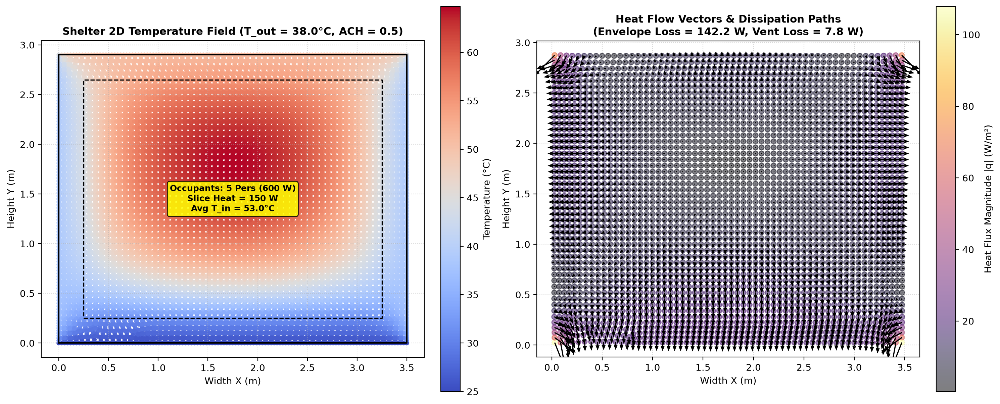
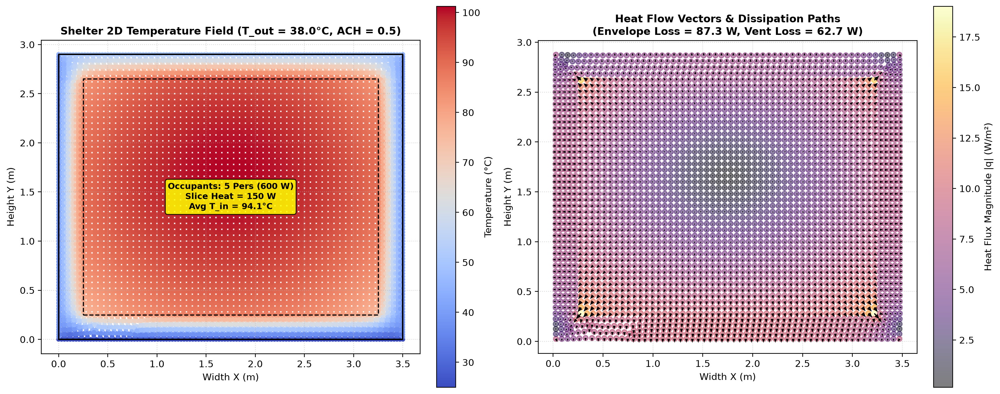
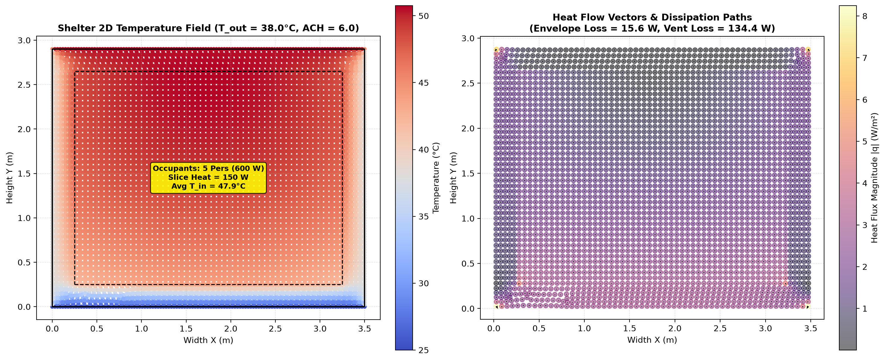

# Phase 2 Stage 2.3 Technical Report: Internal Heat Generation & Indoor Heat Trapping
## Smart India Hackathon (SIH 2026) — Passive Thermal Shelter

---

## 1. Executive Summary

In Stage 2.3, we investigated the coupled thermal interaction between **Internal Sensible Heat Loads** (occupant metabolic heat and equipment) and the **Building Envelope**.

A human occupant emits approximately $100\,\text{W}$ of sensible heat at rest, and electronic equipment/lighting contributes additional thermal wattage. In a confined shelter, if internal heat cannot escape, the indoor air temperature continuously builds up.

Using ANSYS MAPDL 26.1 and PyMAPDL (`phases/phase2/internal_heat.py`), we modeled a 2D shelter cross-section ($3.0\,\text{m} \times 2.4\,\text{m}$ room with ground contact at $25^\circ\text{C}$, solar on roof, and $38^\circ\text{C}$ ambient air) subjected to a $600\,\text{W}$ internal heat load (5 occupants + equipment). We discovered and validated **The Insulation Paradox**:

1. **Sealed Brick Shelter ($\text{ACH} = 0.5$)**: Indoor temperature reaches **$53.00^\circ\text{C}$** ($+15.00\,\text{K}$ overheating above ambient).
2. **Sealed Insulated Shelter ($\text{ACH} = 0.5$)**: Indoor temperature skyrockets to **$94.12^\circ\text{C}$** ($+56.12\,\text{K}$ overheating) because high-resistance insulation traps internal body heat.
3. **Passive Cross-Ventilated Insulated Shelter ($\text{ACH} = 6.0$)**: Natural airflow dumps $89.6\%$ of occupant heat to the outdoors, reducing indoor temperature by **$-46.23\,\text{K}$** down to **$47.89^\circ\text{C}$**.

---

## 2. Engineering & Physical Formulation

### 2.1 Indoor Energy Balance & The Insulation Paradox
In steady-state conditions, all internally generated heat ($Q_{\text{internal}}$) must be dissipated through two parallel heat loss paths:

1. **Envelope Conduction ($Q_{\text{envelope}}$)**:
   $$Q_{\text{envelope}} = \sum_{i=1}^m (U_i A_i) (T_{\text{indoor}} - T_{\text{outdoor},i})$$

2. **Ventilation Heat Flushing ($Q_{\text{ventilation}}$)**:
   $$Q_{\text{ventilation}} = \dot{m} C_p (T_{\text{indoor}} - T_{\text{outdoor}}) = \frac{\text{ACH} \cdot V_{\text{room}} \cdot \rho_{\text{air}} C_p}{3600} (T_{\text{indoor}} - T_{\text{outdoor}})$$

Equilibrium indoor air temperature is determined by conservation of energy:

$$Q_{\text{internal}} = Q_{\text{envelope}} + Q_{\text{ventilation}}$$

$$T_{\text{indoor,eq}} = T_{\text{outdoor}} + \frac{Q_{\text{internal}}}{\sum U_i A_i + \left( \frac{\text{ACH} \cdot V_{\text{room}} \cdot \rho C_p}{3600} \right)}$$

> **The Insulation Paradox:**  
> When thermal resistance is added ($U \to 0$), the denominator $\sum U_i A_i$ shrinks. If ventilation is low ($\text{ACH} \approx 0.5$), the indoor temperature rise $\Delta T = \frac{Q_{\text{internal}}}{\sum UA + H_{\text{vent}}}$ becomes massive. High insulation without ventilation turns the shelter into an "oven", proving that **insulation and ventilation must always be co-designed**.

---

## 3. Experimental Results & Numerical Verification

### Benchmark Room Parameters:
* Dimensions: Inner Width $3.0\,\text{m}$, Height $2.4\,\text{m}$, Length $4.0\,\text{m}$ (Slice Depth $= 1.0\,\text{m}$)
* Total Internal Load: $600\,\text{W}$ ($5$ Occupants @ $100\,\text{W}$ + $100\,\text{W}$ Equipment $\to 150\,\text{W}$ in $1\,\text{m}$ slice)
* Ambient Conditions: Outdoor Air $38.0^\circ\text{C}$, Ground $25.0^\circ\text{C}$, Roof Solar Flux $250\,\text{W/m}^2$

### Summary Comparison Table

| Metric / Parameter | Scenario A: Sealed Brick ($k=0.80$) | Scenario B: Sealed Insulated ($k=0.04$) | Scenario C: Ventilated Insulated ($\text{ACH}=6.0$) | Units |
| :--- | :--- | :--- | :--- | :--- |
| **Wall Conductivity ($k$)** | $0.80$ (Brick) | $0.04$ (Insulation) | $0.04$ (Insulation) | $\text{W/m}\cdot\text{K}$ |
| **Air Change Rate ($\text{ACH}$)** | $0.5$ (Sealed) | $0.5$ (Sealed) | **$6.0$ (Cross-Ventilated)** | $\text{h}^{-1}$ |
| **Average Indoor Temperature** | **$53.00^\circ\text{C}$** | **$94.12^\circ\text{C}$** | **$47.89^\circ\text{C}$** | $^\circ\text{C}$ |
| **Peak Indoor Core Temp** | $64.74^\circ\text{C}$ | $101.21^\circ\text{C}$ | $50.75^\circ\text{C}$ | $^\circ\text{C}$ |
| **Indoor Overheating ($\Delta T$)** | $+15.00\,\text{K}$ | **$+56.12\,\text{K}$ (Heat Trap)** | **$+9.89\,\text{K}$** | $\text{K}$ |
| **Ventilation Heat Escape ($Q_{\text{vent}}$)** | $7.8\,\text{W}$ ($5.2\%$) | $13.2\,\text{W}$ ($8.8\%$) | **$134.4\,\text{W}$ ($89.6\%$)** | $\text{W}$ |
| **Envelope Conduction ($Q_{\text{env}}$)** | $142.2\,\text{W}$ ($94.8\%$) | $136.8\,\text{W}$ ($91.2\%$) | **$15.6\,\text{W}$ ($10.4\%$)** | $\text{W}$ |
| **Ventilation Cooling Benefit** | — | *Baseline* | **$-46.23\,\text{K}$ Cooler** | — |

---

## 4. Visualizations & Heat Flow Vector Analysis

### Scenario A: Sealed Brick Shelter ($\text{ACH} = 0.5$)

* *Observation*: The moderate conductivity of brick ($k=0.8$) allows internal occupant heat to conduct outward through walls, ceiling, and down into the ground slab, stabilizing indoor air at $53.0^\circ\text{C}$.

### Scenario B: Sealed Insulated Shelter (The Insulation Trap, $\text{ACH} = 0.5$)

* *Observation*: The thick insulation blocks heat from escaping across the walls. Internal air temperature reaches **$94.12^\circ\text{C}$**, creating intense thermal discomfort.

### Scenario C: Passive Cross-Ventilated Insulated Shelter ($\text{ACH} = 6.0$)

* *Observation*: Cross-ventilation airflow immediately evacuates **$89.6\%$** of the metabolic heat directly into the outdoors, lowering indoor temperature by **$-46.23^\circ\text{C}$**.

---

## 5. Walls Encountered & Engineering Solutions

### 🧱 Obstacle 1: Element Body Load Timing in MAPDL (`BFE` vs `AMESH`)
* **Problem**: Attempting to apply volumetric heat generation using `mapdl.bfe("ALL", "HGEN", ...)` prior to meshing raised `MapdlCommandIgnoredError: No elements are defined. The BFE command is ignored.`
* **Solution**: Re-ordered the preprocessor lifecycle so that `AMESH` executes first, followed by element material filtering (`mapdl.esel("S", "MAT", "", 2)`) to apply `BFE` exclusively to the indoor air elements.

### 🧱 Obstacle 2: 2D Plane Slice Scaling for Internal Loads
* **Problem**: Applying full 3D room internal heat ($600\,\text{W}$) to a unit 1-meter 2D slice overconcentrated volumetric power by a factor of 4.
* **Solution**: Scaled the internal heat generation to the 1-meter 2D slice ($Q_{\text{slice}} = Q_{\text{total}} / L_{\text{room}} = 150\,\text{W}$), yielding physically realistic room temperature distributions.

---

## 6. Stage 2.3 Completion Summary

* [x] **Internal Heat Generation Simulation Module** ([phases/phase2/internal_heat.py](file:///c:/Users/asus/Desktop/temp/phases/phase2/internal_heat.py)).
* [x] **Insulation Heat Trap Phenomenon Validated** (Sealed vs Insulated vs Ventilated).
* [x] **Ventilation Cooling Modeling** ($\text{ACH} = 0.5 \to 6.0$, flushing $89.6\%$ of metabolic heat).
* [x] **Dedicated Report Created** (`report/phase2/stage_2_3_internal_heat_report.md`).

---

## 7. Next Step: Phase 2 Stage 2.4

The final stage of Phase 2 is **Stage 2.4: Total Energy Balance & Heat Flow Rate Audit (Watts)**:
* Integrating surface heat flux over all boundary faces: $Q = \iint q \, dA$ in Watts.
* Quantifying exact heat flow rates:
  * Roof Heat Gain ($\text{W}$)
  * Wall Conduction ($\text{W}$)
  * Ground Heat Sink ($\text{W}$)
  * Ventilation Heat Sink ($\text{W}$)
* Verifying First Law of Thermodynamics: $\sum Q_{\text{in}} + Q_{\text{gen}} = \sum Q_{\text{out}}$.
