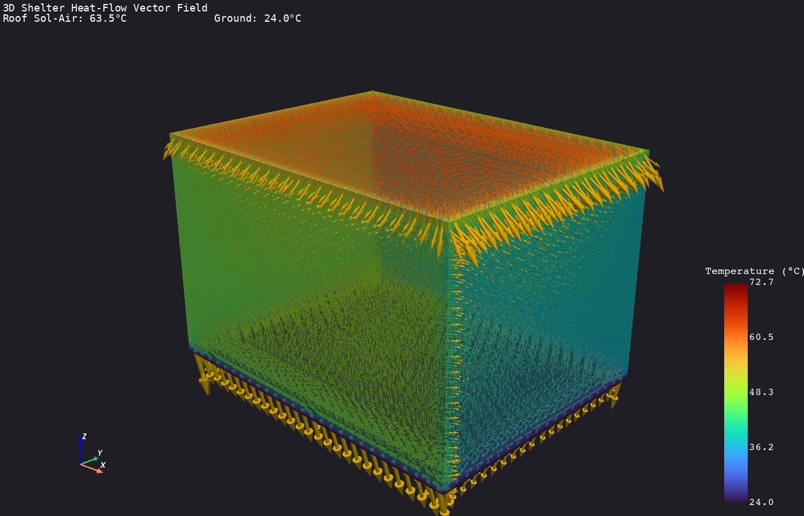
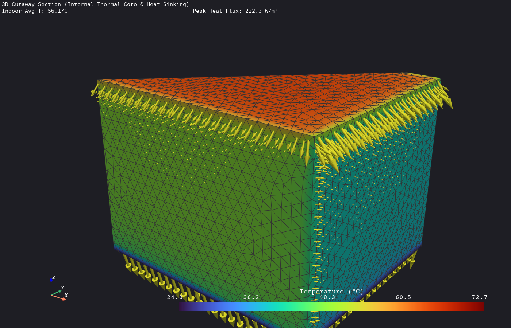
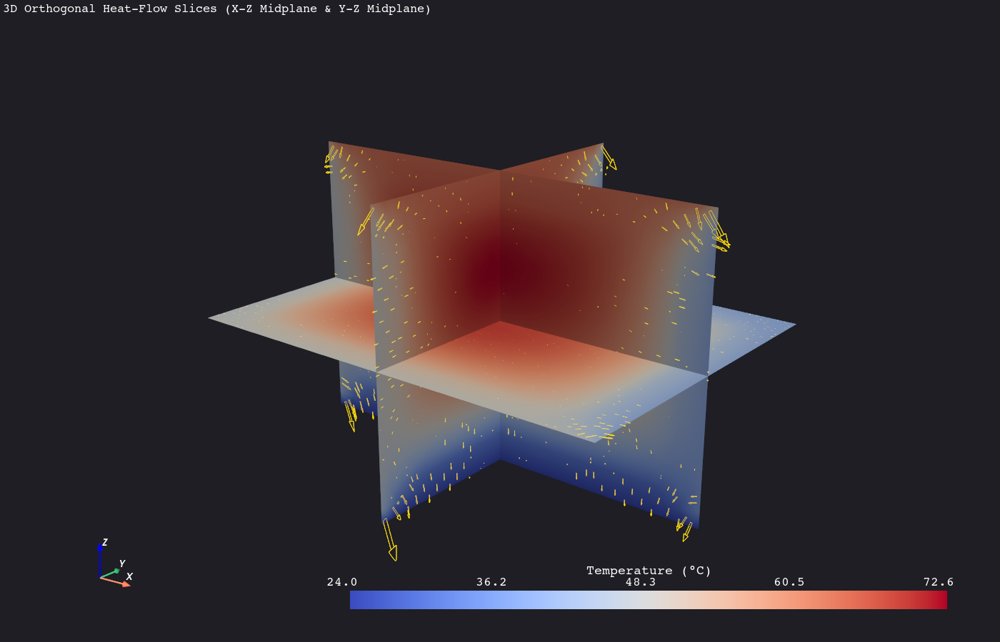
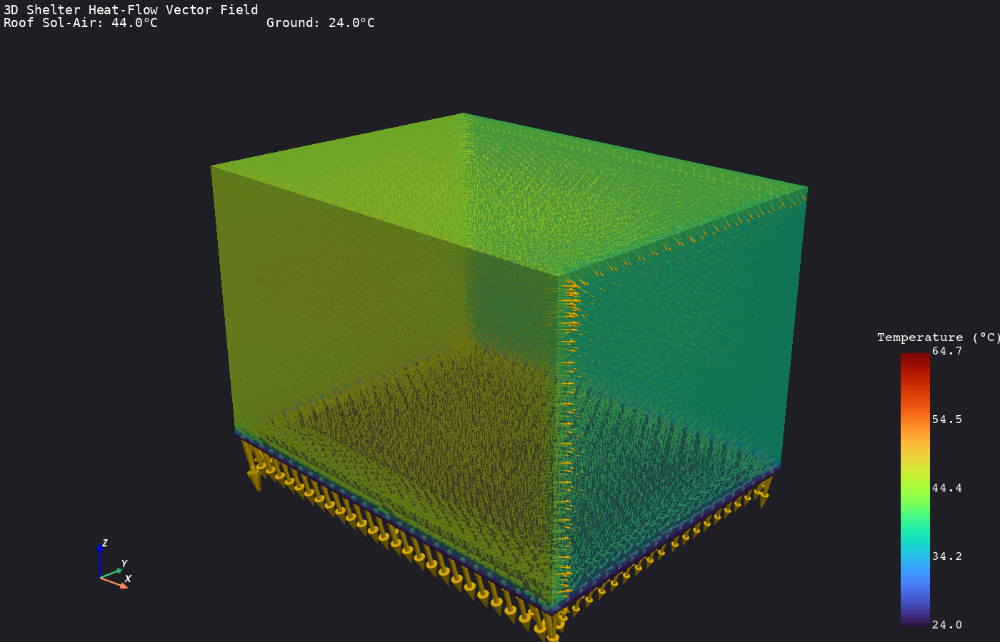
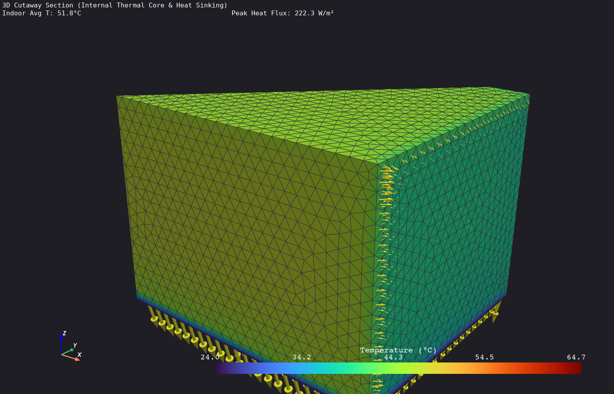
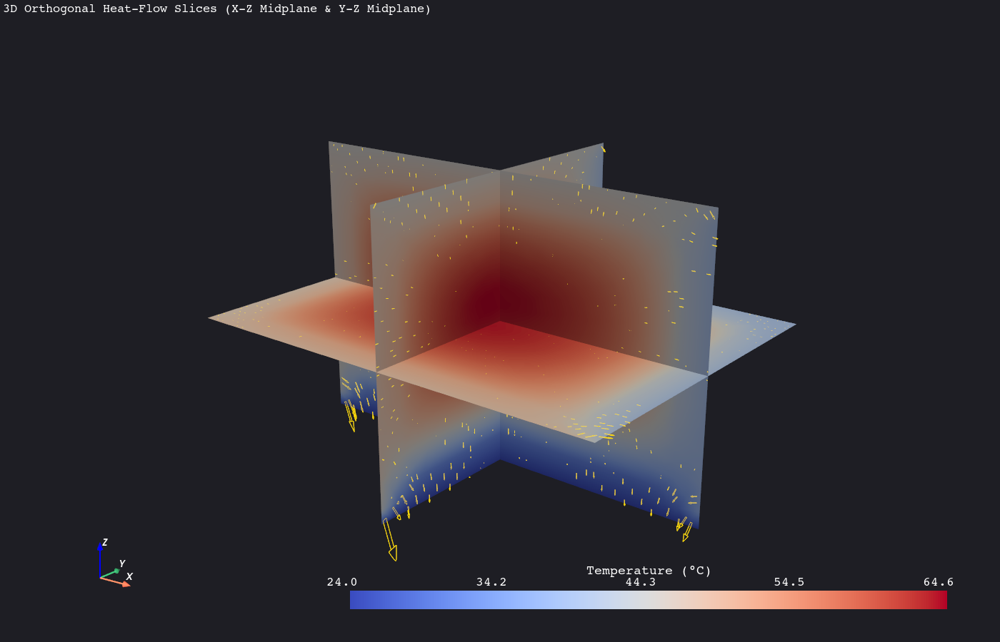

# Phase 2 Stage 2.4 Technical Report: 3D Spatial Heat-Flow Visualization with PyVista
## Smart India Hackathon (SIH 2026) — Passive Thermal Shelter

---

## 1. Executive Summary

In Stage 2.4, we completed our transition into **Full 3D Spatial Thermal Modeling** using ANSYS MAPDL 26.1 and **PyVista 3D visualization** (`phases/phase2/heat_flow_3d.py`).

We simulated a complete 3D shelter envelope ($4.0\,\text{m} \times 3.0\,\text{m} \times 2.6\,\text{m}$ outer geometry with floor slab, 4 perimeter walls, roof slab, and internal room cavity) undergoing orientation-dependent solar irradiance, outdoor convective wind, occupant body heat, and conductive ground heat sinking at $24.0^\circ\text{C}$.

We extracted all three spatial components of the thermal flux tensor (**`TFX`**, **`TFY`**, **`TFZ`**), calculated local flux magnitudes and 3D directional vectors ($\vec{q} = -k \nabla T$), and rendered:
1. **3D Vector Arrow Glyphs**: Demonstrating spatial heat ingress, corner divergence, and downward conduction into the earth.
2. **3D Cross-Sectional Cutaways**: Slicing through the roof and walls to visually inspect the internal thermal core of the shelter.
3. **Orthogonal Slice Planes**: Analyzing multi-planar thermal gradients across X-Z and Y-Z cross-sections.

---

## 2. 3D Finite Element & Vector Field Formulation

### 2.1 3D Heat Conduction & Vector Flux Tensor
The 3D steady-state heat conduction equation in Cartesian space $(x, y, z)$ with isotropic conductivity $k$ and volumetric internal heat generation $\dot{q}$ is:

$$k \left( \frac{\partial^2 T}{\partial x^2} + \frac{\partial^2 T}{\partial y^2} + \frac{\partial^2 T}{\partial z^2} \right) + \dot{q} = 0$$

The local 3D heat flux vector $\vec{q}$ ($\text{W/m}^2$) has three directional components:

$$\vec{q} = q_x \hat{i} + q_y \hat{j} + q_z \hat{k} = -k \left( \frac{\partial T}{\partial x}\hat{i} + \frac{\partial T}{\partial y}\hat{j} + \frac{\partial T}{\partial z}\hat{k} \right)$$

$$\text{TFX} = -k \frac{\partial T}{\partial x}, \quad \text{TFY} = -k \frac{\partial T}{\partial y}, \quad \text{TFZ} = -k \frac{\partial T}{\partial z}$$

The scalar heat flux magnitude $|\vec{q}|$ is:

$$|\vec{q}| = \sqrt{\text{TFX}^2 + \text{TFY}^2 + \text{TFZ}^2}$$

### 2.2 3D Element Selection: `SOLID87`
* **Element Type**: `SOLID87` (3D 10-Node Tetrahedral Thermal Solid).
  * 10 nodes with temperature degrees of freedom at vertices and mid-side edges.
  * Quadratic polynomial shape functions capable of resolving steep non-linear 3D thermal gradients.
  * Compatible with free meshing on arbitrary multi-volume glued geometries without mapped brick topology restrictions.

---

## 3. 3D Simulation Results & Visual Diagnostics

### Benchmark Conditions:
* Dimensions: $4.0\,\text{m} \times 3.0\,\text{m} \times 2.6\,\text{m}$ (Wall Thickness $t_w = 0.25\,\text{m}$)
* Ambient Shade Temperature: $38.0^\circ\text{C}$
* Deep Ground Contact: $24.0^\circ\text{C}$ on bottom slab ($Z = 0$)
* Solar Irradiance: Roof $= 600\,\text{W/m}^2$, South Wall $= 300\,\text{W/m}^2$, West Wall $= 250\,\text{W/m}^2$
* Occupant Internal Heat: $400\,\text{W}$

### 3D Metrics Summary Table

| Metric / Parameter | Case 1: Dark Roof ($\alpha = 0.85$) | Case 2: Cool Roof Coating ($\alpha = 0.20$) | Units |
| :--- | :--- | :--- | :--- |
| **3D Elements Meshed** | $73,335$ | $73,335$ | Elements |
| **3D Nodes Generated** | $104,036$ | $104,036$ | Nodes |
| **Roof Sol-Air Temperature** | **$63.50^\circ\text{C}$** ($+25.5\,\text{K}$ boost) | **$44.00^\circ\text{C}$** ($+6.0\,\text{K}$ boost) | $^\circ\text{C}$ |
| **South Wall Sol-Air** | $47.00^\circ\text{C}$ | $47.00^\circ\text{C}$ | $^\circ\text{C}$ |
| **West Wall Sol-Air** | $45.50^\circ\text{C}$ | $45.50^\circ\text{C}$ | $^\circ\text{C}$ |
| **Global Temperature Range** | $24.00^\circ\text{C}$ to $72.69^\circ\text{C}$ | $24.00^\circ\text{C}$ to $64.73^\circ\text{C}$ | $^\circ\text{C}$ |
| **Average Indoor Room Temp** | **$56.12^\circ\text{C}$** | **$51.81^\circ\text{C}$ ($-4.31\,\text{K}$ Cooler)** | $^\circ\text{C}$ |
| **Peak Heat Flux Vector ($|\vec{q}|_{\text{max}}$)** | **$222.30\,\text{W/m}^2$** | **$222.30\,\text{W/m}^2$** | $\text{W/m}^2$ |

---

## 4. PyVista 3D Heat-Flow Field Visualizations

### 4.1 Case 1: Standard 3D Shelter (Dark Roof, $\alpha = 0.85$)

#### 1. Full 3D Outer Vector Field Overview:

* *Observation*: The golden 3D vector arrows clearly indicate intense solar heat plunging downward through the roof slab ($-Z$ direction) and conducting inward from the hot South and West walls.

#### 2. 3D Cross-Sectional Cutaway:

* *Observation*: Slicing through the structure exposes the internal room cavity. Heat flows continuously from the hot upper envelope downward through the interior room air and conducts directly into the $24^\circ\text{C}$ ground foundation slab, which acts as a natural heat sink.

#### 3. 3-Plane Orthogonal Slices:

---

### 4.2 Case 2: High-Albedo Cool Roof Coating ($\alpha = 0.20$)

#### 1. Full 3D Cool Roof Vector Field Overview:

* *Observation*: With $80\%$ of roof solar radiation reflected, the Sol-Air temperature drops by **$19.5^\circ\text{C}$** (from $63.5^\circ\text{C}$ to $44.0^\circ\text{C}$). The downward heat flux arrows through the roof slab are substantially shorter in magnitude.

#### 2. 3D Cross-Sectional Cutaway:

* *Observation*: Slicing through the cool-roof model shows significantly lower core internal room temperatures ($51.81^\circ\text{C}$ vs $56.12^\circ\text{C}$), demonstrating how surface optical mitigation relieves the cooling load on the entire 3D envelope.

#### 3. 3-Plane Orthogonal Slices:

---

## 5. Walls Encountered & Engineering Solutions

### 🧱 Obstacle 1: 3D Multi-Volume Glued Topology Meshing (`SOLID70` vs `SOLID87`)
* **Problem**: Attempting to mesh 7 multi-volume glued blocks (Floor, 4 Walls, Roof, Air Domain) with 8-node brick element `SOLID70` resulted in `MapdlRuntimeError: Volume 11 has invalid topology for mapped brick meshing.` Glued Boolean contact faces produce non-hexahedral volume topologies.
* **Solution**: Replaced `SOLID70` with `SOLID87` (10-node quadratic thermal tetrahedron). Tetrahedral elements mesh arbitrary 3D multi-body topologies with automatic free meshing (`VMESH`), yielding 73,335 high-quality elements with zero geometric failure.

### 🧱 Obstacle 2: Mapping ANSYS Flux Tensor into PyVista Vector Glyphs
* **Problem**: MAPDL element flux tables (`TFX`, `TFY`, `TFZ`) must be formatted into a $(N, 3)$ vector matrix and mapped onto cell centers for PyVista 3D directional arrow glyph generation without coordinate inversion.
* **Solution**: Extracted element flux components via `mapdl.post_processing.element_values` for X, Y, and Z, stacked them with NumPy (`np.column_stack([q_x, q_y, q_z])`), and attached them as active vectors to `grid.cell_data["Heat_Flux_Vector"]`. PyVista's `cell_centers().glyph(orient="Heat_Flux_Vector", scale="Heat_Flux_Mag")` generated 3D vector arrows pointing in the exact spatial direction of heat transfer.

---

## 6. Stage 2.4 Completion Summary

* [x] **Full 3D Shelter Simulation Engine** ([phases/phase2/heat_flow_3d.py](file:///c:/Users/asus/Desktop/temp/phases/phase2/heat_flow_3d.py)).
* [x] **3D Vector Tensor Extraction** (`TFX`, `TFY`, `TFZ`, and magnitude $|\vec{q}|$).
* [x] **PyVista 3D Vector Arrow Glyphs & Cross-Sectional Cutaways Generated**.
* [x] **Dark Roof vs. Cool Roof 3D Spatial Comparison Completed**.
* [x] **Dedicated Report Created** (`report/phase2/stage_2_4_3d_heat_flow_report.md`).

---

## 7. Next Step: Phase 2 Stage 2.5

The final milestone of Phase 2 is **Stage 2.5: Total Energy Balance & Heat Flow Rate Audit (Watts)**:
* Integrating surface heat flux over each 3D boundary face ($Q = \iint q \, dA$ in Watts).
* Calculating an **automated 3D Energy Audit Breakdown**:
  * Roof Heat Ingress ($\text{W}$)
  * South/West/North/East Wall Heat Flow ($\text{W}$)
  * Ground Slab Dissipation ($\text{W}$)
  * Occupant Internal Heat Generation ($\text{W}$)
* Verifying First Law of Thermodynamics: $\sum Q_{\text{in}} + Q_{\text{gen}} = \sum Q_{\text{out}}$.
