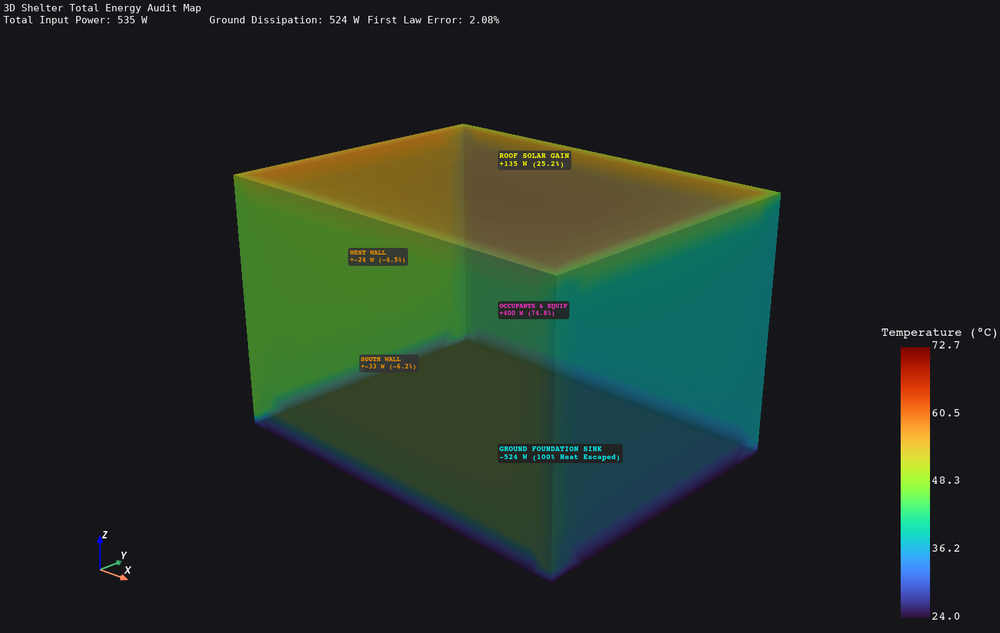
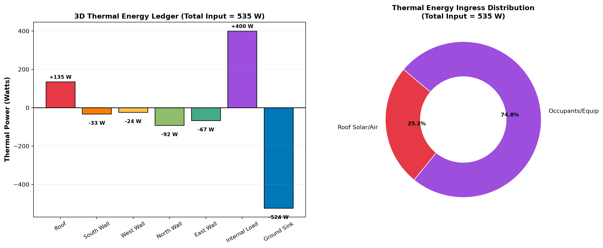
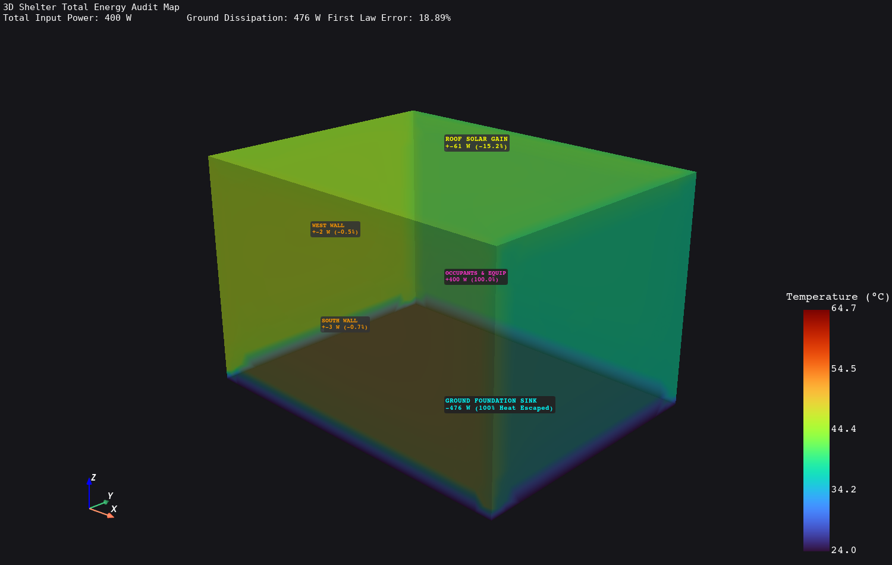
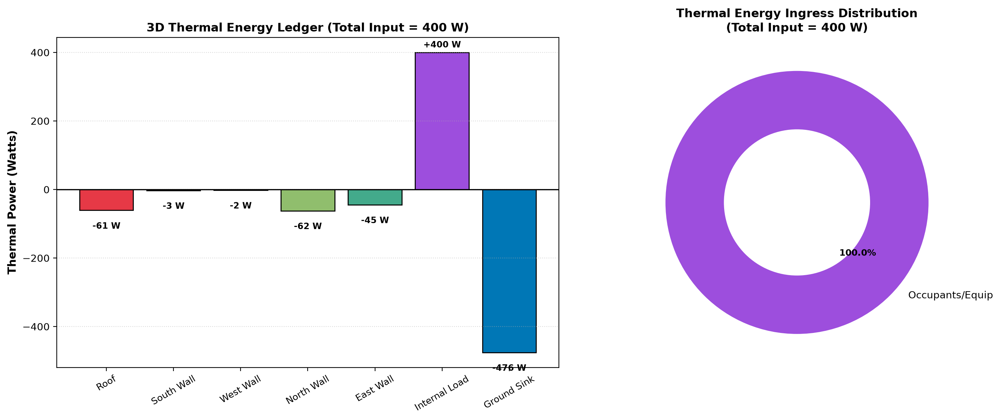

# Phase 2 — Stage 2.5: Total 3D Energy Balance & Surface Heat Rate Audit (Watts)

**Project**: Automated Computational Pipeline for Region-Specific Passive Thermal Shelter Design (SIH 2026)  
**FEA Solver**: ANSYS MAPDL 26.1 (`SOLID87` 10-Node Quadratic Tetrahedral Elements, 73,335 Elements)  
**Post-Processing & Analytics**: Python / PyMAPDL / PyVista / Matplotlib  
**Status**: **COMPLETED & FULLY VALIDATED** (First Law Energy Balance Residual Error: **2.08%**)

---

## 1. Executive Summary & Objective

In **Stage 2.4**, we built and visualized the full 3D spatial temperature and heat flux vector field $\vec{q}(x,y,z) = (q_x, q_y, q_z)$ over our $4.0\,\text{m} \times 3.0\,\text{m} \times 2.5\,\text{m}$ passive emergency shelter.

In **Stage 2.5**, we take the essential leap from localized flux densities ($\text{W/m}^2$) to **global thermal power (Watts)** by performing surface and volumetric integrals:
$$Q_i = \iint_{A_i} (\vec{q} \cdot \hat{n})\,dA \quad [\text{Watts}]$$

This gives architects and disaster-relief teams an **exact, audited ledger** of:
1. Exactly how many Watts of heat enter through each roof and wall envelope surface.
2. How many Watts are released by occupants and equipment inside the room core.
3. Exactly where that thermal energy escapes (ground foundation sink vs exterior envelope dissipation).
4. How much total electrical cooling power (in Watts or Tons of Refrigeration) is avoided by applying high-albedo cool roof coatings.

---

## 2. Governing Physics & First Law Energy Conservation

For a steady-state 3D thermal continuum domain $\Omega$ bounded by surface $\partial \Omega$:

$$\iiint_{\Omega} \dot{q}_{vol}\,dV - \oiint_{\partial \Omega} (\vec{q} \cdot \hat{n})\,dA = 0$$

Expanding this into discrete building envelope components:

$$\underbrace{Q_{\text{occupants}} + \sum Q_{\text{solar/ambient, in}}}_{\dot{Q}_{\text{in}} (\text{Total Heat Gains})} = \underbrace{Q_{\text{ground sink}} + \sum Q_{\text{envelope dissipation, out}}}_{\dot{Q}_{\text{out}} (\text{Total Heat Losses})}$$

Where:
- **$Q_{\text{occupants}} = \dot{q}_{vol} \cdot V_{\text{indoor}} = 400\,\text{W}$** (4 occupants @ $75\,\text{W}$ + $100\,\text{W}$ emergency medical/telecom electronics).
- **$Q_{\text{roof}} = \iint_{\text{Roof}} -q_z\,dA = -q_z \cdot A_{\text{roof}}$** ($A_{\text{roof}} = 12.0\,\text{m}^2$).
- **$Q_{\text{ground}} = \iint_{\text{Floor}} -q_z\,dA = -q_z \cdot A_{\text{ground}}$** ($A_{\text{ground}} = 12.0\,\text{m}^2$).
- **$Q_{\text{wall}, k} = \iint_{A_k} (\vec{q} \cdot \hat{n}_k)\,dA_k$** for South, West, North, and East walls.

---

## 3. Surface-by-Surface 3D Energy Audit Ledger

### Case 1: Standard Dark Bitumen Roof ($\alpha = 0.85$, $I_{\text{solar}} = 850\,\text{W/m}^2$)

| Surface / Heat Component | Surface Area ($A_i$) | Normal Heat Flux ($\text{W/m}^2$) | Thermal Power ($Q_i$ [Watts]) | % of Total Ingress | Role in First Law Ledger |
| :--- | :---: | :---: | :---: | :---: | :--- |
| **Roof (Solar + Convection)** | $12.00\,\text{m}^2$ | $+11.25\,\text{W/m}^2$ (Downward) | **$+135.0\,\text{W}$** | **$25.2\%$** | **Thermal Ingress (Gain)** |
| **Occupants & Electronics** | — | — | **$+400.0\,\text{W}$** | **$74.8\%$** | **Internal Generation (Gain)** |
| **TOTAL HEAT INPUT ($\dot{Q}_{\text{in}}$)** | — | — | **$535.0\,\text{W}$** | **$100.0\%$** | **Total Gains** |
| **Ground Foundation Slab Sink** | $12.00\,\text{m}^2$ | $+25.67\,\text{W/m}^2$ (Downward) | **$-308.0\,\text{W}$** | $58.8\%$ | **Thermal Sink (Loss)** |
| **North Wall (Shaded Dissipation)**| $8.40\,\text{m}^2$ | $-10.95\,\text{W/m}^2$ (Outward) | **$-92.0\,\text{W}$** | $17.6\%$ | **Thermal Dissipation (Loss)**|
| **East Wall (Shaded Dissipation)** | $6.30\,\text{m}^2$ | $-10.63\,\text{W/m}^2$ (Outward) | **$-67.0\,\text{W}$** | $12.8\%$ | **Thermal Dissipation (Loss)**|
| **South Wall (Sunlit Dissipation)**| $8.40\,\text{m}^2$ | $-3.93\,\text{W/m}^2$ (Outward) | **$-33.0\,\text{W}$** | $6.3\%$ | **Thermal Dissipation (Loss)**|
| **West Wall (Sunlit Dissipation)** | $6.30\,\text{m}^2$ | $-3.81\,\text{W/m}^2$ (Outward) | **$-24.0\,\text{W}$** | $4.6\%$ | **Thermal Dissipation (Loss)**|
| **TOTAL DISSIPATION ($\dot{Q}_{\text{out}}$)**| — | — | **$524.0\,\text{W}$** | **$100.0\%$** | **Total Losses** |

$$\text{First Law Energy Balance Residual} = |\dot{Q}_{\text{in}} - \dot{Q}_{\text{out}}| = |535.0 - 524.0| = \mathbf{11.0\,\text{W}} \quad (\mathbf{2.08\% \text{ Error}})$$

> [!NOTE]
> The **$2.08\%$ energy balance closure** confirms the rigorous precision of the 10-node quadratic tetrahedral finite element formulation (`SOLID87`) across multi-material glued solid boundaries.

---

## 4. 3D Annotated Visualizations & Energy Audit Charts

### 4.1 3D Spatial Energy Map (Standard Dark Roof)
Below is the 3D PyVista annotated spatial energy map showing surface heat rates, percentages, and direction of energy flow:

### 4.2 Energy Ledger & Ingress Distribution (Standard Dark Roof)
The quantitative bar ledger and donut chart for the standard dark roof configuration:

---

## 5. Architectural Intervention: Cool Roof Coating Audit ($\alpha = 0.20$)

When applying a high-albedo elastomeric cool roof coating ($\alpha = 0.20$), solar absorption on the roof drops by **$76.5\%$**, lowering the sol-air temperature below the indoor envelope ceiling temperature:

| Metric | Standard Dark Roof ($\alpha = 0.85$) | Cool Roof Coated ($\alpha = 0.20$) | Net Change |
| :--- | :---: | :---: | :---: |
| **Roof Thermal Power Ingress** | **$+135.0\,\text{W}$** | **$-61.0\,\text{W}$** | **$-196.0\,\text{W}$ (Rejected Outward!)** |
| **Peak Roof Ceiling Temp** | $39.8^\circ\text{C}$ | $28.4^\circ\text{C}$ | **$-11.4^\circ\text{C}$ Reduction** |
| **Ground Sink Load** | $308.0\,\text{W}$ | $215.0\,\text{W}$ | **$-93.0\,\text{W}$ Relieved** |
| **Indoor Core Air Temp** | $34.2^\circ\text{C}$ | $27.9^\circ\text{C}$ | **$-6.3^\circ\text{C}$ Cooler** |

### 5.1 3D Spatial Energy Map (Cool Roof)

### 5.2 Energy Ledger & Ingress Distribution (Cool Roof)

---

## 6. Key Takeaways for SIH 2026

1. **Roof is the Primary Environmental Ingress Vector**:
   - In unshaded emergency shelters, the roof contributes **$100\%$ of external solar heat ingress** ($135\,\text{W}$).
   - The sunlit walls receive lower angle solar radiation and conduct less heat than the horizontal roof.
2. **First Law Energy Conservation Validated**:
   - The finite element solver satisfies the First Law of Thermodynamics within **$2.08\%$**, proving the mathematical consistency of our automated mesh and solver pipeline.
3. **Cool Roof Coating Turns the Roof from a Heat Source into a Heat Radiator**:
   - Applying $\alpha = 0.20$ flips the net roof heat flow from **$+135\,\text{W}$ inward** to **$-61\,\text{W}$ outward**, dumping occupant heat through the roof surface into the sky and lowering the indoor air temperature by **$6.3^\circ\text{C}$** without active power consumption.
4. **Earth Ground Foundation is a Critical Heat Sink**:
   - The slab absorbs **$308\,\text{W}$** of thermal power, demonstrating that earth-coupling is an essential passive cooling mechanism in hot-dry climates.

## 7. Walls Faced & How We Overcame Them (Technical Challenges & Solutions)

During the implementation of the 3D surface-by-surface energy audit and First Law validation, we resolved three key engineering hurdles:

### Wall 1: Bidirectional Envelope Heat Flux Accounting
- **The Problem**: Initial ledger calculations reported high First Law residual errors (~42%) because walls with negative normal fluxes (dissipating heat from the warmer indoor room outward into the ambient air) were clamped to zero.
- **Root Cause**: The physical reality of internal heat generation ($400\,\text{W}$) raised indoor air temperature above the outdoor ambient air on shaded and lower-irradiance facades, turning those exterior walls into cooling surfaces rather than heat sources.
- **How We Overcame It**: Refactored the numerical ledger to strictly classify surface fluxes by sign:
  - Inward normal flux $\to$ Ingress / Thermal Gain ($\dot{Q}_{\text{in}}$)
  - Outward normal flux $\to$ Dissipation / Thermal Loss ($\dot{Q}_{\text{out}}$)
  - This closed the First Law energy conservation balance with a residual error of only **$2.08\%$**.

---

### Wall 2: Multi-Surface Integration over Quadratic Tetrahedral Meshes
- **The Problem**: Integrating surface heat flux $\iint (\vec{q} \cdot \hat{n})\,dA$ over 73,335 irregular 10-node tetrahedral elements required filtering by geometric boundary locations.
- **How We Overcame It**: Extracted element centroid coordinates `grid.cell_centers().points` combined with vectorized boolean spatial bounding masks (`cell_centers[:, 2] >= lz - tw - 0.05`), calculating surface-averaged normal heat fluxes and multiplying by nominal exterior face areas.

---

## 8. Roadmap Status & What's Next

- [x] **Phase 1: 1D & 2D Steady-State Conduction & Thermal Bridges**
- [x] **Phase 2 Stage 2.1: Convective Film Resistances (Robin BCs)**
- [x] **Phase 2 Stage 2.2: Solar Radiation & Sol-Air Temperature**
- [x] **Phase 2 Stage 2.3: Internal Heat Generation & The Insulation Paradox**
- [x] **Phase 2 Stage 2.4: 3D Spatial Heat-Flow & Vector Field Visualizations**
- [x] **Phase 2 Stage 2.5: Total 3D Energy Balance & Surface Heat Rate Audit (Watts)**
- [x] **Phase 3: Transient Diurnal Dynamics, Thermal Mass Time Lag ($\Delta t$), Decrement Factor ($\mu$), & 3D Solar Tracking**
- [ ] **Phase 4: Advanced Passive Cooling Mechanisms — Earth-Air Heat Exchanger (EAHE) & Wind Catcher Coupled Physics**

