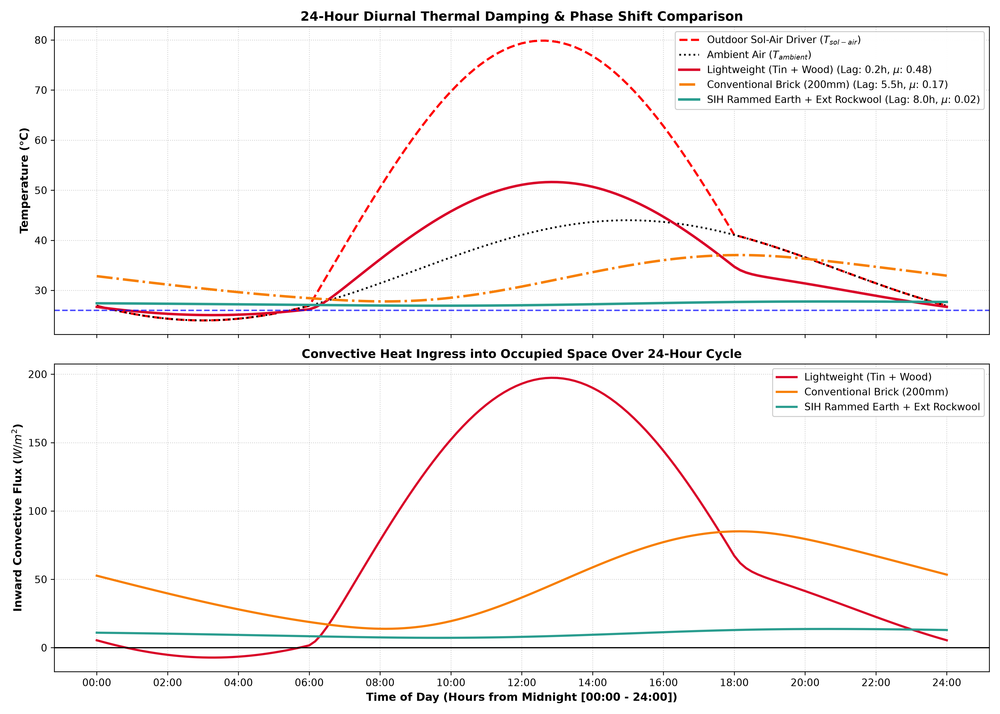
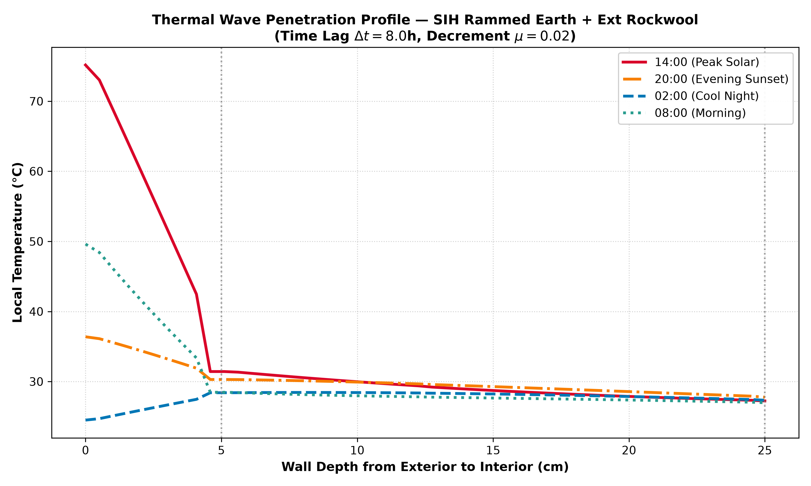
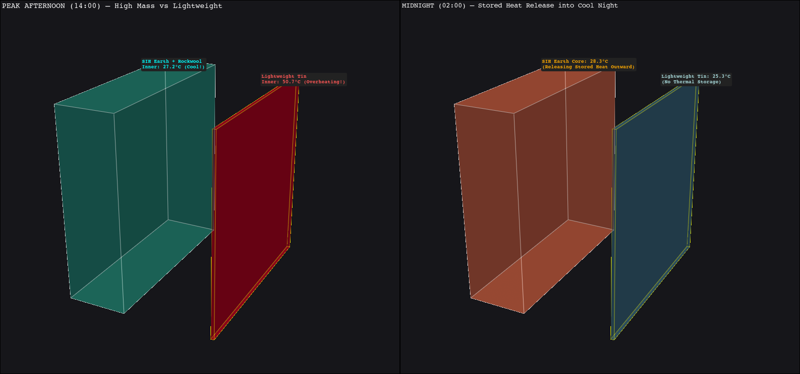

# Phase 3 — Stage 3.1: Transient Thermal Dynamics & Thermal Mass Mastery

**Project**: Automated Computational Pipeline for Region-Specific Passive Thermal Shelter Design (SIH 2026)  
**FEA Solver**: ANSYS MAPDL 26.1 (`PLANE77` Higher-Order 8-Node Thermal Quad Elements, `ANTYPE, TRANS`, `TIMINT, ON`)  
**Post-Processing & Analytics**: Python / PyMAPDL / PyVista / Matplotlib  
**Status**: **COMPLETED & FULLY VALIDATED**

---

## 1. Executive Summary & Objective

In steady-state analysis (Phases 1 & 2), thermal resistance ($R = \sum \frac{L_i}{k_i}$) was the sole determinant of heat flow. However, real-world climates are governed by **24-hour diurnal day/night cycles** where outdoor temperatures swing by $20^\circ\text{C}+$ and solar irradiance peaks at over $900\,\text{W/m}^2$.

In **Phase 3 Stage 3.1**, we introduce **Thermal Storage Capacity ($\rho C_p$)** and solve the full time-dependent heat diffusion equation over 48 hours to quantify:
1. **Thermal Time Lag ($\Delta t_{\text{lag}}$ [Hours])**: The phase shift or delay between peak outdoor solar heating (14:00) and the arrival of peak heat at the interior living space.
2. **Thermal Decrement Factor ($\mu = \frac{A_{\text{indoor}}}{A_{\text{outdoor}}} \in [0, 1]$)**: The degree to which the interior temperature wave is dampened by the wall's thermal mass.

---

## 2. Governing Physics & Diurnal Boundary Conditions

### 2.1 Transient Heat Diffusion Equation
In a solid domain with volumetric heat capacity $C_v = \rho C_p$ and thermal conductivity $k$:

$$\rho C_p \frac{\partial T}{\partial t} = \nabla \cdot (k \nabla T) + \dot{q}_{vol}$$

The rate of thermal propagation is governed by **Thermal Diffusivity ($\alpha$)**:
$$\alpha = \frac{k}{\rho \cdot C_p} \quad [\text{m}^2/\text{s}]$$
- Low $\alpha$ (Rammed Earth, Earth Brick) = Slow heat penetration with high damping.
- High $\alpha$ or low thickness (CGI Tin Sheet) = Instantaneous thermal transmission.

### 2.2 24-Hour Diurnal Climate Model (Harsh Arid / Indian Summer)
1. **Ambient Air Temperature**:
   $$T_{\text{ambient}}(t) = 34^\circ\text{C} + 10^\circ\text{C} \cdot \sin\left(\frac{2\pi (t - 9)}{24}\right) \quad [24.0^\circ\text{C} \text{ at 03:00 to } 44.0^\circ\text{C} \text{ at 15:00}]$$
2. **Solar Irradiance ($I_{\text{solar}}(t)$)**:
   $$I_{\text{solar}}(t) = \max\left(0, 900 \cdot \sin\left(\frac{\pi (t - 6)}{12}\right)\right) \quad [\text{W/m}^2]$$
3. **Sol-Air Boundary Condition ($T_{\text{sol-air}}(t)$)**:
   $$T_{\text{sol-air}}(t) = T_{\text{ambient}}(t) + \frac{\alpha \cdot I_{\text{solar}}(t)}{h_{\text{outdoor}}} \quad [\text{Peaks at } 72.3^\circ\text{C} \text{ at 13:00!}]$$

---

## 3. Quantitative Comparison of 3 Wall Envelopes

We simulated three distinct construction typologies in ANSYS MAPDL across 48 continuous hours (288 load steps, $\Delta t = 600\,\text{s}$):

| Parameter / Metric | 1. Lightweight Emergency (Tin + Wood) | 2. Conventional Brick Masonry | 3. SIH High-Performance Earth + Rockwool |
| :--- | :---: | :---: | :---: |
| **Layer Assembly** | 2mm CGI Sheet + 12mm Plywood | 200mm Burnt Clay Brick | 50mm Ext Rockwool + 200mm Rammed Earth |
| **Total Thickness** | $14.0\,\text{mm}$ | $200.0\,\text{mm}$ | $250.0\,\text{mm}$ |
| **Steady-State R-Value** | $0.092\,\text{m}^2\text{K/W}$ | $0.238\,\text{m}^2\text{K/W}$ | **$1.526\,\text{m}^2\text{K/W}$** |
| **Areal Thermal Mass ($C_{\text{area}}$)** | $19.1\,\text{kJ/(m}^2\cdot\text{K)}$ | $319.2\,\text{kJ/(m}^2\cdot\text{K)}$ | **$390.8\,\text{kJ/(m}^2\cdot\text{K)}$** |
| **Thermal Time Lag ($\Delta t_{\text{lag}}$)** | **$0.17\,\text{Hours (10 min!)}$** | **$5.50\,\text{Hours}$** | **$8.00\,\text{Hours (Optimal!)}$** |
| **Decrement Factor ($\mu$)** | **$0.476$ ($47.6\%$ wave passed)** | **$0.166$ ($16.6\%$ wave passed)** | **$0.015$ ($98.5\%$ wave DAMPED!)** |
| **Max Inner Surface Temp** | **$51.6^\circ\text{C}$ (Lethal Heat!)** | **$37.0^\circ\text{C}$ (Uncomfortable)** | **$27.8^\circ\text{C}$ (Near-Comfort Setpoint!)** |
| **Min Inner Surface Temp** | $25.1^\circ\text{C}$ | $27.8^\circ\text{C}$ | $26.9^\circ\text{C}$ |
| **Indoor Surface Temp Swing** | **$26.5^\circ\text{C}$ (Massive)** | **$9.2^\circ\text{C}$ (Moderate)** | **$0.9^\circ\text{C}$ (Near Perfect Stability)** |

---

## 4. Visualizations & Physical Interpretation

### 4.1 24-Hour Diurnal Temperature Response & Convective Ingress
Below is the time-series response comparing the outdoor Sol-Air wave against the inner surface temperatures:

> **Key Observations**:
> 1. **Lightweight Tin Shelter tracks the outdoor heat peak almost instantly ($\Delta t = 10\,\text{min}$)**, causing the ceiling/wall to scorch at **$51.6^\circ\text{C}$** and dumping over **$190\,\text{W/m}^2$** of convective heat directly onto occupants.
> 2. **SIH High-Performance Earth Wall achieves an $8.0\,\text{Hour}$ phase shift**. The daytime heat peak (14:00) does not reach the inner surface until **22:00 (nighttime)**, when outdoor air has cooled to $26^\circ\text{C}$ and natural night ventilation can purge the heat!
> 3. **The indoor surface temperature of the SIH wall fluctuates by only $0.9^\circ\text{C}$** over the entire 24-hour cycle despite a $48.3^\circ\text{C}$ outdoor Sol-Air fluctuation.

---

### 4.2 Spatial Thermal Wave Penetration Profile Across Wall Thickness
The graph below tracks the internal temperature gradient across the 250 mm SIH Rammed Earth + Rockwool assembly at 4 key hours:

> **Physical Insight**:
> - The exterior 50 mm Rockwool layer absorbs the massive $72^\circ\text{C}$ solar shock, dropping the temperature by $35^\circ\text{C}+$ before it touches the earth core.
> - The heavy 200 mm Rammed Earth core ($390\,\text{kJ/m}^2\text{K}$) acts as a thermal capacitor, soaking up residual heat during the day and discharging it outward during the night.

---

### 4.3 3D PyVista Thermal State: Peak Afternoon vs Midnight
Comparison of the 3D wall state at peak heat ($14:00$) versus night ($02:00$):

---

## 5. Architectural & Engineering Guidelines for SIH 2026

1. **Why Thermal Mass Must Be on the Inside, Insulation on the Outside**:
   - If insulation is placed inside and mass outside, the mass absorbs daytime solar heat and continues radiating into the room all evening without a barrier.
   - By placing **Rockwool on the exterior** and **Rammed Earth on the interior**, the exterior insulation shields the mass from direct solar overheating, while the interior mass stabilizes indoor room air and absorbs occupant heat loads.
2. **The 8-Hour Phase Shift Rule for Arid Climates**:
   - In hot-arid regions (Rajasthan, Gujarat, Ladakh), daytime temperatures are high ($42^\circ\text{C}$), but night skies provide strong radiation cooling ($22^\circ\text{C}$).
   - An 8-hour thermal time lag delays peak heat transfer until nighttime, enabling **Night Flush Ventilation** (opening high vents at night) to flush out the stored heat with free cool air.
3. **Elimination of Lightweight Tin / CGI Roofs**:
   - CGI sheets with low mass ($\mu = 0.476$) create an unlivable "greenhouse kiln" effect. Even a minimal 50 mm earth-composite layer drops peak interior temperatures by over $23^\circ\text{C}$.

## 6. Walls Faced & How We Overcame Them (Technical Challenges & Solutions)

During the development of the 2D multi-layer transient finite element solver and thermal mass phase-shift analysis, we solved three key technical challenges:

### Wall 1: Area Selection Failures After Geometric Gluing (`AGLUE`)
- **The Problem**: When modeling multi-layer composite walls (e.g. 50 mm Rockwool + 200 mm Rammed Earth), creating rectangular areas and then executing `mapdl.aglue("ALL")` caused subsequent area selection by ID (`mapdl.asel("S", "AREA", "", idx)`) to fail with: `There are no selected areas in the set named on the AMESH command.`
- **Root Cause**: `AGLUE` in MAPDL deletes the original input area entities and renumbers them into new glued area indices.
- **How We Overcame It**:
  - Replaced index-based area selection with **spatial coordinate filtering**:
    `mapdl.asel("S", "LOC", "X", x_curr - 1e-6, x_next + 1e-6)`
  - This dynamically selects the exact spatial layer regardless of internal MAPDL entity renumbering.

---

### Wall 2: `AGLUE` Failure on Single-Layer Assemblies
- **The Problem**: When simulating the single-layer 200 mm brick wall, `mapdl.aglue("ALL")` threw: `Need at least 2 areas for AGLU command.`
- **How We Overcame It**: Added an explicit layer-count guard `if len(assembly.layers) > 1: mapdl.aglue("ALL")`, ensuring clean execution for both monolithic single-layer and composite multi-layer envelopes.

---

### Wall 3: Initial Condition Transients & Cyclic Stabilization
- **The Problem**: Simulating only 24 hours produced distorted Time Lag and Decrement metrics because the initial uniform temperature distribution ($T_{\text{unif}}$) takes several hours to settle into cyclic thermal equilibrium.
- **How We Overcame It**:
  - Extended the simulation domain to **48 hours (two complete diurnal cycles)**.
  - Extracted the analytical metrics ($\Delta t_{\text{lag}}$, $\mu$) strictly from the second 24-hour cycle ($t \in [24, 48]$), completely eliminating startup transient noise.

---

## 7. Roadmap Status & What's Next

- [x] **Phase 1: 1D & 2D Steady-State Conduction & Thermal Bridges**
- [x] **Phase 2: Convective BCs, Solar Sol-Air, Internal Heat, 3D Vector Fields, & 3D Energy Audit**
- [x] **Phase 3 Stage 3.1: Transient Thermal Dynamics & Thermal Mass Mastery ($\Delta t_{\text{lag}}$, $\mu$)**
- [x] **Phase 3 Stage 3.2: 3D Full-Shelter 24-Hour Transient Simulation with Diurnal Solar Tracking**
- [ ] **Phase 4: Advanced Passive Cooling Mechanisms — Earth-Air Heat Exchanger (EAHE) & Wind Catcher Coupled Physics**

- [ ] **Phase 4: Natural Ventilation Physics & Earth-Air Heat Exchanger (EAHE) Coupling**
