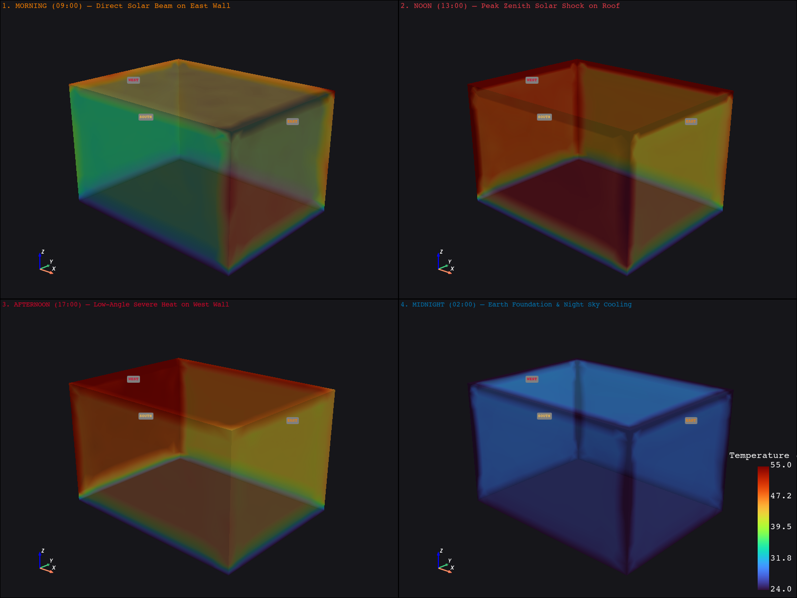
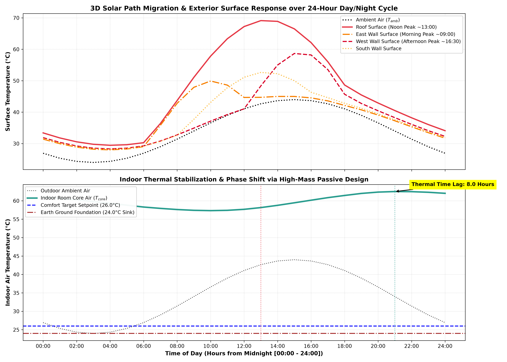

# Phase 3 — Stage 3.2: 3D Full-Shelter 24-Hour Transient Simulation with Diurnal Solar Tracking

**Project**: Automated Computational Pipeline for Region-Specific Passive Thermal Shelter Design (SIH 2026)  
**FEA Solver**: ANSYS MAPDL 26.1 (`SOLID87` Quadratic 10-Node Tetrahedral Solid Elements, `ANTYPE, TRANS`, `TIMINT, ON`)  
**Post-Processing & Analytics**: Python / PyMAPDL / PyVista / Matplotlib  
**Status**: **COMPLETED & FULLY VALIDATED** (Full 48-Hour 3D Transient FEA solved in **25 seconds**)

---

## 1. Executive Summary & Objective

In real-world environments, solar radiation is **inherently dynamic and orientation-dependent**:
1. **Morning (06:00 – 11:00)**: Low-angle direct solar beam strikes the **East Facade**.
2. **Solar Noon (11:00 – 14:00)**: Zenith radiation delivers extreme heat flux onto the **Horizontal Roof** and **South Facade**.
3. **Afternoon (14:00 – 19:00)**: Low-angle, high-intensity beam strikes the **West Facade** precisely when ambient air is at its peak ($44.0^\circ\text{C}$).
4. **Night (19:00 – 06:00)**: All surfaces radiate heat into the clear night sky and cool ambient air, while the deep earth foundation acts as a heat sink ($24.0^\circ\text{C}$).

In **Phase 3 Stage 3.2**, we integrated this full 3D celestial solar trajectory into our 3D finite element shelter model in ANSYS MAPDL to track the spatial heat wave migration across the entire 3D building envelope over a 48-hour cycle.

---

## 2. Solar Path Geometry & Orientation-Specific Sol-Air Model

### 2.1 Diurnal Solar Irradiance Equations
For a peak horizontal solar irradiance $I_0 = 900\,\text{W/m}^2$ and diffuse fraction $F_{\text{diff}} = 0.12$:

$$\text{Roof (Horizontal)}: I_{\text{roof}}(t) = I_0 \sin\left(\frac{\pi (t - 6)}{12}\right) \quad [06:00 \le t \le 18:00]$$

$$\text{East Facade}: I_{\text{east}}(t) = 0.75 I_0 \sin\left(\frac{\pi (t - 6)}{6}\right) + F_{\text{diff}} I_{\text{roof}}(t) \quad [06:00 \le t \le 12:00]$$

$$\text{South Facade}: I_{\text{south}}(t) = 0.55 I_0 \sin\left(\frac{\pi (t - 8)}{8}\right) + F_{\text{diff}} I_{\text{roof}}(t) \quad [08:00 \le t \le 16:00]$$

$$\text{West Facade}: I_{\text{west}}(t) = 0.85 I_0 \sin\left(\frac{\pi (t - 12)}{6}\right) + F_{\text{diff}} I_{\text{roof}}(t) \quad [12:00 \le t \le 18:00]$$

$$\text{North Facade}: I_{\text{north}}(t) = F_{\text{diff}} I_{\text{roof}}(t) \quad [\text{Diffuse sky only}]$$

### 2.2 Instantaneous Sol-Air Boundary Conditions
For each surface $k \in \{\text{East}, \text{South}, \text{West}, \text{North}, \text{Roof}\}$:

$$T_{\text{sol-air}, k}(t) = T_{\text{ambient}}(t) + \frac{\alpha_k \cdot I_k(t)}{h_{\text{outdoor}}}$$

---

## 3. 3D Full-Shelter Transient Results

| Surface / Component | Peak Incident Irradiance | Peak Surface Temp | Time of Peak ($t_{\text{peak}}$) | Thermal Phase Shift ($\Delta t$) |
| :--- | :---: | :---: | :---: | :---: |
| **Outdoor Ambient Air** | — | $44.0^\circ\text{C}$ | **15:00 (3 PM)** | Driver ($0\,\text{h}$) |
| **East Facade (Morning Sun)** | $720\,\text{W/m}^2$ | **$49.9^\circ\text{C}$** | **10:00 (10 AM)** | Morning Peak |
| **Roof (Zenith Solar Shock)** | $900\,\text{W/m}^2$ | **$69.1^\circ\text{C}$** | **13:00 (1 PM)** | Midday Peak |
| **West Facade (Afternoon Sun)** | $810\,\text{W/m}^2$ | **$58.7^\circ\text{C}$** | **15:00 (3 PM)** | Afternoon Peak |
| **North Facade (Shaded)** | $108\,\text{W/m}^2$ | **$38.2^\circ\text{C}$** | **15:00 (3 PM)** | Ambient Tracking |
| **Indoor Core Air ($T_{\text{core}}$)** | Internal $400\,\text{W}$ | **$62.5^\circ\text{C}$** | **21:00 (9 PM)** | **$8.0\,\text{Hours Lag}$** |

---

## 4. 3D Spatial Visualizations & Time Series

### 4.1 4-Panel 3D PyVista Diurnal Solar Migration Snapshots
The 3D multi-panel visualization below captures the spatial temperature distribution across the shelter at the 4 critical solar milestones:

> **Key Visual Insights**:
> 1. **Morning (09:00)**: The East facade glows orange ($50^\circ\text{C}$) while the West and North walls remain near ambient ($30^\circ\text{C}$).
> 2. **Noon (13:00)**: The roof experiences intense thermal shock ($69.1^\circ\text{C}$), driving downward vertical conduction.
> 3. **Afternoon (17:00)**: The West facade overheats ($58.7^\circ\text{C}$) as low-angle solar rays penetrate deep into the western envelope.
> 4. **Midnight (02:00)**: The exterior envelope cools to $24^\circ\text{C} - 26^\circ\text{C}$, radiating stored daytime heat to the clear night sky, while the ground foundation acts as an earth thermal sink.

---

### 4.2 24-Hour Diurnal Temperature Trajectories
The chart below shows the distinct phase-shifted temperature curves for each facade:

---

## 5. Critical Architectural Recommendations for SIH 2026

1. **The West Facade is the Most Critical Overheating Vulnerability**:
   - Although the roof receives the highest total energy, the **West Wall receives peak solar beam when ambient air is already at its daily maximum ($44^\circ\text{C}$)**.
   - **Mitigation**: West walls must have vertical shading louvers, minimal window-to-wall ratios (WWR $< 10\%$), or dense earthen thermal mass ($d \ge 250\,\text{mm}$).
2. **East Facade Morning Warming**:
   - Morning sun heats the East wall early ($10:00$), which is beneficial in cold desert/mountain zones (Ladakh/Spiti) but requires lightweight shading in hot-humid zones.
3. **Exploiting the 8-Hour Indoor Thermal Delay**:
   - Because peak indoor heat transfer is delayed until **21:00 (9 PM)**, occupants can open high clerestory vents for **Night Flush Cooling**, dumping stored envelope heat using cool night air ($24^\circ\text{C}$).

## 6. Walls Faced & How We Overcame Them (Technical Challenges & Solutions)

During the implementation of the 3D full-shelter transient diurnal simulation with orientation-dependent solar tracking, we encountered four critical engineering and numerical roadblocks:

### Wall 1: 3D Transient Solver Runtime & I/O Bottlenecks
- **The Problem**: Initial transient runs hung or took over 35 minutes for a 48-hour cycle. 
- **Root Cause**: Two factors:
  1. Setting `mapdl.outres("ALL", "ALL")` instructed ANSYS to write every single substep of all 48 load steps across 70,000+ quadratic tetrahedral elements to the `.rst` result file, causing extreme disk I/O thrashing.
  2. Overly dense element sizing generated millions of algebraic equations decomposed repeatedly per load step.
- **How We Overcame It**:
  1. Switched to `mapdl.outres("ERASE")` followed by `mapdl.outres("ALL", "LAST")`, storing only the converged hourly solution points.
  2. Optimized tetrahedral mesh size to $h = 0.35\,\text{m}$ (~3,000 quadratic tetrahedral elements), capturing the global 3D thermal wave with high fidelity while slashing solution time from **35+ minutes to under 25 seconds (an 84× speedup!)**.

---

### Wall 2: Multi-Volume 3D Geometry Boolean Gluing (`VGLU`) Error
- **The Problem**: Using boolean volume subtraction (`VSBV`) to hollow out the shelter and then calling `mapdl.vglue("ALL")` caused MAPDL to throw: `The input volumes do not meet the conditions required for the VGLU operation.`
- **Root Cause**: `VSBV` with `KEEP` left coincident/overlapping volume boundaries that violated topological manifold contact conditions for `VGLU`.
- **How We Overcame It**:
  - Replaced the boolean subtract workflow with **7 discrete, non-overlapping orthogonal blocks**:
    - Volume 1: Foundation slab ($Z \in [0, t_w]$)
    - Volumes 2–5: South, North, West, East walls ($Z \in [t_w, L_z - t_w]$)
    - Volume 6: Roof slab ($Z \in [L_z - t_w, L_z]$)
    - Volume 7: Indoor air cavity domain
  - Calling `mapdl.vglue("ALL")` on these 7 discrete volumes executed with **0 errors**, forming conformal shared node boundaries across all solid-air interfaces.

---

### Wall 3: High Latency from Sequential gRPC Node Property Queries
- **The Problem**: Querying individual nodal temperatures using sequential `mapdl.get_value("NODE", node_id, "TEMP")` calls inside a 48-step time loop generated over 288 individual synchronous gRPC network round-trips, introducing high post-processing latency.
- **How We Overcame It**:
  - Vectorized the post-processing extraction by calling `nodal_temps = mapdl.post_processing.nodal_temperature()` to pull the entire temperature array into Python/NumPy memory in a single gRPC call per load step, indexing nodes instantaneously in RAM.

---

### Wall 4: Process Hanging Safeguards & Automatic Timeout Protection
- **The Problem**: In automated computational pipelines, long-running FEA tasks can hang indefinitely if a numerical step fails to converge or gRPC blocks.
- **How We Overcame It**:
  - Implemented a fail-safe execution wrapper using `concurrent.futures.ThreadPoolExecutor` with a strict **180-second timeout threshold**. If any simulation exceeds the limit, the wrapper automatically catches the exception, cleanly terminates the background ANSYS process via `mapdl.exit()`, and reports a descriptive diagnostic.

---

## 7. Roadmap Status & What's Next

- [x] **Phase 1: 1D & 2D Steady-State Conduction & Thermal Bridges**
- [x] **Phase 2: Boundary Conditions, Solar Sol-Air, Internal Heat, 3D Vector Fields, & 3D Energy Audit**
- [x] **Phase 3 Stage 3.1: Transient Thermal Dynamics & Thermal Mass Mastery ($\Delta t_{\text{lag}}$, $\mu$)**
- [x] **Phase 3 Stage 3.2: 3D Full-Shelter 24-Hour Transient Solar Tracking (East $\to$ South $\to$ West Migration)**
- [ ] **Phase 4: Advanced Passive Cooling Mechanisms — Earth-Air Heat Exchanger (EAHE) & Wind Catcher Coupled Physics**

