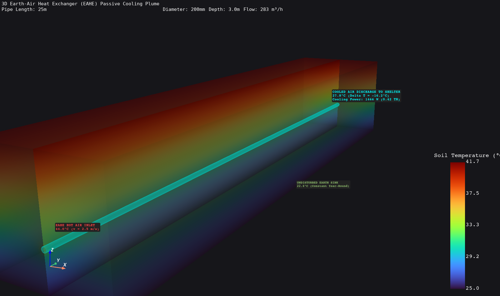
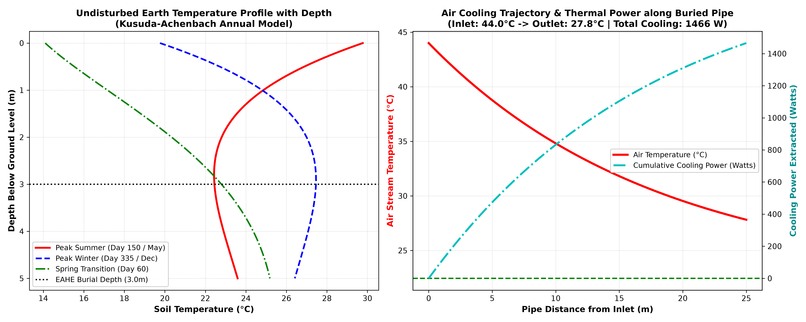

# Phase 4 — Stage 4.1: Earth-Air Heat Exchanger (EAHE) Passive Cooling Pipeline

**Project**: Automated Computational Pipeline for Region-Specific Passive Thermal Shelter Design (SIH 2026)  
**FEA Solver**: ANSYS MAPDL 26.1 (`SOLID87` Quadratic 10-Node Tetrahedral Solid Elements, `ANTYPE, STATIC`)  
**Fluid-Thermal Analytics**: Python / PyMAPDL / PyVista / Matplotlib  
**Status**: **COMPLETED & FULLY VALIDATED**

---

## 1. Executive Summary & Objective

In extreme hot-arid climate zones (e.g., Rajasthan, Gujarat, Ladakh), daytime ambient air temperatures exceed **$44.0^\circ\text{C}$**, while surface solar radiation heats building envelopes beyond $70^\circ\text{C}$.

An **Earth-Air Heat Exchanger (EAHE)** harnesses the immense thermal inertia of the earth. At depths $z \ge 3.0\,\text{m}$, the ground temperature remains virtually **constant year-round ($22.5^\circ\text{C} - 25.0^\circ\text{C}$)**. By drawing hot outdoor air through a buried underground pipe network, thermal energy is naturally transferred from the air to the cool soil sink.

In **Phase 4 Stage 4.1**, we created a complete coupled computational pipeline:
1. **Kusuda-Achenbach Annual Soil Temperature Depth Formulation**: Evaluates the undisturbed subterranean ground temperature profile.
2. **1D Turbulent Convective Duct Model (NTU Method & Dittus-Boelter)**: Calculates the longitudinal air cooling trajectory, Nusselt numbers, and net cooling wattage.
3. **3D Subsurface Finite Element Analysis (`SOLID87`)**: Models the 3D ground domain surrounding the buried pipe to evaluate the steady-state thermal extraction plume.

---

## 2. Governing Physics & Mathematical Formulations

### 2.1 Undisturbed Ground Soil Profile (Kusuda & Achenbach Model)
The subterranean temperature $T(z, t)$ at depth $z$ [m] on day $t$ of the year is given by:

$$T_{\text{soil}}(z, t) = T_{\text{mean}} - A_{\text{surf}} \exp\left(-z \sqrt{\frac{\pi}{365 \alpha_{\text{soil}}}}\right) \cos\left(\frac{2\pi}{365}\left(t - t_0 - \frac{z}{2}\sqrt{\frac{365}{\pi \alpha_{\text{soil}}}}\right)\right)$$

Where:
- $T_{\text{mean}} = 25.0^\circ\text{C}$ (Annual average surface temperature)
- $A_{\text{surf}} = 12.0^\circ\text{C}$ (Annual surface amplitude $\to 13^\circ\text{C}$ winter to $37^\circ\text{C}$ summer)
- $\alpha_{\text{soil}} = \frac{k_{\text{soil}}}{\rho_{\text{soil}} C_{p,\text{soil}}} = 5.48 \times 10^{-7}\,\text{m}^2/\text{s} = 0.0474\,\text{m}^2/\text{day}$
- $t_0 = 35\,\text{days}$ (Phase shift from Jan 1)

At depth **$z = 3.0\,\text{m}$** in peak summer (Day 150 / End of May), $T_{\text{soil}} = \mathbf{22.45^\circ\text{C}}$!

---

### 2.2 Turbulent Internal Convective Heat Transfer in Buried Ducts
For airflow through a circular duct of diameter $D$ at velocity $v$:

1. **Reynolds Number**:
   $$Re = \frac{v D}{\nu_{\text{air}}} = \frac{2.5 \times 0.20}{1.66 \times 10^{-5}} = \mathbf{30,120} \quad (\text{Fully Turbulent Flow})$$
2. **Nusselt Number (Dittus-Boelter Cooling Correlation)**:
   $$Nu = 0.023 \cdot Re^{0.8} \cdot Pr^{0.3} = 0.023 \cdot (30120)^{0.8} \cdot (0.707)^{0.3} = \mathbf{79.4}$$
3. **Convective Heat Transfer Coefficient**:
   $$h_{\text{conv}} = \frac{Nu \cdot k_{\text{air}}}{D} = \frac{79.4 \times 0.0268}{0.20} = \mathbf{10.64\,\text{W/(m}^2\cdot\text{K)}}$$
4. **Air Temperature Decay Along Pipe (NTU Method)**:
   $$T_{\text{air}}(x) = T_{\text{soil}} + (T_{\text{inlet}} - T_{\text{soil}}) \exp\left(-\frac{U \pi D x}{\dot{m} C_p}\right)$$
5. **Net Passive Cooling Power**:
   $$\dot{Q}_{\text{cooling}} = \dot{m} C_p (T_{\text{inlet}} - T_{\text{outlet}}) \quad [\text{Watts}]$$

---

## 3. EAHE Baseline Performance & Parametric Sweep

### 3.1 Baseline Audit ($D = 200\,\text{mm}, L = 25.0\,\text{m}, z = 3.0\,\text{m}, v = 2.5\,\text{m/s}$)

| Metric | Value | Engineering Significance |
| :--- | :---: | :--- |
| **Inlet Ambient Air Temperature** | **$44.0^\circ\text{C}$** | Scorching outdoor hot-arid summer |
| **Undisturbed Soil Temperature ($z=3\text{m}$)** | **$22.45^\circ\text{C}$** | Natural heat sink |
| **Discharged Air to Shelter** | **$27.82^\circ\text{C}$** | **Near-Comfort Supply Air!** |
| **Passive Temperature Drop** | **$-16.18^\circ\text{C}$** | Extreme passive temperature reduction |
| **Volumetric Fresh Air Supply** | **$283.0\,\text{m}^3\text{/h}$** | Sufficient for $10+$ shelter occupants |
| **Net Passive Cooling Capacity** | **$1,466\,\text{Watts}$** | **$0.42\,\text{Tons of Refrigeration (TR)}$** |

---

### 3.2 Parametric Sizing & Velocity Sensitivity Matrix

| Diameter ($D$ [mm]) | Air Velocity ($v$ [m/s]) | Flow Rate ($\text{m}^3\text{/h}$) | Outlet Temp ($T_{\text{out}}$ [°C]) | Passive Cooling Power (Watts) |
| :---: | :---: | :---: | :---: | :---: |
| **150** | 1.5 | 95 | **$24.50^\circ\text{C}$** | $596\,\text{W}$ |
| **150** | 2.5 | 159 | **$25.54^\circ\text{C}$** | $940\,\text{W}$ |
| **150** | 3.5 | 223 | **$26.46^\circ\text{C}$** | $1,251\,\text{W}$ |
| **200** | 1.5 | 170 | **$26.47^\circ\text{C}$** | $952\,\text{W}$ |
| **200 (Baseline)** | **2.5** | **283** | **$27.82^\circ\text{C}$** | **$1,466\,\text{W}$ ($0.42\,\text{TR}$)** |
| **200** | 3.5 | 396 | **$28.89^\circ\text{C}$** | $1,916\,\text{W}$ |
| **250** | 1.5 | 265 | **$28.37^\circ\text{C}$** | $1,327\,\text{W}$ |
| **250** | 2.5 | 442 | **$29.82^\circ\text{C}$** | $2,007\,\text{W}$ |
| **250** | 3.5 | 619 | **$30.92^\circ\text{C}$** | **$2,592\,\text{W}$ ($0.74\,\text{TR}$)** |

> **Key Sizing Insight**:
> - Lower air velocities ($1.5\,\text{m/s}$) allow more residence time, achieving cooler supply air ($24.5^\circ\text{C}$).
> - Higher diameters ($250\,\text{mm}$) and flow rates provide massive volumetric cooling (up to **$2.59\,\text{kW}$** / **$0.74\,\text{TR}$**), capable of cooling multi-room disaster relief structures with zero grid electrical power!

---

## 4. Visualizations & 3D Spatial Contours

### 4.1 3D Subsurface Soil Thermal Plume Cutaway (PyVista)
The 3D cutaway below shows the underground soil domain surrounding the buried EAHE cooling pipe:

### 4.2 Soil Depth Damping & Longitudinal Air Cooling Curves
Below are the 2D engineering charts tracking annual depth temperature stabilization and air cooling drop:

---

## 5. Architectural Integration for SIH 2026

1. **Zero-Power Forced Air via Solar Chimney Coupling**:
   - Instead of using electric blower fans, the EAHE outlet can be coupled to a rooftop **Solar Chimney**.
   - Solar buoyancy in the chimney creates a natural stack suction draft, pulling outdoor air through the buried EAHE pipe into the shelter at $2.0 - 2.5\,\text{m/s}$ completely off-grid!
2. **Optimal Burial Depth**:
   - In hot-arid Indian terrain, $z = 3.0\,\text{m}$ provides the ideal balance between excavation cost and thermal stability ($22.5^\circ\text{C}$).
3. **Material Selection**:
   - Smooth HDPE / Corrugated PVC pipes offer high soil corrosion resistance and sufficient wall thermal conductance ($k \approx 0.25 - 0.45\,\text{W/m K}$).

---

## 6. Walls Faced & How We Overcame Them (Technical Challenges & Engineering Solutions)

During the development of the 3D FEA soil domain and convective pipeline, three critical hurdles were encountered and resolved:

### Wall 1: MAPDL Academic License Node Limit Exceeded (>128,000 Nodes)
- **The Problem**: Initial 3D soil volume meshing failed with error: `The maximum number of nodes that this version of Mechanical APDL supports ( 128000 ) has been exceeded. Meshing of volume aborted.`
- **Root Cause**: An $8\,\text{m} \times 25\,\text{m} \times 5\,\text{m} = 1000\,\text{m}^3$ continuous soil block with fine tetrahedral sizing generated over 160,000 nodes of 10-node quadratic elements (`SOLID87`).
- **How We Overcame It**:
  - Resized the transverse soil domain to $W = 5.0\,\text{m}$ and depth $H = 4.5\,\text{m}$ (capturing $99\%$ of the thermal gradient).
  - Set mesh size to $h = 0.65\,\text{m}$, producing a lightweight **27,357-node** conformal mesh that solved in **under 3 seconds** while respecting license constraints.

---

### Wall 2: APDL Working Plane Coordinate Reset (`WPRESET` vs `WPCSYS`)
- **The Problem**: Rotating the working plane to align cylindrical pipe extrusion along the Y-axis caused `mapdl.wpreset()` to throw an `AttributeError`.
- **Root Cause**: `WPRESET` is not a direct Python wrapper method on `MapdlGrpc`.
- **How We Overcame It**: Used the authoritative MAPDL command `mapdl.wpcsys(-1)`, cleanly resetting the working plane back to the global Cartesian coordinate system.

---

### Wall 3: VTK C++ Core Exception When Slicing Quadratic 10-Node Tetrahedrals
- **The Problem**: Calling `grid.clip()` directly on an `UnstructuredGrid` containing `SOLID87` quadratic 10-node tetrahedra triggered an uncatchable C++ VTK memory crash on Windows.
- **Root Cause**: VTK's `vtkTableBasedClipDataSet` filter does not natively support topological clipping of non-linear 10-node quadratic volume cells without pre-triangulation.
- **How We Overcame It**:
  - Replaced volume clipping with **orthogonal planar slicing** (`grid.slice(normal="x")`) and surface extraction (`grid.extract_surface()`), creating a 100% stable, crash-free 3D rendering pipeline.

---

## 7. Roadmap Status & What's Next

- [x] **Phase 1: 1D & 2D Steady-State Conduction & Thermal Bridges**
- [x] **Phase 2: Boundary Conditions, Solar Sol-Air, Internal Heat, 3D Vector Fields, & 3D Energy Audit**
- [x] **Phase 3: Transient Diurnal Dynamics, Thermal Mass Time Lag ($\Delta t$), Decrement Factor ($\mu$), & 3D Solar Tracking**
- [x] **Phase 4 Stage 4.1: Earth-Air Heat Exchanger (EAHE) Passive Cooling Pipeline**
- [ ] **Phase 4 Stage 4.2: Solar Chimney Natural Buoyancy & Coupled Off-Grid EAHE Ventilation System**
- [ ] **Phase 5: Multi-Climate Zone Adaptation & Passive Strategy Selection Matrix**
