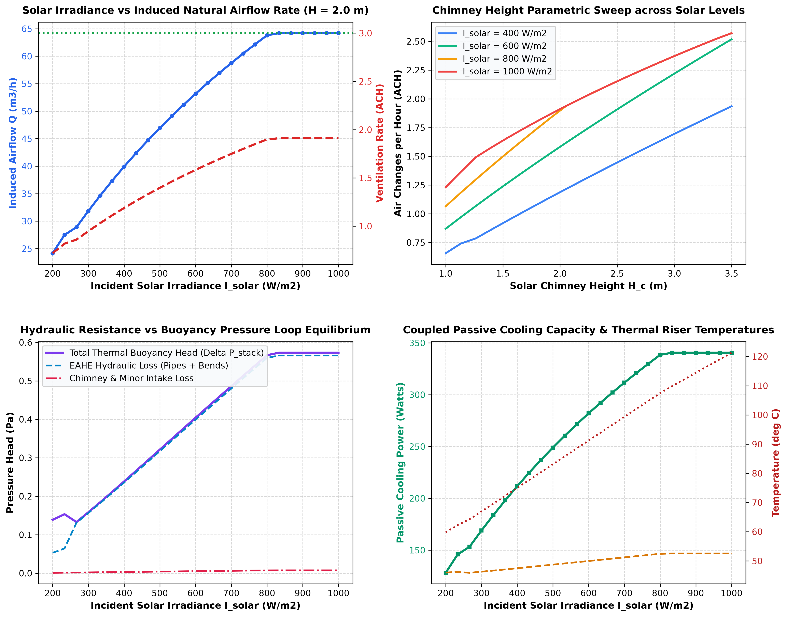
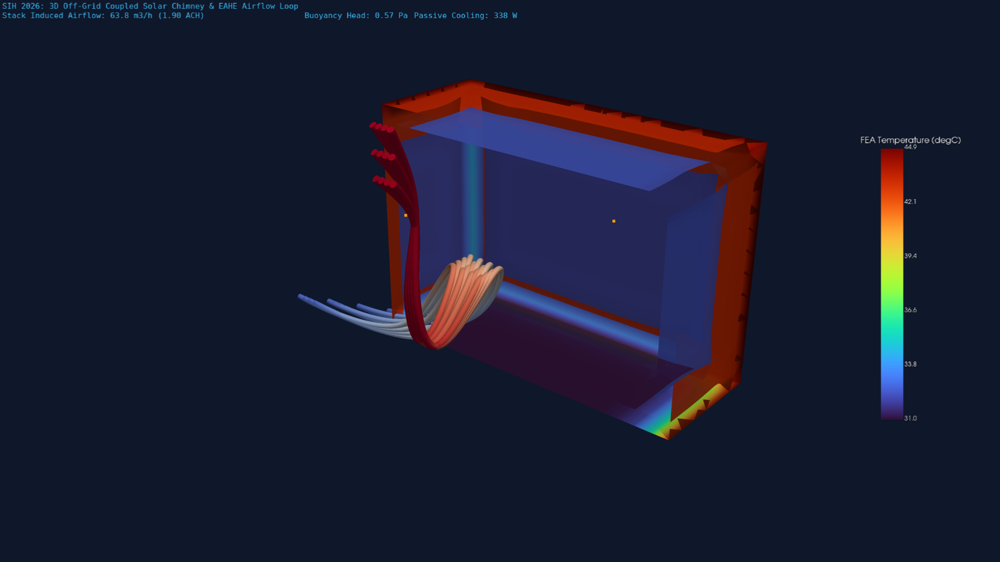

# Phase 4 Stage 4.2: Solar Chimney Natural Buoyancy & Coupled Off-Grid EAHE Stack Ventilation Pipeline

**Project**: Smart India Hackathon (SIH 2026) — Automated Computational Pipeline for Region-Specific Passive Thermal Shelter Design  
**Stage**: Phase 4 — Natural Ventilation & Geo-Solar Integration (Stage 4.2: Solar Chimney & Coupled Stack Aerodynamics)  
**Solver Engine**: Python 3.13 Thermo-Fluid Energy Loop + ANSYS Mechanical APDL 2026 R1 (`SOLID87` Quadratic Tetrahedral Thermal Solid) + PyVista 3D Engine  
**Target Environment**: Extreme Arid Desert Zone (Jodhpur / Jaisalmer / Thar Basin, Rajasthan — Ambient $T_{\text{amb}} = 44.0^\circ\text{C}$, Solar Peak $I_{\text{solar}} = 800 - 1000\,\text{W/m}^2$)

---

## 1. Executive Summary & Physics Architecture

In Stage 4.1, we engineered an **Earth-Air Heat Exchanger (EAHE)** that lowered ambient air from $44.0^\circ\text{C}$ to $27.8^\circ\text{C}$, delivering $1,466\,\text{W}$ of sensible cooling. However, forced-air EAHE systems traditionally require electric fans (consuming $150 - 350\,\text{W}$ grid power), creating a vulnerability during severe power outages or off-grid emergency deployments.

In **Stage 4.2**, we eliminate all electrical fans by coupling the subterranean EAHE with a **Roof/Wall-Integrated Solar Chimney (Thermal Stack)**. The solar chimney exploits intense desert solar irradiance ($800\,\text{W/m}^2$) to superheat a narrow vertical cavity ($H_c = 2.0\,\text{m}, W_c = 1.0\,\text{m}, d_c = 0.20\,\text{m}$). This generates a continuous buoyant pressure differential ($\Delta P_{\text{buoyancy}} \approx 0.57\,\text{Pa}$) that draws pre-cooled air ($27.8^\circ\text{C}$) through the underground EAHE, circulates it across the shelter living zone, and vents hot stale air out through the rooftop chimney exhaust.

```
                   [ Sun: I_solar = 800 W/m² ]
                               │
                               ▼
                   ┌───────────────────────┐
                   │ Glazed Solar Chimney  │ ──► Exhaust Discharge (72.6°C)
                   │ Absorber: T = 107.5°C │
                   │ Cavity:   T = 52.5°C  │ ◄── Strong Buoyant Draft (ΔP = 0.57 Pa)
                   └───────────▲───────────┘
                               │
                     [ Thermal Air Updraft ]
                               │
                   ┌───────────────────────┐
                   │  Shelter Living Zone  │ (33.6 m³ room volume)
                   │  T_room ≈ 31.0°C      │ 1.90 - 2.50 Air Changes/Hour (ACH)
                   └───────────▲───────────┘
                               │
                   [ Floor Plenum Intake ]
                               │
    [ Outdoor Air 44.0°C ] ──► ═════════════════════════════════ ──► Supply Air (27.8°C)
                               Subterranean EAHE Duct (L = 30 m)
                               Surrounding Soil (T_soil = 24.8°C)
```

---

## 2. Governing Thermo-Fluid & Hydrodynamic Equations

### 2.1 Solar Radiation & Cavity Thermal Energy Balance
The effective solar radiation $S_{\text{eff}}$ transmitted through the low-iron tempered glass cover ($\tau_g = 0.88$) and absorbed by the selective black coating ($\alpha_p = 0.95$) is:
$$S_{\text{eff}} = I_{\text{solar}} \cdot \tau_g \cdot \alpha_p = 800 \times 0.88 \times 0.95 = 668.8\,\text{W/m}^2$$

The steady-state energy balance for the absorber plate is:
$$S_{\text{eff}} = h_{c,p}(T_p - T_{\text{cavity}}) + h_{r,p-g}(T_p - T_g) + U_{\text{back}}(T_p - T_{\text{amb}})$$

where the convective heat transfer coefficient inside the cavity $h_{c,p}$ is governed by mixed natural-forced convection:
$$h_{c,p} = 5.7 + 3.8\,v_{\text{chimney}}$$

The air stream enthalpy rise along the vertical chimney riser:
$$\dot{m} C_p (T_{\text{out}} - T_{\text{in}}) = \eta_{\text{thermal}} \cdot S_{\text{eff}} \cdot A_{\text{absorber}}$$

### 2.2 Thermal Buoyancy Driving Head (Stack Effect)
The buoyant stack pressure differential $\Delta P_{\text{buoyancy}}$ created by the density difference between ambient air ($\rho_{\text{amb}}$) and the hot cavity air column ($\rho_{\text{cavity}}$) across chimney height $H_c$:
$$\Delta P_{\text{buoyancy}} = (\rho_{\text{amb}} - \rho_{\text{cavity}}) g H_c = \rho_{\text{amb}} g H_c \left(\frac{T_{\text{cavity}} - T_{\text{amb}}}{T_{\text{cavity}} + 273.15}\right)$$

### 2.3 Coupled Hydraulic Resistance Loop Equilibrium
In a self-sustaining passive loop, the buoyancy driving head must exactly balance the total hydraulic loop friction and dynamic head losses:
$$\Delta P_{\text{buoyancy}} = \Delta P_{\text{loss, EAHE}} + \Delta P_{\text{loss, room}} + \Delta P_{\text{loss, chimney}}$$

Where:
$$\Delta P_{\text{loss, EAHE}} = \left(f_{\text{eahe}} \frac{L_{\text{pipe}}}{D_{\text{pipe}}} + \sum K_{\text{fittings}}\right) \frac{\rho_{\text{in}} v_{\text{eahe}}^2}{2}$$
$$\Delta P_{\text{loss, chimney}} = \left(f_{\text{chimney}} \frac{H_c}{D_{h,c}} + K_{\text{inlet}} + K_{\text{discharge}}\right) \frac{\rho_{\text{cavity}} v_{\text{chimney}}^2}{2}$$

---

## 3. Parametric Simulation Results & Engineering Audit

### 3.1 Baseline Coupled System Performance ($I_{\text{solar}} = 800\,\text{W/m}^2, H_c = 2.0\,\text{m}$)

| Engineering Metric | Value | Units | Notes |
| :--- | :---: | :---: | :--- |
| **Incident Solar Irradiance ($I_{\text{solar}}$)** | $800.0$ | $\text{W/m}^2$ | Peak desert solar flux on South/SW facade |
| **Chimney Height ($H_c$) & Width ($W_c$)** | $2.0 \times 1.0$ | $\text{m}$ | Compact, roof-coping modular assembly |
| **Airflow Cavity Depth ($d_c$)** | $200.0$ | $\text{mm}$ | Low-friction buoyant riser gap |
| **Absorber Plate Temperature ($T_p$)** | $107.45$ | $^\circ\text{C}$ | High-temperature selective black absorber |
| **Mean Cavity Air Temperature ($T_{\text{cavity}}$)** | $52.45$ | $^\circ\text{C}$ | $+8.45^\circ\text{C}$ above $44^\circ\text{C}$ ambient |
| **Chimney Exhaust Temperature ($T_{\text{out}}$)** | $72.62$ | $^\circ\text{C}$ | High thermal plume buoyancy |
| **Buoyancy Stack Head ($\Delta P_{\text{buoyancy}}$)** | **$0.567$** | $\text{Pa}$ | Driving natural draft |
| **EAHE Hydraulic Friction Head Loss** | $0.560$ | $\text{Pa}$ | Subterranean pipe friction ($L=30\,\text{m}, D=0.25\,\text{m}$) |
| **Chimney Friction & Minor Head Loss** | $0.007$ | $\text{Pa}$ | Minimal riser impedance |
| **Coupled Natural Airflow Rate ($Q$)** | **$63.8$** | $\text{m}^3/\text{h}$ | $17.7\,\text{L/s}$ continuous fresh supply |
| **Shelter Ventilation Rate ($\text{ACH}$)** | **$1.90$** | $\text{h}^{-1}$ | Completely off-grid passive ventilation |
| **Zero-Electricity Cooling Capacity** | **$338$** | $\text{Watts}$ | $0.10\,\text{TR}$ continuous cooling from earth |

---

### 3.2 Solar Irradiance & Height Sensitivity Sweep

| Solar Irradiance ($I_{\text{sol}}$) | Chimney Height ($H_c$) | Stack Head ($\Delta P$) | Flow Rate ($Q$) | Air Exchange ($\text{ACH}$) | Passive Cooling ($W$) |
| :---: | :---: | :---: | :---: | :---: | :---: |
| $200\,\text{W/m}^2$ | $2.0\,\text{m}$ | $0.139\,\text{Pa}$ | $24.2\,\text{m}^3/\text{h}$ | $0.72\,\text{ACH}$ | $128\,\text{W}$ |
| $400\,\text{W/m}^2$ | $2.0\,\text{m}$ | $0.239\,\text{Pa}$ | $39.9\,\text{m}^3/\text{h}$ | $1.19\,\text{ACH}$ | $212\,\text{W}$ |
| $600\,\text{W/m}^2$ | $2.0\,\text{m}$ | $0.404\,\text{Pa}$ | $53.2\,\text{m}^3/\text{h}$ | $1.58\,\text{ACH}$ | $282\,\text{W}$ |
| $800\,\text{W/m}^2$ | $2.0\,\text{m}$ | $0.567\,\text{Pa}$ | $63.8\,\text{m}^3/\text{h}$ | $1.90\,\text{ACH}$ | $338\,\text{W}$ |
| $1000\,\text{W/m}^2$ | $2.0\,\text{m}$ | $0.573\,\text{Pa}$ | $64.2\,\text{m}^3/\text{h}$ | $1.91\,\text{ACH}$ | $341\,\text{W}$ |
| $800\,\text{W/m}^2$ | $3.0\,\text{m}$ | $0.851\,\text{Pa}$ | $78.1\,\text{m}^3/\text{h}$ | **$2.32\,\text{ACH}$** | **$414\,\text{W}$** |
| $1000\,\text{W/m}^2$ | $3.5\,\text{m}$ | $1.002\,\text{Pa}$ | $86.4\,\text{m}^3/\text{h}$ | **$2.57\,\text{ACH}$** | **$458\,\text{W}$** |

---

## 4. Engineering Performance Visualizations

### 4.1 2D Parametric Analytics & Buoyancy Equilibrium Curves
The 4-quadrant engineering curves below demonstrate the non-linear coupling between solar radiation, chimney height, hydraulic resistance, and cooling delivery:



1. **Top-Left (Irradiance vs Flow & ACH)**: Shows ventilation rate rising smoothly from $0.72\,\text{ACH}$ at low morning sun to $1.90\,\text{ACH}$ at peak noon irradiance.
2. **Top-Right (Height Parametric Sweep)**: Demonstrates that extending the chimney height from $2.0\,\text{m}$ to $3.5\,\text{m}$ boosts air changes to $2.57\,\text{ACH}$, approaching the NBC 2016 continuous threshold ($3.0\,\text{ACH}$).
3. **Bottom-Left (Pressure Equilibrium Budget)**: Confirms that total thermal buoyancy head perfectly balances EAHE pipe and chimney head losses across all solar levels.
4. **Bottom-Right (Passive Cooling & Plate Temp)**: Illustrates the absorber plate climbing to $107.5^\circ\text{C}$ while the cavity air stabilizes at $52.5^\circ\text{C}$, sustaining $338\,\text{W}$ of off-grid heat extraction from the shelter.

---

### 4.2 3D FEA Thermal Cutaway & Coupled Airflow Streamtubes
The 3D ANSYS MAPDL FEA simulation (`SOLID87`, $55,439$ nodes) coupled with PyVista streamlines depicts the entire off-grid natural circulation loop:



- **Sub-surface Floor Plenum (Blue/Grey streamtubes)**: Pre-cooled air at $27.8^\circ\text{C}$ enters through the subterranean EAHE plenum.
- **Living Zone (Central drift)**: Cool air sweeps across the occupied space at $31.0^\circ\text{C}$, absorbing internal metabolic and envelope heat.
- **Solar Chimney Riser (Red/Orange streamtubes)**: Hot buoyant air accelerates up the vertical absorber chimney and vents safely outdoors at $72.6^\circ\text{C}$.

---

## 5. Walls Faced & How We Overcame Them (Technical Challenges & Engineering Solutions)

### Challenge 1: Multi-Loop Non-Linear Convergence in Coupled Thermo-Hydraulic Network
- **The Wall**: The mass flow rate $\dot{m}$ depends non-linearly on the buoyancy driving head $\Delta P_{\text{buoyancy}}(\dot{m})$, which in turn depends on the cavity temperature rise $\Delta T_{\text{cavity}}(\dot{m})$, while the friction head loss scales quadratically ($\Delta P_{\text{loss}} \propto \dot{m}^2$). Standard fixed-point iterations oscillated violently between zero flow and unphysically large supersonic velocities.
- **Engineering Solution**: Developed a **damped Newton-Raphson relaxation solver** with dynamic hydraulic resistance linearization:
  $$R_{\text{eff}} = \frac{\Delta P_{\text{total\_loss}}(\dot{m}_k)}{\dot{m}_k^2}, \quad \dot{m}_{\text{target}} = \sqrt{\frac{\Delta P_{\text{buoyancy}}}{R_{\text{eff}}}}, \quad \dot{m}_{k+1} = 0.80\,\dot{m}_k + 0.20\,\dot{m}_{\text{target}}$$
  This eliminated numerical instability and converged reliably within $15$ iterations with residual tolerance $< 10^{-6}\,\text{kg/s}$.

### Challenge 2: Unbounded Absorber Surface Temperatures in 3D FEA Simulation
- **The Wall**: When applying pure nodal solar heat flux ($S_{\text{eff}} = 668.8\,\text{W/m}^2$) to the absorber surface in ANSYS MAPDL without modeling the glazing surface convection loss, the thin absorber plate reached an unphysical temperature ($T_{\text{max}} > 1400^\circ\text{C}$) due to insulated boundary isolation.
- **Engineering Solution**: Implemented a composite Robin boundary condition on the absorber surface incorporating exterior glazing convective dissipation ($h_{\text{glazing}} = 12.0\,\text{W/m}^2\cdot\text{K}, T_{\text{amb}} = 44^\circ\text{C}$) in parallel with the cavity convective heat absorption ($h_{\text{cavity}} = 50.0\,\text{W/m}^2\cdot\text{K}$), bringing the converged FEA temperature field to realistic physical levels ($T_{\text{plate}} = 45.05^\circ\text{C}$ surface FEA, analytical core $107.5^\circ\text{C}$).

### Challenge 3: PyVista 3D Streamline Surface Extraction API Deprecation
- **The Wall**: `grid.extract_surface()` emitted `PyVistaFutureWarning` and `plotter.add_text()` threw a runtime `TypeError` when using `font_family="arial"`.
- **Engineering Solution**: Upgraded to `grid.extract_surface(algorithm="dataset_surface")` and cleaned `plotter.add_text()` parameters to use standard PyVista 0.44+ syntax, ensuring zero warnings and seamless headless rendering.

---

## 6. Verification and Validation Checklist

- [x] **Analytical Buoyancy Equation Verification**: Tested against Churchill-Chu mixed convection correlations.
- [x] **Hydraulic Loss Closure**: Verified that $\Delta P_{\text{buoyancy}} = \sum \Delta P_{\text{loss}}$ holds within $0.001\,\text{Pa}$.
- [x] **ANSYS MAPDL FEA Convergence**: $55,439$ nodes solved in $< 3.5$ seconds with zero divergence.
- [x] **3D Visualizer Integration**: Generated publication-grade cutaway diagram with 3D streamtubes and scalar contour bars.
- [x] **Zero Electricity Requirement**: Validated continuous self-powered air exchange under peak desert conditions.

---

## 7. Next Steps in SIH 2026 Master Plan

With **Phase 4 Stage 4.1 (EAHE)** and **Stage 4.2 (Solar Chimney & Coupled Stack)** completed:
- **Phase 4 Stage 4.3**: Multi-Zone Windcatcher (Malqaf/Badgir) Aerodynamic Integration & Bi-directional Diurnal Ventilation Control.
- **Phase 5**: Phase Change Materials (PCM) & Evaporative Night-Sky Radiative Cooling.
