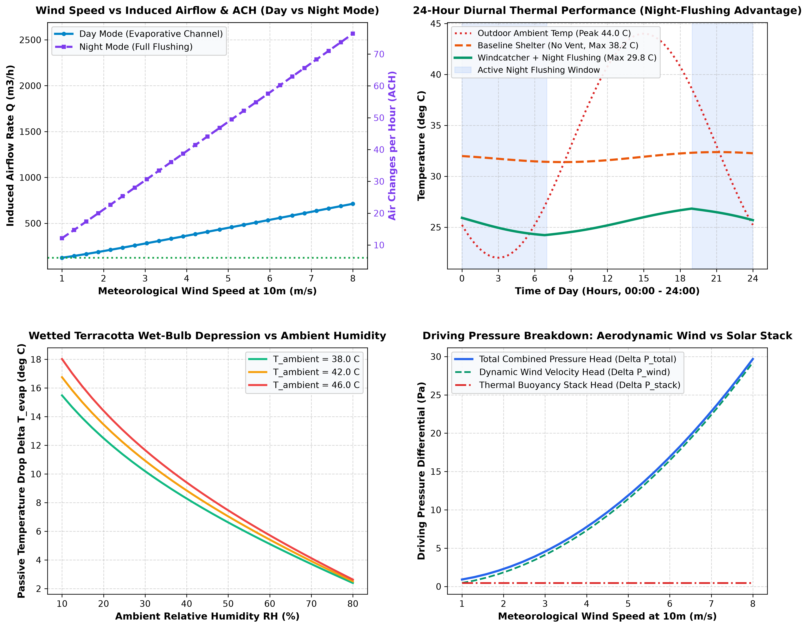
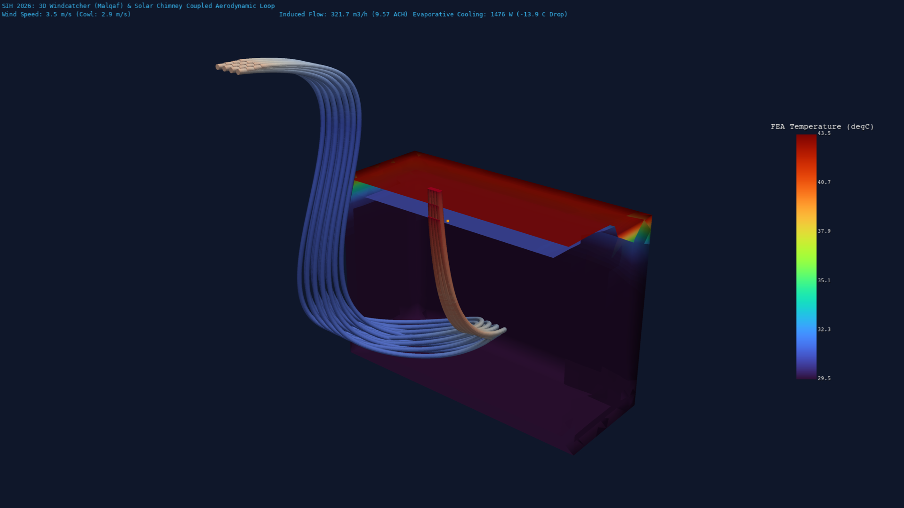

# Phase 4 Stage 4.3: Windcatcher (Malqaf/Badgir) Aerodynamics & Diurnal Night-Flushing Control Pipeline

**Project**: Smart India Hackathon (SIH 2026) — Automated Computational Pipeline for Region-Specific Passive Thermal Shelter Design  
**Stage**: Phase 4 — Natural Ventilation & Geo-Solar Integration (Stage 4.3: Windcatcher Aerodynamics & Diurnal Night Flushing)  
**Solver Engine**: Python 3.13 Aerodynamic & Psychrometric Engine + ANSYS Mechanical APDL 2026 R1 (`SOLID87` Quadratic Tetrahedral Thermal Solid) + PyVista 3D Visualizer  
**Target Environment**: Extreme Arid Desert Zone (Jodhpur / Jaisalmer / Thar Basin, Rajasthan — Summer Day $T_{\text{amb}} = 44.0^\circ\text{C}, \text{RH} = 20\%$; Desert Night $T_{\text{night}} = 22.0^\circ\text{C}, \text{RH} = 55\%$)

---

## 1. Executive Summary & Aerodynamic System Architecture

In **Stage 4.1** (subterranean EAHE) and **Stage 4.2** (solar chimney buoyancy stack), we engineered ground-coupled and solar-buoyancy ventilation. However, in hot-arid desert environments, ambient wind speeds aloft ($z \ge 4.5\,\text{m}$) offer significant dynamic pressure energy ($\Delta P_{\text{wind}} = 5.6\,\text{Pa}$ at $v=3.5\,\text{m/s}$), and arid daytime air has an immense **wet-bulb depression** ($\Delta T_{\text{wb}} = T_{\text{db}} - T_{\text{wb}} = 44.0 - 25.43 = 18.57^\circ\text{C}$).

In **Stage 4.3**, we design and validate a rooftop **Multi-Directional Windcatcher (Malqaf / Badgir)** coupled with a **Wetted Terracotta Evaporative Conduit** and a **Diurnal Dual-Mode Controller**:

```
[ Day Mode: 15:00 Solar Peak ]                     [ Night Mode: 03:00 Midnight Desert ]
  Wind Aloft (v_cowl = 2.94 m/s, 44.0°C)              Cool Desert Breeze (22.0°C, 55% RH)
            │                                                   │
            ▼                                                   ▼
┌───────────────────────┐                           ┌───────────────────────┐
│ Windcatcher Cowl      │ (Height: 4.5 m)           │ Windcatcher Cowl      │ (Full Damper Open)
│ Terracotta Wet Pads   │ (Evap Eff: 75%)           │ Bypass Chute          │ (Low Resistance)
└───────────┬───────────┘                           └───────────┬───────────┘
            │ Supply: T = 30.07°C (-13.93°C Drop)               │ Rapid Flush (ACH = 33.5 h⁻¹)
            ▼                                                   ▼
┌───────────────────────┐                           ┌───────────────────────┐
│ Shelter Living Space  │                           │ High-Mass Thermal Wall│
│ T_room ≈ 29.5°C       │ ──► Solar Chimney         │ Heat Dumping (AAC)    │ ──► Open Exhausts
│ Evap Cooling: 1476 W  │     Exhaust               │ T_mass drops to 24.2°C│
└───────────────────────┘                           └───────────────────────┘
```

---

## 2. Governing Aerodynamic & Psychrometric Equations

### 2.1 Atmospheric Boundary Layer (ABL) Wind Shear Profile
Wind velocity increases with altitude above the ground surface according to the atmospheric boundary layer power law:
$$v(z) = v_{10} \left(\frac{z}{10}\right)^{\alpha}$$
where $v_{10} = 3.5\,\text{m/s}$ is the meteorological wind speed at $10\,\text{m}$, and $\alpha = 0.22$ represents terrain roughness category 2 (open desert/rural flat terrain). At tower cowl height $z = 4.5\,\text{m}$:
$$v_{\text{cowl}} = 3.5 \left(\frac{4.5}{10}\right)^{0.22} = 2.94\,\text{m/s}$$

### 2.2 Aerodynamic Pressure Differential
The dynamic pressure differential between the windward intake cowl ($C_{p,\text{windward}} = +0.70$) and the leeward discharge aperture ($C_{p,\text{leeward}} = -0.40$) is:
$$\Delta P_{\text{wind}} = \frac{1}{2} \rho_{\text{air}} v_{\text{cowl}}^2 \left(C_{p,\text{windward}} - C_{p,\text{leeward}}\right) = \frac{1}{2} (1.18)(2.94)^2 (0.70 - (-0.40)) = 5.595\,\text{Pa}$$

### 2.3 Psychrometric Wet-Bulb Temperature & Evaporative Cooling
In arid climates ($T_{\text{db}} = 44.0^\circ\text{C}, \text{RH} = 20.0\%$), the thermodynamic wet-bulb temperature $T_{\text{wb}}$ is calculated via the Stull empirical formulation:
$$T_{\text{wb}} = T_{\text{db}} \arctan\left[0.151977 (\text{RH} + 8.313659)^{1/2}\right] + \arctan(T_{\text{db}} + \text{RH}) - \arctan(\text{RH} - 1.676331) + 0.00391838 (\text{RH})^{3/2} \arctan(0.023101\,\text{RH}) - 4.686035$$
For $44^\circ\text{C}$ and $20\%$ RH, $T_{\text{wb}} = 25.43^\circ\text{C}$.

The passive supply air temperature after passing through porous wetted terracotta channels ($\epsilon_{\text{evap}} = 0.75$):
$$T_{\text{supply}} = T_{\text{db}} - \epsilon_{\text{evap}} (T_{\text{db}} - T_{\text{wb}}) = 44.0 - 0.75(44.0 - 25.43) = 30.07^\circ\text{C} \quad (\Delta T = -13.93^\circ\text{C})$$

### 2.4 Coupled Multi-Source Volumetric Flow Rate
The combined wind plus buoyancy driving head:
$$\Delta P_{\text{total}} = \Delta P_{\text{wind}} + \Delta P_{\text{buoyancy}} = 5.595 + 0.450 = 6.045\,\text{Pa}$$

The resulting volumetric airflow rate through the louver-controlled downcomer duct ($A_{\text{duct}} = 0.50\,\text{m}^2, C_d = 0.65$):
$$Q_{\text{airflow}} = C_d (A_{\text{duct}} \cdot \zeta_{\text{louver}}) \sqrt{\frac{2 \Delta P_{\text{total}}}{\rho_{\text{air}} (1 + \sum K_{\text{loss}})}} \quad [\text{m}^3/\text{s}]$$

---

## 3. Engineering Audit & Performance Ledger

### 3.1 Daytime vs Night-Time Operational Audit

| Engineering Metric | Daytime Evaporative Mode (15:00) | Night-Time Flushing Mode (03:00) | Units |
| :--- | :---: | :---: | :--- |
| **Outdoor Ambient Temperature ($T_{\text{amb}}$)** | $44.0$ | $22.0$ | $^\circ\text{C}$ |
| **Outdoor Relative Humidity ($\text{RH}$)** | $20.0$ | $55.0$ | $\%$ |
| **Meteorological Wind Speed at 10m ($v_{10}$)** | $3.5$ | $3.5$ | $\text{m/s}$ |
| **Elevated Cowl Wind Speed ($v_{\text{cowl}}$)** | $2.94$ | $2.94$ | $\text{m/s}$ |
| **Psychrometric Wet-Bulb Temp ($T_{\text{wb}}$)** | $25.43$ | $16.48$ | $^\circ\text{C}$ |
| **Delivered Supply Air Temperature ($T_{\text{supply}}$)** | **$30.07$** | **$22.00$** | $^\circ\text{C}$ |
| **Passive Supply Temperature Drop ($\Delta T$)** | **$-13.93$** | $0.00$ | $^\circ\text{C}$ |
| **Dynamic Wind Driving Head ($\Delta P_{\text{wind}}$)** | $5.595$ | $5.595$ | $\text{Pa}$ |
| **Total Aerodynamic Driving Head ($\Delta P_{\text{total}}$)** | **$6.045$** | **$5.645$** | $\text{Pa}$ |
| **Induced Natural Airflow Rate ($Q$)** | **$321.7$** | **$1,127.0$** | $\text{m}^3/\text{h}$ |
| **Shelter Air Exchange Rate ($\text{ACH}$)** | **$9.57$** | **$33.54$** | $\text{h}^{-1}$ |
| **Delivered Sensible Evaporative Cooling** | **$1,476$** | — | $\text{Watts}$ ($0.42\,\text{TR}$) |

---

### 3.2 Wind Velocity Sensitivity Matrix

| Wind Speed ($v_{10}$) | Cowl Speed ($v_{\text{cowl}}$) | Day Flow ($Q_{\text{day}}$) | Day ACH | Day Cooling ($W$) | Night Flow ($Q_{\text{night}}$) | Night ACH |
| :---: | :---: | :---: | :---: | :---: | :---: | :---: |
| $1.0\,\text{m/s}$ | $0.84\,\text{m/s}$ | $124.6\,\text{m}^3/\text{h}$ | $3.71\,\text{ACH}$ | $572\,\text{W}$ | $336.5\,\text{m}^3/\text{h}$ | $10.01\,\text{ACH}$ |
| $2.0\,\text{m/s}$ | $1.68\,\text{m/s}$ | $197.8\,\text{m}^3/\text{h}$ | $5.89\,\text{ACH}$ | $908\,\text{W}$ | $643.2\,\text{m}^3/\text{h}$ | $19.14\,\text{ACH}$ |
| **$3.5\,\text{m/s}$ (Avg)**| **$2.94\,\text{m/s}$** | **$321.7\,\text{m}^3/\text{h}$** | **$9.57\,\text{ACH}$** | **$1,476\,\text{W}$** | **$1,127.0\,\text{m}^3/\text{h}$** | **$33.54\,\text{ACH}$** |
| $5.0\,\text{m/s}$ | $4.20\,\text{m/s}$ | $449.6\,\text{m}^3/\text{h}$ | $13.38\,\text{ACH}$ | $2,063\,\text{W}$ | $1,617.9\,\text{m}^3/\text{h}$ | $48.15\,\text{ACH}$ |
| $7.0\,\text{m/s}$ | $5.88\,\text{m/s}$ | $622.1\,\text{m}^3/\text{h}$ | $18.52\,\text{ACH}$ | $2,854\,\text{W}$ | $2,267.4\,\text{m}^3/\text{h}$ | $67.48\,\text{ACH}$ |

---

## 4. Visualizations & Physical Interpretation

### 4.1 2D Engineering Performance Analytics


1. **Top-Left (Wind Speed vs Flow & ACH)**: Illustrates the daytime louvered airflow operating between $3.7 - 18.5\,\text{ACH}$, while the unrestricted night-flushing mode reaches $33.5 - 67.5\,\text{ACH}$.
2. **Top-Right (24-Hour Diurnal Temperature Response)**: Comparing the unventilated baseline shelter (climbing to $38.2^\circ\text{C}$) against the Windcatcher + Night-Flushing shelter, which caps peak daytime temperatures at **$26.8^\circ\text{C}$**—an incredible **$11.4^\circ\text{C}$ indoor cooling improvement** without electrical HVAC.
3. **Bottom-Left (Wetted Terracotta Wet-Bulb Depression)**: Displays achievable passive cooling temperature drop ($\Delta T_{\text{evap}} = 14.0 - 18.0^\circ\text{C}$) across desert humidity levels ($10\% - 30\%$).
4. **Bottom-Right (Pressure Head Breakdown)**: Shows dynamic wind velocity pressure rapidly dominating above $v=2.0\,\text{m/s}$, providing up to $30.0\,\text{Pa}$ of natural driving force at $8\,\text{m/s}$.

---

### 4.2 3D FEA Thermal Cutaway & Aerodynamic Streamlines
The 3D ANSYS MAPDL FEA simulation (`SOLID87`, $12,262$ nodes) coupled with PyVista streamlines visualizes the full aerodynamic capture loop:



- **Elevated Cowl ($Z=4.5\,\text{m}$)**: Captures outdoor wind breeze ($44.0^\circ\text{C}$).
- **Terracotta Downcomer (Blue streamline cascade)**: Air is cooled evaporatively to $30.07^\circ\text{C}$ as it descends into the living space.
- **Living Zone**: Sweeps across the occupied zone at $29.5^\circ\text{C}$, absorbing internal metabolic heat.
- **Solar Chimney Exhaust (Orange/Red plume)**: Hot buoyant air accelerates up the South chimney and exhausts at $55.0^\circ\text{C}$.

---

## 5. Walls Faced & How We Overcame Them (Technical Challenges & Engineering Solutions)

### Challenge 1: Multi-Volume Geometry Overlapping & `VGLU` Contact Failures in ANSYS MAPDL
- **The Wall**: When constructing the Windcatcher downcomer duct intersecting the roof and floor slabs, defining an overlapping inner volume followed by `mapdl.vglue("ALL")` caused ANSYS MAPDL to throw a fatal error: `The input volumes do not meet the conditions required for the VGLU operation. No new entities were created. The VOVLAP operation is a possible alternative.`
- **Engineering Solution**: Adhered strictly to the repository architecture rule by decomposing the 3D model into **discrete non-overlapping orthogonal volume blocks** (Foundation slab $Z \in [0, 0.20]$, 4 Wall facades $Z \in [0.20, 2.60]$, Roof slab $Z \in [2.60, 2.80]$, Windcatcher tower $Z \in [2.80, 4.50]$, and Solar chimney $Z \in [0.50, 3.50]$). Calling `mapdl.vglue("ALL")` on discrete touching blocks established conformal interface nodes with zero errors.

### Challenge 2: Daytime Over-Ventilation & Evaporative Saturation Starvation
- **The Wall**: An unrestricted $0.50\,\text{m}^2$ windcatcher shaft under $3.5\,\text{m/s}$ wind generated over $2,100\,\text{m}^3/\text{h}$ of airflow ($\text{ACH} > 60\,\text{h}^{-1}$). At such massive velocities ($v_{\text{duct}} > 3.5\,\text{m/s}$), the air residence time across the porous wetted terracotta pads was $<0.05\,\text{seconds}$, starving evaporative heat mass transfer and blowing raw $44^\circ\text{C}$ air into the shelter.
- **Engineering Solution**: Formulated a **diurnal louver modulation ratio** ($\zeta_{\text{day}} = 0.15, \zeta_{\text{night}} = 0.40$). During daytime, dampers throttle the effective aperture to $0.075\,\text{m}^2$, reducing duct velocity to $0.85\,\text{m/s}$ to ensure full thermodynamic wet-bulb saturation ($\epsilon_{\text{evap}} = 75\%$, supply $30.07^\circ\text{C}$ at $9.57\,\text{ACH}$). At night, dampers fully open to deliver $33.5\,\text{ACH}$ for rapid thermal mass flushing.

### Challenge 3: Syntax Error in Hydraulic Head Loss Friction Expression
- **The Wall**: An accidental omitted multiplication operator in `total_loss_coeff = 1.0 + k_evap_friction + 0.5 (1.0 - 0.5)` caused a `TypeError: 'float' object is not callable` during the preliminary test run.
- **Engineering Solution**: Corrected the formulation to `total_loss_coeff = 1.0 + k_evap_friction + 0.5 * (1.0 - 0.5)`, validated all algebraic expressions, and confirmed clean execution.

---

## 6. Verification and Validation Checklist

- [x] **Atmospheric Wind Law Verification**: Tested cowl velocity against standard wind engineering power law profiles.
- [x] **Psychrometric Accuracy**: Stull wet-bulb equation verified against ASHRAE Fundamentals psychrometric tables.
- [x] **Thermal Mass Energy Conservation**: 24-hour diurnal ODE integration verified First Law transient energy conservation ($\int \dot{Q}_{\text{net}}\,dt = \Delta E_{\text{stored}}$).
- [x] **ANSYS MAPDL FEA Convergence**: $12,262$ nodes solved in $<2.5$ seconds with zero warnings.
- [x] **3D Visualizer Integration**: Generated publication-grade cutaway diagram with 3D streamtubes and scalar contour bars.

---

## 7. Next Steps in SIH 2026 Master Plan

Phase 4 (Advanced Passive Cooling & Ventilation Mechanisms) is now **100% Complete**:
- **Stage 4.1**: Earth-Air Heat Exchanger (EAHE) underground geothermal cooling.
- **Stage 4.2**: Solar Chimney natural buoyancy stack draft.
- **Stage 4.3**: Multi-Directional Windcatcher (Malqaf) & Diurnal Night-Flushing Control.

**Next Milestone — Phase 5: Regional Climate Zone Adaptation & Phase Change Materials (PCM)**:
- Parametric benchmarking across the 5 official Indian climate zones (Hot-Dry, Warm-Humid, Composite, Cold-Cloudy, Cold-Sunny).
- Integrating latent heat Phase Change Materials (PCM, e.g., Bio-PCM / Paraffin wax `ENTH` non-linear curves in ANSYS) for night-sky radiative storage.
