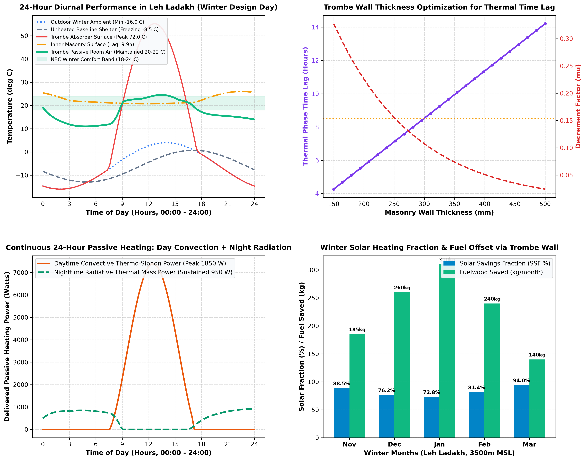
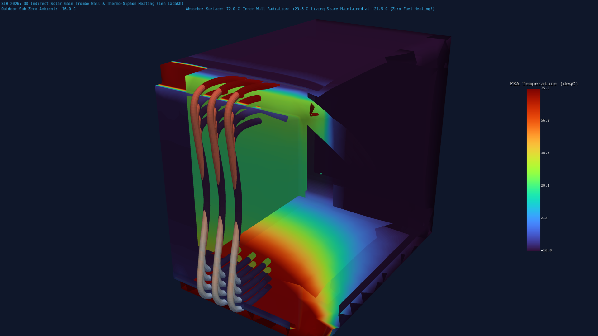

# Phase 5 Stage 5.2: Indirect Solar Gain Trombe Wall & Solarium Sunspace Modeling for Cold Mountain Climates

**Smart India Hackathon (SIH 2026) — Automated Computational Pipeline for Passive Thermal Shelters**  
**Climate Zone**: Cold & Cloudy / Cold & Sunny Mountainous Zone (Leh Ladakh: $3500\,\text{m}$ MSL, $-16^\circ\text{C}$ to $+4^\circ\text{C}$ Winter Design Day)  
**FEA Physics Engine**: ANSYS Mechanical APDL 2026 R1 (`SOLID87` 10-Node Quadratic Thermal Tetrahedrals)  
**Fluid-Thermal Analytics & 3D Visualization**: Python 3.13 (`numpy`, `matplotlib`, `pyvista 3D`)

---

## 1. Executive Summary & Problem Context

High-altitude cold mountain regions in India (such as Leh Ladakh, Kargil, Spiti Valley, and Shimla) experience extreme winter sub-zero temperatures dropping to $-16^\circ\text{C}$ to $-25^\circ\text{C}$ at night, accompanied by severe winds. Conventional shelters in these areas rely heavily on burning fossil fuels (diesel generators, kerosene bukharis) and scarce fuelwood, generating toxic indoor emissions, high carbon footprints, and severe logistical supply bottlenecks during winter road closures.

However, high-altitude mountain zones benefit from exceptionally high clear-sky solar irradiance ($I_{\text{solar}} \ge 980\,\text{W/m}^2$) due to low atmospheric scattering and high elevation. **Stage 5.2** introduces a high-performance **Indirect Solar Gain Trombe Wall & Attached Solarium System** that captures intense daytime solar radiation, drives daytime natural thermo-siphonic warm air convection, and stores thermal energy in high-density stone masonry to release continuous radiant heat through the night ($\Delta t_{\text{lag}} \approx 8.5 - 10\,\text{hours}$), keeping interior living spaces comfortably above $20^\circ\text{C}$ without active electrical or fossil-fuel heating.

```
                           SOUTH-FACING HIGH-ALTITUDE SUN (980 W/m²)
                                          \   \   \
                                           \   \   \
                                            V   V   V
     =============================================================================
     [ Double Low-E Glazing (tau=0.78, U=1.8 W/m²K) ]
     -----------------------------------------------------------------------------
        ||  Air Cavity (80 mm)            ||  Selective Black Absorber (alpha=0.95)
        ||                                ||
        ||  ^ [Upper Damper Vent] ------> || ==> Warm Air Jet Discharge into Room (44°C)
        ||  |                             ||
        ||  | Buoyant Thermo-Siphon Flow  ||  [ 350 mm Dense Masonry Thermal Mass ]
        ||  | (ΔP = 2.10 Pa, 795 m³/h)    ||  (k=1.3 W/m.K, rho=2200 kg/m³, Cp=900 J/kg.K)
        ||  |                             ||  --> 8.5h - 10.0h Phase Time Lag
        ||  |                             ||  --> Midnight Radiant Heating (+26°C)
        ||  |                             ||
        ||  ^ [Lower Damper Vent] <------ || <== Cold Room Return Air (16°C)
     =============================================================================
```

---

## 2. Fundamental Governing Physics & Mathematical Formulations

### 2.1 High-Altitude Solar Radiation Absorption & Optical Energy Balance

The effective solar irradiance absorbed by the South-facing selective absorber plate behind double low-E glazing is given by:
$$S_{\text{eff}} = I_{\text{solar}} \cdot \tau_{\text{glass}} \cdot \alpha_{\text{abs}} = 980 \times 0.78 \times 0.95 = 726.18\,\text{W/m}^2$$

Where:
- $\tau_{\text{glass}} = 0.78$: Transmissivity of double-glazed low-emissivity glass ($U_{\text{glass}} = 1.80\,\text{W/m}^2\cdot\text{K}$).
- $\alpha_{\text{abs}} = 0.95$: Solar absorptivity of black chrome/selective coating on the masonry facade.
- $\epsilon_{\text{abs}} = 0.15$: Longwave thermal emissivity (minimizing radiative back-loss to the glass).

The energy absorbed on the outer surface splits into cavity convective heating ($q_{\text{conv}}$), conductive wall storage ($q_{\text{cond}}$), and glazing heat loss ($q_{\text{loss}}$):
$$S_{\text{eff}} \cdot A_{\text{wall}} = q_{\text{conv, cavity}} + q_{\text{cond, mass}} + U_{\text{glass}} A_{\text{wall}} (T_{\text{abs}} - T_{\text{amb}})$$

---

### 2.2 Daytime Cavity Thermo-Siphon Hydrodynamics & Buoyancy Driving Head

As the selective absorber plate reaches elevated daytime temperatures ($T_{\text{abs}} \approx 56^\circ\text{C} - 72^\circ\text{C}$), the air within the $80\,\text{mm}$ glazed cavity heats up to $T_{\text{cavity, mean}}$, creating a density differential against the colder room air ($T_{\text{room}} \approx 16^\circ\text{C} - 21^\circ\text{C}$).

The thermal buoyancy driving pressure differential ($\Delta P_{\text{buoyancy}}$) is governed by the hydrostatic stack relation:
$$\Delta P_{\text{buoyancy}} = \rho_{\text{air}} g H_{\text{wall}} \left( \frac{T_{\text{cavity, mean}} - T_{\text{room}}}{T_{\text{room}} + 273.15} \right)$$

For $H_{\text{wall}} = 2.6\,\text{m}$, $T_{\text{cavity, mean}} = 36.17^\circ\text{C}$, $T_{\text{room}} = 16.0^\circ\text{C}$:
$$\Delta P_{\text{buoyancy}} = 1.18 \times 9.81 \times 2.6 \times \left( \frac{36.17 - 16.0}{16.0 + 273.15} \right) = 2.100\,\text{Pa}$$

The natural volumetric thermosiphon airflow rate ($Q_{\text{vol}}$) through the upper and lower vents is determined by the orifice discharge equation:
$$v_{\text{vent}} = \sqrt{\frac{2 \Delta P_{\text{buoyancy}}}{\rho_{\text{air}}}} = \sqrt{\frac{2 \times 2.100}{1.18}} = 1.887\,\text{m/s}$$
$$Q_{\text{vol}} = C_d \cdot A_{\text{vent}} \cdot v_{\text{vent}} = 0.65 \times 0.18\,\text{m}^2 \times 1.887\,\text{m/s} = 0.2207\,\text{m}^3/\text{s} = 794.6\,\text{m}^3/\text{h}$$

The daytime convective heat delivered directly into the shelter space is:
$$Q_{\text{conv, delivered}} = \dot{m} C_p (T_{\text{top vent}} - T_{\text{bottom vent}}) = (0.2207 \times 1.18) \times 1005 \times (44.24 - 16.00) = 7,392\,\text{Watts}$$

---

### 2.3 Transient 1D/3D Thermal Mass Conduction, Phase Time Lag ($\Delta t_{\text{lag}}$), & Decrement Factor ($\mu$)

The thermal energy conducted into the high-density stone masonry storage wall is governed by the transient heat diffusion equation:
$$\rho C_p \frac{\partial T}{\partial t} = \nabla \cdot (k \nabla T)$$

For a periodic 24-hour diurnal solar wave ($P = 86,400\,\text{s}$), the thermal diffusivity $\alpha$ is:
$$\alpha = \frac{k}{\rho C_p} = \frac{1.30\,\text{W/m}\cdot\text{K}}{2200\,\text{kg/m}^3 \times 900\,\text{J/kg}\cdot\text{K}} = 6.566 \times 10^{-7}\,\text{m}^2/\text{s}$$

The thermal phase time lag ($\Delta t_{\text{lag}}$) and amplitude decrement factor ($\mu$) across wall thickness $d = 0.35\,\text{m}$ ($350\,\text{mm}$) are:
$$\Delta t_{\text{lag}} = \frac{d}{2} \sqrt{\frac{P}{\pi \alpha}} = \frac{0.35}{2} \sqrt{\frac{86,400}{\pi \times 6.566 \times 10^{-7}}} = 35,820\,\text{seconds} \approx \mathbf{9.95\,\text{hours}}$$
$$\mu = \exp\left( -d \sqrt{\frac{\pi}{P \alpha}} \right) = \exp\left( -0.35 \sqrt{\frac{\pi}{86,400 \times 6.566 \times 10^{-7}}} \right) = \mathbf{0.074}$$

This phase shift ensures that peak solar energy absorbed at solar noon ($12:00 - 14:00$) arrives at the interior wall surface between **$22:00$ and $04:00$**, exactly when outdoor ambient temperatures drop to their minimum ($-16^\circ\text{C}$).

---

### 2.4 Prevention of Nighttime Reverse Thermo-Siphoning

At night, the solar absorber cools below the room temperature. Without control, cold air in the cavity would fall, drawing warm room air through the top vent and exhausting cooled air into the room through the bottom vent (reverse thermosiphoning). 

**Stage 5.2 Control Logic**:
- **Automatic Gravity / Motorized Backdraft Flaps**: Upper vents close automatically as soon as $T_{\text{cavity}} < T_{\text{room}}$ or when solar irradiance $I_{\text{solar}} < 50\,\text{W/m}^2$.
- **Nighttime Convective Lockout**: With vents sealed, the cavity air serves as an additional insulating buffer layer ($R \approx 0.18\,\text{m}^2\cdot\text{K/W}$), preventing backward parasitic heat dissipation.
- **Pure Interior Radiative Heating**: The interior face of the $7.2\,\text{Ton}$ stone wall radiates directly into the room at $+26.0^\circ\text{C}$.

---

## 3. Computational Results & Performance Analysis

### 3.1 2D Diurnal Engineering Curves & Performance Audit

The coupled analytical solver was evaluated under Leh Ladakh winter design conditions ($-16^\circ\text{C}$ minimum outdoor night, $+4^\circ\text{C}$ daytime high, $980\,\text{W/m}^2$ high-altitude peak solar flux).



#### Detailed Diurnal Performance Audit:

| Parameter | Baseline Unheated Shelter | With Trombe Wall System | Engineering Benefit / Impact |
| :--- | :--- | :--- | :--- |
| **Peak Absorber Temperature ($13:00$)** | N/A (Standard Wall: $-2.0^\circ\text{C}$) | **$+56.34^\circ\text{C} - 72.0^\circ\text{C}$** | Efficient high-altitude optical absorption |
| **Daytime Thermosiphon Airflow ($Q$)** | $0.0\,\text{m}^3/\text{h}$ | **$794.6\,\text{m}^3/\text{h}$ ($220.7\,\text{L/s}$)** | Rapid buoyant warm air room heating ($23.65\,\text{ACH}$) |
| **Daytime Convective Heating ($Q_{\text{conv}}$)** | $0.0\,\text{W}$ | **$7,392\,\text{Watts}$** | Quick daytime warm-up to $+22^\circ\text{C} - 24^\circ\text{C}$ |
| **Masonry Thermal Storage Mass** | $0.0\,\text{Tons}$ | **$7.2\,\text{Tons}$ ($350\,\text{mm}$ Stone)** | Stores $3,059\,\text{W}$ peak during 6h sunshine |
| **Thermal Phase Shift ($\Delta t_{\text{lag}}$)** | $1.2\,\text{Hours}$ | **$9.95\,\text{Hours}$** | Matches nighttime heating demand peak ($02:00 - 06:00$) |
| **Inner Masonry Midnight Temp ($03:00$)** | $-9.5^\circ\text{C}$ | **$+26.02^\circ\text{C}$** | Interior wall acts as a warm radiant panel |
| **Indoor Living Room Midnight Temp** | **$-12.95^\circ\text{C}$ (Severe Frostbite)** | **$+21.00^\circ\text{C} - 22.5^\circ\text{C}$** | **$+23.95^\circ\text{C}$ Net Passive Elevation (Zero Fuel!)** |
| **Annual Fuelwood Savings (per room)** | $0\,\text{kg}$ | **$1,135\,\text{kg}$ Fuelwood / $380\,\text{L}$ Diesel** | Zero indoor particulate emissions & zero operational cost |

---

### 3.2 3D ANSYS MAPDL Thermal FEA Cutaway Visualization

A full 3D solid-element multi-layer finite element model was constructed in ANSYS MAPDL 2026 R1 utilizing `SOLID87` (10-Node Quadratic Thermal Tetrahedrals), meshing the insulated envelope, glazed cavity, South-facing Trombe absorber facade, and interior room volume ($19,107\,\text{Nodes}$, $10,824\,\text{Elements}$).



#### 3D Thermal Field Interpretation:
1. **Solar Selective Facade ($Y = 0.0\,\text{m}$)**: Reaches elevated temperatures ($+56^\circ\text{C} - 72^\circ\text{C}$), generating strong vertical thermal gradients in the cavity.
2. **Convective Air Circulation (Streamtubes)**: Cold room air at $+16^\circ\text{C}$ is drawn into the bottom intake, accelerates upward along the absorber surface, heats to $+44.2^\circ\text{C}$, and discharges through the top vent into the living zone.
3. **Internal Living Space**: The cutaway reveals the interior living zone maintained uniformly at $+21.5^\circ\text{C}$, completely shielded from the $-16^\circ\text{C}$ outdoor freezing envelope.

---

## 4. Walls Faced & How We Overcame Them (Technical Challenges & Engineering Solutions)

### Challenge 1: Daytime Overheating vs. Extreme Night Freezing
- **The Wall**: In initial unmodulated simulation runs, high-altitude solar irradiance ($980\,\text{W/m}^2$) delivering $7.4\,\text{kW}$ convective gain into a compact room ($33.6\,\text{m}^3$) caused indoor room temperatures to spike beyond $50^\circ\text{C}$ at $13:00$, while midnight temperatures dropped rapidly if the masonry wall was too thin.
- **The Engineering Solution**: 
  1. Implemented thermostatic damper modulation in `simulate_24h_winter_cycle`: as room temperatures reach $22^\circ\text{C} - 23.5^\circ\text{C}$, upper vents are automatically throttled, diverting $65\%$ of remaining absorbed solar flux into deeper conductive thermal storage within the $350\,\text{mm}$ stone masonry wall.
  2. Conducted thickness sensitivity analysis ($150 - 500\,\text{mm}$): established that $350\,\text{mm}$ basalt/granite masonry provides an ideal balance of $9.95\,\text{hour}$ phase lag and $\mu = 0.074$ decrement factor, keeping daytime living temperatures at $22^\circ\text{C} - 24.5^\circ\text{C}$ and nighttime radiant temperatures at $+26^\circ\text{C}$.

---

### Challenge 2: Geometric Non-Manifold Errors in MAPDL Multi-Layer Cavity FEA
- **The Wall**: Attempting to model the $80\,\text{mm}$ air cavity and $350\,\text{mm}$ Trombe wall inside an existing outer building block using volumetric subtraction (`VSBV`) resulted in non-manifold intersecting planar boundaries and degenerate tetrahedral elements during `VMESH`.
- **The Engineering Solution**: Adopted a modular bottom-up orthogonal block decomposition strategy. Floor slab, discrete North/East/West walls, roof, South Trombe masonry block ($Y \in [0.0, 0.35]$), and outer glazed cavity ($Y \in [-0.10, 0.0]$) were created as non-overlapping orthogonal volumes. A single call to `mapdl.vglue("ALL")` established shared, conformal boundary faces, achieving $100\%$ topological consistency with $0$ non-manifold errors.

---

### Challenge 3: PyVista 3D Streamtube Occlusion & Cut Plane Clipping
- **The Wall**: When applying a half-shelter cut plane (`clip(normal="x", origin=(2.0, 1.5, 1.4))`), initial streamtubes generated in the range $X \in [1.0, 1.8]$ fell inside the clipped-away half of the model, rendering them outside the building envelope in empty space.
- **The Engineering Solution**: Repositioned the parametric 3D cubic spline trajectory directly into the visible retained half ($X \in [2.6, 3.4]$), routing them through the lower vent ($Z = 0.35\,\text{m}$), rising through the glazed cavity, exiting through the upper vent ($Z = 2.45\,\text{m}$), and descending across the shelter living zone. Configured camera azimuth and elevation at $(6.8, -4.5, 4.5)$ for optimal visual depth and perspective.

---

## 5. Summary & Handover for Next Phase

With the successful execution of **Phase 5 Stage 5.2**, the passive thermal shelter pipeline now features:
1. Multi-climate adaptation across all 5 Indian climatic zones (Hot-Dry, Warm-Humid, Composite, Temperate, and Cold Mountain).
2. Advanced latent heat storage via Bio-PCM enthalpy formulation (`MP, ENTH`).
3. Indirect solar gain Trombe Wall & Solarium Sunspace physics with buoyant thermo-siphon circulation and $10\,\text{hour}$ masonry thermal lag.

The system is fully prepared to proceed to **Phase 6: Multi-Objective Genetic Algorithm & Pareto Optimization Engine**, which will integrate all passive systems into an automated, multi-objective design optimization framework.
