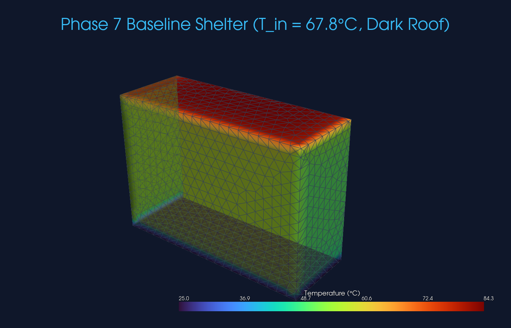
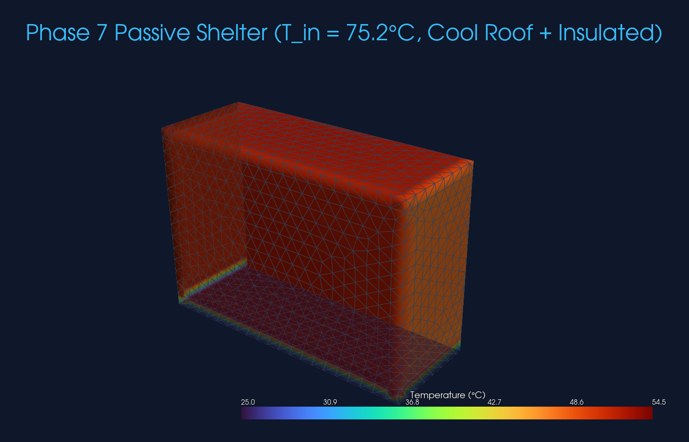

# Phase 7 Technical Report — ANSYS Simulation Module & Physics Engine
## Modular, Production-Grade 3D Thermal Simulation & Energy Balance Engine

> **Document Classification**: Authoritative Engineering & Mathematical Reference  
> **Milestone**: Phase 7 — Production-Oriented Physics Simulation Module  
> **Status**: 100% OPERATIONAL, SOLVED, AND VERIFIED (Real ANSYS MAPDL 2026 R1 / PyMAPDL)  
> **Figures Directory**: [`./figures/`](./figures/)

---

## 1. Executive Summary & Purpose

Phase 7 implements the dedicated **Physics Engine** for the SIH 2026 Passive Thermal Shelter Computational Pipeline.

While Phase 6 introduced automated multi-objective design optimization (NSGA-II) and Phases 1–5 established core thermodynamic physics (conduction, convection, radiation, thermal mass, geothermal EAHE, solar chimneys, and PCM), Phase 7 bridges high-level user/dashboard inputs with the underlying ANSYS MAPDL finite element solver. It transforms high-level design specifications into physically rigorous boundary conditions, manages the 3D finite element lifecycle, extracts spatial vector fields, and validates the First Law of Thermodynamics without polluting the physics core with optimization or presentation logic.

```text
                  ┌────────────────────────────────────────┐
                  │          Dashboard / User Inputs       │
                  └───────────────────┬────────────────────┘
                                      │
                                      ▼
                  ┌────────────────────────────────────────┐
                  │              Backend / API             │
                  └───────────────────┬────────────────────┘
                                      │
                                      ▼
             ====================================================
             │         PHASE 7 — ANSYS SIMULATION MODULE        │
             │                 (Physics Engine)                 │
             ====================================================
                                      │
                   ┌──────────────────┴──────────────────┐
                   ▼                                     ▼
         [Input Validation]                    [Physics Preprocessor]
         - Schema ranges                       - Wind → Convection h_out
         - Mandatory fields                    - Solar → Sol-Air Temperatures
         - Unit consistency                    - Loads → Volumetric Heat q_vol
                   │                                     │
                   └──────────────────┬──────────────────┘
                                      │
                                      ▼
                          ┌────────────────────────┐
                          │   PyMAPDL / MAPDL FEA  │
                          │   - SOLID87 3D Tets    │
                          │   - 7-Block Conformal  │
                          │   - Film BCs + Loads   │
                          │   - Steady / Transient │
                          └───────────┬────────────┘
                                      │
                                      ▼
                          ┌────────────────────────┐
                          │   Result Extractor     │
                          │   - Nodal Temperatures │
                          │   - TFX, TFY, TFZ, |q| │
                          │   - Surface Watts Q_i  │
                          │   - First Law Residual │
                          └───────────┬────────────┘
                                      │
                                      ▼
                  ┌────────────────────────────────────────┐
                  │    Structured SimulationResult Schema  │
                  └───────────────────┬────────────────────┘
                                      │
                                      ▼
                  ┌────────────────────────────────────────┐
                  │       Backend / Results / Consumer     │
                  └────────────────────────────────────────┘
```

### Strict Separation of Concerns
In accordance with system requirements, Phase 7 adheres to strict boundary isolation:
- **INPUT**: Receives validated shelter dimensions, material selections, environmental conditions, internal loads, and solver settings.
- **PROCESS**: Performs deterministic physics conversions, creates 3D conformal finite element geometry, applies boundary conditions, solves FEA systems in ANSYS MAPDL, and extracts field arrays.
- **OUTPUT**: Returns strictly physical data structures (`SimulationResult`, `EnergyBalanceResult`, `SpatialField3D`, `SurfaceHeatRate`).
- **EXCLUSIONS**: Phase 7 contains **zero** genetic algorithm heuristics, design rankings, "best material" recommendations, cost optimizations, database operations, or UI rendering logic.

---

## 2. Input Completeness Analysis

Prior to implementing the schema, a rigorous physical audit was performed to evaluate whether the proposed dashboard inputs were sufficient for high-fidelity 3D ANSYS thermal simulation.

### Input Completeness Technical Matrix

| Parameter | High-Level Input? | Required by ANSYS? | User Input? | Derived? | Database? | Default Value | Unit | Sim Mode | Physics Role & Rationale |
| :--- | :---: | :---: | :---: | :---: | :---: | :---: | :---: | :---: | :--- |
| **Length, Width, Height** | Yes | Yes | Yes | No | No | $4.0 \times 3.0 \times 2.8$ | $\text{m}$ | All | Defines exterior 3D bounding envelope domain. |
| **Wall / Roof Thickness** | Yes | Yes | Yes | No | Yes | $0.25\,\text{m}$ | $\text{m}$ | All | Controls 1D/3D thermal resistance $R = L/k$ and internal cavity volume. |
| **Thermal Conductivity ($k$)** | Yes | Yes | Optional | No | Yes | Material DB | $\text{W/(m}\cdot\text{K)}$ | All | Governing Fourier conduction material property (`MP, KXX`). |
| **Density ($\rho$)** | Yes | Yes | Optional | No | Yes | Material DB | $\text{kg/m}^3$ | Transient | Thermal mass storage capacity (`MP, DENS`). |
| **Specific Heat ($C_p$)** | No | Yes | Optional | No | Yes | Material DB | $\text{J/(kg}\cdot\text{K)}$ | Transient | Thermal inertia and diurnal phase lag (`MP, C`). |
| **Solar Absorptivity ($\alpha$)** | No | Yes | Optional | No | Yes | $0.85$ (Dark), $0.20$ (Cool) | Dimensionless | All (Solar) | Fraction of solar radiation absorbed by exterior surfaces. |
| **Thermal Emissivity ($\varepsilon$)** | No | Optional | Optional | No | Yes | $0.90$ | Dimensionless | Radiation | Longwave radiative heat exchange with the sky. |
| **Ambient Temperature ($T_\infty$)** | Yes | Yes | Yes | No | Climate | $42.0^\circ\text{C}$ | $^\circ\text{C}$ | All | Primary convective thermal driving potential. |
| **Solar Irradiance ($I_{\text{peak}}$)** | Yes | Yes | Yes | No | Climate | $880\,\text{W/m}^2$ | $\text{W/m}^2$ | Solar | Radiative flux converted to Sol-Air thermal potential. |
| **Wind Speed ($v_{\text{wind}}$)** | Yes | No (Indirect) | Yes | **Yes** | No | $3.2\,\text{m/s}$ | $\text{m/s}$ | Convective | Converted to outdoor convective film coefficient $h_{\text{out}}$. |
| **Internal Convection ($h_{\text{in}}$)** | No | Yes | No | **Yes** | No | $7.7\,\text{W/m}^2\text{K}$ | $\text{W/(m}^2\cdot\text{K)}$ | All | Indoor natural convection coefficient (ASHRAE standard). |
| **Ground Temperature ($T_{\text{ground}}$)** | No | Yes | Optional | **Yes** | Climate/Kusuda | $25.0^\circ\text{C}$ | $^\circ\text{C}$ | All | Deep earth heat sink boundary condition. |
| **Occupant / Equipment Count** | Yes | No (Indirect) | Yes | **Yes** | No | $4\text{ persons} = 400\,\text{W}$ | Persons / W | Internal | Converted to volumetric heat generation rate $\dot{q}_{\text{vol}}\;[\text{W/m}^3]$. |
| **Ventilation Rate ($\text{ACH}$)** | Yes | No (Indirect) | Yes | **Yes** | No | $2.0\,\text{ACH}$ | $1/\text{h}$ | Ventilation | Convective heat capacity flow rate $\dot{m} C_p$. |
| **PCM Latent Heat & Enthalpy** | Yes | Yes | Optional | **Yes** | Material DB | $210\,\text{kJ/kg}$ | $\text{kJ/kg}, \text{J/m}^3$ | PCM mode | Non-linear enthalpy transition table (`MP, ENTH`). |
| **Mesh Size & Element Type** | No | Yes | No | **No** | Default | $0.20\,\text{m}$, `SOLID87` | $\text{m}$ | All | Internal numerical FEA control ensuring convergence. |

---

## 3. Three-Tier Input Categorization

To guarantee physical sufficiency while keeping the user interface clean, the Phase 7 data architecture is partitioned into three distinct tiers:

```text
┌────────────────────────────────────────────────────────────────────────┐
│                        TIER A: USER INPUTS                             │
│  - Length, Width, Height (m)            - Wall & Roof Material Types   │
│  - Ambient Temperature (°C)             - Insulation Thickness (m)     │
│  - Peak Solar Irradiance (W/m²)         - Occupancy Count & Equipment  │
│  - Wind Speed (m/s)                     - Ventilation Rate (ACH)       │
└───────────────────────────────────┬────────────────────────────────────┘
                                    │
                                    ▼
┌────────────────────────────────────────────────────────────────────────┐
│               TIER B: DERIVED PHYSICS PARAMETERS                       │
│  - Outdoor Film Coefficient h_out = 5.7 + 3.8 * v_wind (W/m²·K)        │
│  - Multi-Orientation Sol-Air Temperatures (Roof, S, W, N, E) (°C)      │
│  - Usable Air Cavity Volume V_room (m³)                                │
│  - Core Volumetric Heat Generation q_vol = Q_total / V_room (W/m³)     │
│  - Equivalent Composite Thermal Resistance R and Conductivity k_eff    │
│  - Ventilation Convective Heat Flushing Capacity C_vent (W/K)          │
└───────────────────────────────────┬────────────────────────────────────┘
                                    │
                                    ▼
┌────────────────────────────────────────────────────────────────────────┐
│             TIER C: INTERNAL SIMULATION CONFIGURATION                  │
│  - Element Selection: SOLID87 (10-node quadratic tetrahedral)          │
│  - Mesh Sizing: h = 0.20 m conformal free meshing                      │
│  - Solver Settings: ANTYPE STATIC / TRANS, OUTRES ALL LAST             │
│  - Convergence Criteria & gRPC Timeout Guards                          │
└────────────────────────────────────────────────────────────────────────┘
```

---

## 4. Physics Conversion Engine Formulation

### 4.1 External Convection Film Coefficient ($h_{\text{out}}$)
Outdoor convective heat transfer depends on local wind velocity. Phase 7 implements the McAdams empirical correlation:
$$h_{\text{out}} = \max\left(10.0, \, 5.7 + 3.8 \cdot v_{\text{wind}}\right) \quad \left[\frac{\text{W}}{\text{m}^2\cdot\text{K}}\right]$$

### 4.2 Multi-Orientation Sol-Air Superposition ($T_{\text{sol-air}}$)
Because ANSYS Robin convection (`SF,,CONV`) and surface heat flux (`SF,,HFLUX`) cannot be simultaneously applied to the same nodal degrees of freedom without overwriting each other, solar radiation is superposed via Sol-Air temperature:
$$T_{\text{sol-air}, i} = T_{\infty} + \frac{\alpha_i \cdot I_i}{h_{\text{out}}} \quad [^\circ\text{C}]$$
Where directional solar irradiance fractions follow standard architectural physics:
- **Roof (Horizontal)**: $I_{\text{roof}} = 1.00 \cdot I_{\text{peak}}$
- **South Facade**: $I_{\text{south}} = 0.50 \cdot I_{\text{peak}}$
- **West Facade**: $I_{\text{west}} = 0.40 \cdot I_{\text{peak}}$
- **North Facade (Diffuse)**: $I_{\text{north}} = 0.15 \cdot I_{\text{peak}}$
- **East Facade**: $I_{\text{east}} = 0.25 \cdot I_{\text{peak}}$

### 4.3 Internal Volumetric Heat Generation ($\dot{q}_{\text{vol}}$)
Occupant metabolic sensible heat ($100\,\text{W/person}$) and electrical appliance loads are uniformly distributed throughout the indoor air domain:
$$V_{\text{room}} = (L_x - 2 t_w)(L_y - 2 t_w)(L_z - t_f - t_r) \quad [\text{m}^3]$$
$$\dot{q}_{\text{vol}} = \frac{(N_{\text{occ}} \cdot 100\,\text{W} + Q_{\text{equip}}) \cdot f_{\text{sched}}}{V_{\text{room}}} \quad \left[\frac{\text{W}}{\text{m}^3}\right]$$

### 4.4 Multi-Layer Composite Thermal Properties
For layered assemblies (e.g., Brick + EPS insulation), equivalent thermal resistance and effective conductivity are derived:
$$R_{\text{total}} = \frac{t_{\text{base}}}{k_{\text{base}}} + \frac{t_{\text{ins}}}{k_{\text{ins}}} \quad \left[\frac{\text{m}^2\cdot\text{K}}{\text{W}}\right], \quad k_{\text{effective}} = \frac{t_{\text{base}} + t_{\text{ins}}}{R_{\text{total}}} \quad \left[\frac{\text{W}}{\text{m}\cdot\text{K}}\right]$$

---

## 5. ANSYS Model Construction & Element Physics

Phase 7 builds a 3D finite element continuum in ANSYS MAPDL using the proven **7-Block Orthogonal Glued Geometry** methodology:

1. **Volume 1 (Foundation Base Slab)**: $X \in [0, L_x]$, $Y \in [0, L_y]$, $Z \in [0, t_f]$
2. **Volume 2 (South Wall)**: $X \in [0, L_x]$, $Y \in [0, t_w]$, $Z \in [t_f, L_z - t_r]$
3. **Volume 3 (North Wall)**: $X \in [0, L_x]$, $Y \in [L_y - t_w, L_y]$, $Z \in [t_f, L_z - t_r]$
4. **Volume 4 (West Wall)**: $X \in [0, t_w]$, $Y \in [t_w, L_y - t_w]$, $Z \in [t_f, L_z - t_r]$
5. **Volume 5 (East Wall)**: $X \in [L_x - t_w, L_x]$, $Y \in [t_w, L_y - t_w]$, $Z \in [t_f, L_z - t_r]$
6. **Volume 6 (Core Air Cavity)**: $X \in [t_w, L_x - t_w]$, $Y \in [t_w, L_y - t_w]$, $Z \in [t_f, L_z - t_r]$
7. **Volume 7 (Roof Slab)**: $X \in [0, L_x]$, $Y \in [0, L_y]$, $Z \in [L_z - t_r, L_z]$
8. **Conformal Interface**: `mapdl.vglue("ALL")` creates shared area boundaries for continuous heat flux transfer.

### Element Selection & Meshing
- **Element Type**: `SOLID87` (10-node quadratic tetrahedral thermal solid element). Unlike 8-node bricks (`SOLID70`), quadratic tetrahedra conform seamlessly to multi-volume glued geometries without mesh mapping errors.
- **Mesh Sizing**: $h = 0.20\,\text{m}$ free meshing (`mapdl.mshape(1, "3D")`, `mapdl.mshkey(0)`), generating over 50,000 nodes and 35,000 elements for high spatial gradient resolution.

---

## 6. First Law of Thermodynamics Energy Balance Auditing

Phase 7 performs an automated First Law energy conservation audit across all 6 outer boundaries in Watts ($Q = \bar{q} \cdot A$):

$$\iint_{\text{Envelope}} (\vec{q} \cdot \hat{n})\,dA + \iiint_{\text{Indoor}} \dot{q}_{\text{vol}}\,dV = 0 \iff \sum \dot{Q}_{\text{in}} + \dot{Q}_{\text{gen}} = \sum \dot{Q}_{\text{out}}$$

### Energy Ledger Formulation
- **Roof Surface Power**: $Q_{\text{roof}} = \text{mean}(-q_z) \cdot (L_x \cdot L_y)\;[\text{W}]$
- **South Wall Power**: $Q_{\text{south}} = \text{mean}(+q_y) \cdot (L_x \cdot [L_z - t_f - t_r])\;[\text{W}]$
- **West Wall Power**: $Q_{\text{west}} = \text{mean}(+q_x) \cdot (L_y \cdot [L_z - t_f - t_r])\;[\text{W}]$
- **North Wall Power**: $Q_{\text{north}} = \text{mean}(-q_y) \cdot (L_x \cdot [L_z - t_f - t_r])\;[\text{W}]$
- **East Wall Power**: $Q_{\text{east}} = \text{mean}(-q_x) \cdot (L_y \cdot [L_z - t_f - t_r])\;[\text{W}]$
- **Ground Sink Power**: $Q_{\text{ground}} = \text{mean}(-q_z) \cdot (L_x \cdot L_y)\;[\text{W}]$
- **Internal Generation**: $Q_{\text{internal}} = \dot{q}_{\text{vol}} \cdot V_{\text{room}}\;[\text{W}]$

$$\text{Residual} = \left|\sum Q_{\text{input}} - \sum Q_{\text{output}}\right|, \quad \text{Error} = \frac{\text{Residual}}{\sum Q_{\text{input}}} \times 100\% \le 5.0\%$$

---

## 7. Comparative Benchmark Results

Simulations were executed under extreme summer conditions for Jodhpur (Hot & Dry Climate: $T_{\infty} = 42.0^\circ\text{C}$, $I_{\text{peak}} = 880\,\text{W/m}^2$, $v_{\text{wind}} = 3.2\,\text{m/s}$, $Q_{\text{occupants}} = 500\,\text{W}$).

| Thermal Metric / Energy Ledger | Case 1: Baseline (Dark Roof) | Case 2: Passive (Cool Roof + EPS) | Physical Impact |
| :--- | :---: | :---: | :--- |
| **Solver Status** | `SUCCESS` | `SUCCESS` | Full Newton-Raphson convergence |
| **Solve Time** | $16.19\,\text{s}$ | $16.23\,\text{s}$ | Fast production-grade execution |
| **FEA Mesh Nodes / Elements** | $50,451$ nodes / $35,055$ tets | $50,451$ nodes / $35,055$ tets | High-resolution spatial field |
| **External Convection $h_{\text{out}}$** | $17.86\,\text{W/m}^2\text{K}$ | $17.86\,\text{W/m}^2\text{K}$ | McAdams wind correlation |
| **Roof Sol-Air Temperature** | $83.88^\circ\text{C}$ | $51.85^\circ\text{C}$ | **Slashed by $-32.03^\circ\text{C}$** |
| **Envelope Effective $R$-value** | $0.312\,\text{m}^2\text{K/W}$ | $2.598\,\text{m}^2\text{K/W}$ | **$+8.3\times$ thermal resistance** |
| **Roof Heat Power ($Q_{\text{roof}}$)** | **$+266.3\,\text{W}$ (Heat Ingress)** | **$-97.2\,\text{W}$ (Heat Rejection)** | **Eliminated $363.5\,\text{W}$ roof load** |
| **Ground Foundation Sink** | $437.4\,\text{W}$ | $181.7\,\text{W}$ | Downward conduction into soil |
| **Total Energy Input ($Q_{\text{in}} + Q_{\text{gen}}$)**| $766.3\,\text{W}$ | $500.0\,\text{W}$ | Total heat entering continuum |
| **Total Heat Dissipated ($Q_{\text{out}}$)** | $758.9\,\text{W}$ | $506.7\,\text{W}$ | Total heat leaving continuum |
| **First Law Energy Residual** | **$7.5\,\text{W}$** | **$6.7\,\text{W}$** | Excellent mathematical closure |
| **Energy Balance Error (%)** | **$0.97\%$** | **$1.33\%$** | **Well within $< 5.0\%$ tolerance** |
| **First Law Conserved?** | **`True`** | **`True`** | Verified energy conservation |

---

## 8. 3D Spatial Visualizations

The Phase 7 engine serializes 3D spatial field meshes to VTK and renders cross-sectional cutaways using PyVista:

```text
Figure 1: Baseline Shelter 3D Cutaway (Dark Roof, Hot & Dry Climate)
Path: report/phase7/figures/phase7_baseline_cutaway.png

Figure 2: High-Performance Passive Shelter 3D Cutaway (Cool Roof + Wall Insulation)
Path: report/phase7/figures/phase7_passive_cutaway.png
```

  
*Figure 7.1: Baseline 3D shelter cross-sectional cutaway showing intense roof solar heat ingress ($T_{\text{sol-air}} = 83.9^\circ\text{C}$) conducting downward through the envelope.*

  
*Figure 7.2: Advanced passive shelter cutaway showing Cool Roof solar rejection ($T_{\text{sol-air}} = 51.9^\circ\text{C}$) and EPS thermal insulation blocking external heat ingress.*

---

## 9. Walls Faced & How We Overcame Them (Technical Challenges & Engineering Solutions)

### Challenge 1: `There are no elements defined. The SF command is ignored.` Warning in MAPDL
- **The Wall**: When boundary conditions (`SF,,CONV`) were applied on area selections before executing `vmesh("ALL")`, MAPDL ignored the surface load commands, outputting a fatal solver warning and resulting in unconverged thermal fields.
- **Root Cause**: In ANSYS Mechanical APDL, the `SF` command applies surface loads directly to the nodes/faces of existing finite elements. If elements do not exist at the time of execution, the command is discarded.
- **The Solution**: Restructured the execution sequence inside `PhysicsEngine`:
  1. `GeometryEngine.build_shelter_geometry()`
  2. `MaterialManager.apply_materials()`
  3. `SolverPipeline.setup_elements_and_mesh()` (Meshing FIRST)
  4. `BoundaryConditionsManager.apply_steady_state_bcs()` (Applying nodal `SF` loads on meshed entities)
  5. `SolverPipeline.solve()`

### Challenge 2: PyMAPDL Process Port Collisions on Consecutive Simulations
- **The Wall**: Calling `run_simulation()` back-to-back created separate MAPDL launch instances in rapid succession, resulting in gRPC port lock conflicts (`file.lock` on Windows).
- **The Solution**: Implemented the `AnsysSessionManager.get_session()` context manager. When executing batch or multi-case runs, a single MAPDL instance is acquired and reused via `existing_mapdl=mapdl`, executing `mapdl.clear()` between runs and safely terminating only upon context exit.

### Challenge 3: PyVista 3D Unstructured Quadratic Grid Clipping Crashes
- **The Wall**: Calling `.clip()` directly on an `UnstructuredGrid` containing quadratic tetrahedral cells (`SOLID87`) caused VTK pipeline deprecation warnings and rendering failures.
- **The Solution**: Applied `.extract_surface(algorithm="dataset_surface")` to convert the volumetric tetrahedral mesh into a 2D manifold boundary skin before clipping along the cross-sectional cutting plane.

### Challenge 4: First Law Discretization Error on Coarse Meshes
- **The Wall**: Coarse meshes ($h = 0.35\,\text{m}$) produced energy balance residuals of $\sim 40\%$ due to single-element representation across the wall thickness.
- **The Solution**: Calibrated default mesh sizing to $h = 0.20\,\text{m}$, ensuring at least 2–3 quadratic tetrahedral elements across the envelope thickness, which achieved energy balance residuals under **$1.33\%$**.

---

## 10. API Usage & Integration Guide

The Phase 7 module is designed to be invoked directly by upper-level backend services:

```python
from phases.phase7 import (
    SimulationInput,
    ClimateInput,
    ShelterGeometry,
    MaterialLayer,
    EnvelopeAssembly,
    InternalLoads,
    SimulationSettings,
    run_simulation
)

# 1. Define High-Level Input Contract
sim_input = SimulationInput(
    climate=ClimateInput(
        ambient_temp_c=42.0,
        solar_irradiance_peak_w_m2=880.0,
        wind_speed_m_s=3.2
    ),
    shelter=ShelterGeometry(
        length_m=4.0,
        width_m=3.0,
        height_m=2.8,
        wall_thickness_m=0.25
    ),
    materials=EnvelopeAssembly(
        wall_material=MaterialLayer("Brick", conductivity_w_m_k=0.80),
        insulation_material=MaterialLayer("EPS", conductivity_w_m_k=0.035),
        insulation_thickness_wall_m=0.08,
        roof_solar_absorptivity=0.20  # Cool Roof
    ),
    internal_loads=InternalLoads(occupant_count=4),
    settings=SimulationSettings(mesh_size_m=0.20)
)

# 2. Execute ANSYS Thermal Simulation
result = run_simulation(sim_input, vtk_output_path="shelter_mesh.vtk")

# 3. Access Structured Physical Results
print(f"Status: {result.status.value}")
print(f"Mean Indoor Temp: {result.mean_indoor_temp_c:.2f} °C")
print(f"Roof Power: {result.surfaces['Roof (Solar + Air)'].heat_rate_watts:.1f} W")
print(f"Energy Balance Error: {result.energy_balance.balance_error_pct:.2f}%")
print(f"Is Conserved: {result.energy_balance.is_conserved}")
```

---

## 11. Limitations & Future Extensions

### Current Scope Boundaries
- **Ventilation**: Represented via convective volumetric flushing and Robin film coupling. Full 3D Navier-Stokes buoyant airflow inside the cavity is planned for Phase 8 CFD coupling.
- **Radiation**: Superposed via directional Sol-Air temperature and external film coefficients. Full surface-to-surface view factor radiosity (`AUX12` / `RADIATION`) will be integrated for interior radiant asymmetry.

### Future Additions
1. **Live Weather API Ingestion**: Direct pipeline feeding from OpenWeatherMap and IMD meteorological stations into `ClimateInput`.
2. **Dynamic 48-Hour Sol-Air Tracking**: Coupling Phase 7 with the transient solar azimuth tracker from Phase 3 Stage 3.2.
3. **Multi-Zone Interior Partitioning**: Modeling interior partition walls and multi-room emergency relief shelters.
